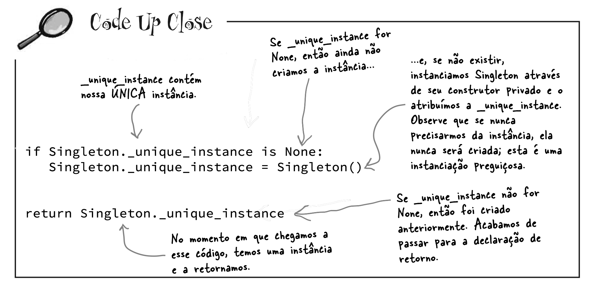
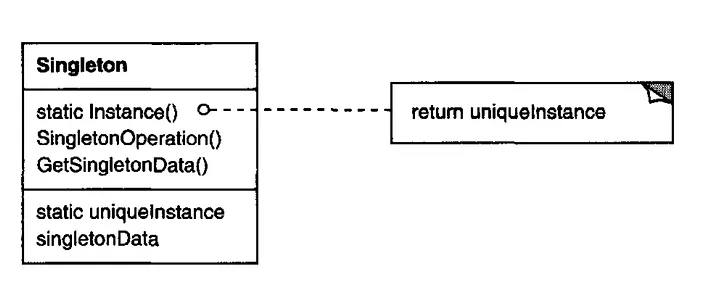
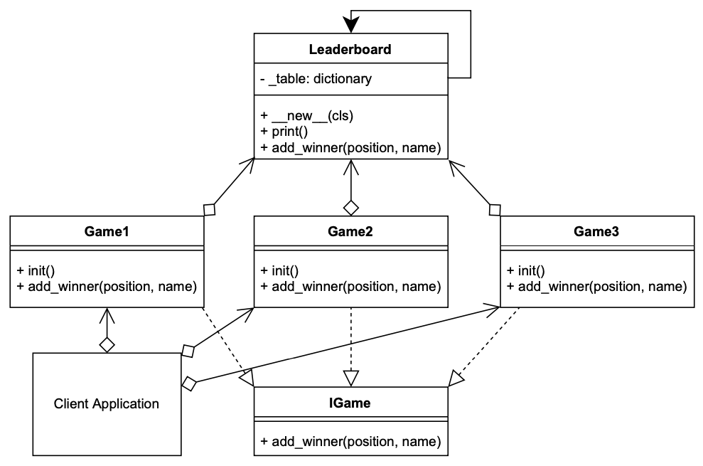
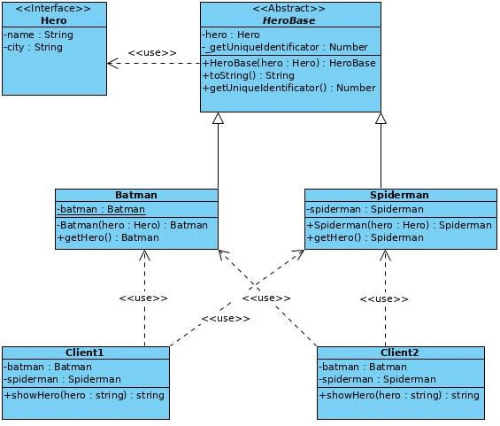
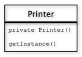
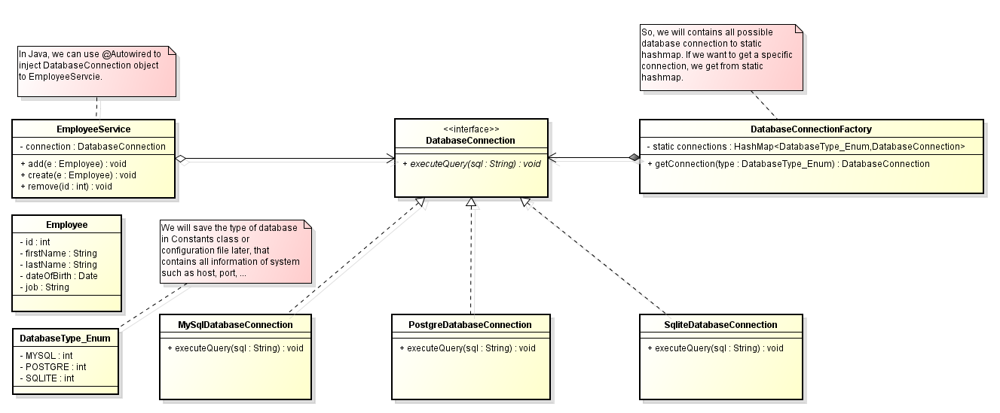

# Objetos Únicos✨✨


---

> Nossa próxima parada é o **Padrão Singleton**, nosso ingresso para a criação de objetos únicos para os quais existe apenas uma instância. Você pode ficar feliz em saber que, de todos os padrões, o **Singleton** é o mais simples em termos de diagrama de classes. Na verdade, ele (diagrama) contém apenas uma classe! Mas não fique muito confortável. Apesar de sua simplicidade do ponto de vista do design de classes, será necessário um pensamento profundo orientado a objetos em sua implementação. 
> 

---

## Pergunte ao Guru...


**Desenvolvedor**: Para que serve isso?

**Guru**: Existem muitos objetos dos quais precisamos apenas de um: pools de threads, caches, caixas de diálogo, objetos que tratam de preferências e configurações de registro, objetos usados para registro e objetos que atuam como drivers de dispositivos como impressoras e placas gráficas. Na verdade, para muitos desses tipos de objetos, se instanciarmos mais de um, encontraremos todos os tipos de problemas, como comportamento incorreto do programa, uso excessivo de recursos ou resultados inconsistentes.

**Desenvolvedor**: Ok, talvez existam classes que devam ser instanciadas apenas uma vez, mas não posso fazer isso usando variáveis globais? 

**Guru**: De muitas maneiras, o Padrão `Singleton` é uma convenção para garantir que um e apenas um objeto seja instanciado para uma determinada classe. Se você tiver um melhor, o mundo gostaria de ouvir falar dele; mas lembre-se, como todos os padrões, `Singleton` é um método testado pelo tempo para garantir que apenas um objeto seja criado. Ele também nos dá um ponto de acesso global, assim como uma variável global, mas sem as desvantagens.

**Desenvolvedor**: Quais são as desvantagens?

**Guru**: Bem, aqui está um exemplo: se você atribuir um objeto a uma variável global, então esse objeto poderá ser criado quando seu aplicativo for iniciado. Certo? E se esse objeto consumir muitos recursos e seu aplicativo nunca acabar usando-o? Como você verá, com o Padrão `Singleton`, podemos criar nossos objetos somente quando eles forem necessários.

**Desenvolvedor**: Isso ainda não parece ser tão difícil.

**Guru**: Não é. Mas, é interessante ver como funciona um `Singleton` e, por mais simples que pareça, é difícil acertar o seu código. Basta perguntar para você mesmo: como evito que mais de um objeto seja instanciado? Não é tão óbvio, não é?

## Dissecando a Implementação Clássica do `Singleton Pattern`

Observe o código abaixo:

```python
class Singleton:
	# Temos uma variável para armazenar 
	# nossa única instância da classe Singleton.
    _unique_instance = None

    def __init__(self):
        # outras variáveis de instância úteis aqui
        pass

    # O método getInstance() nos fornece uma maneira 
    # de instanciar a classe e também 
    # de retornar uma instância dela.
    @staticmethod
    def get_instance():
        if Singleton._unique_instance is None:
            Singleton._unique_instance = Singleton()
        return Singleton._unique_instance

    # outros métodos úteis aqui
    # claro, Singleton é uma classe normal; 
    # possui outras variáveis ​​e métodos úteis
```

Agora vamos analisar o método `get_instance()` mais profundamente. O trecho de código abaixo nos dá mais "insights".




## A Fábrica de Chocolate


Todo mundo sabe que todas as fábricas de chocolate modernas possuem caldeiras de chocolate controladas por computador. A função da caldeira é levar o chocolate e o leite, fervê-los e depois passá-los para a próxima fase da fabricação das barras de chocolate.
Abaixo está a classe do Controlador para a caldeira de chocolate da Indústria **Choc-O-Holic, Inc**. 

Confira o código; você notará que eles tentaram ter muito cuidado para garantir que coisas ruins não acontecessem, como drenar 500 galões de mistura não fervida, ou encher a caldeira quando ela já estava cheia, ou ferver uma caldeira vazia!

```python
class ChocolateBoiler:
    def __init__(self):
        self.empty = True
        self.boiled = False

    # Para encher a caldeira ela deve estar vazia e, 
    # uma vez cheia, acionamos as flags de vazia e fervida.
    def fill(self):
        if self.is_empty():
            self.empty = False
            self.boiled = False
            # Preencha a caldeira com uma mistura de leite/chocolate

    
    # Para drenar a caldeira, ela deve estar cheia (não vazia) 
    # e também fervida. Depois de drenada, 
    # nós definimos a flag empty (vazia) de volta como verdadeira.
    def drain(self):
        if not self.is_empty() and self.is_boiled():
            # Drene o leite e o chocolate fervidos
            self.empty = True

    
    # Para ferver a mistura, a caldeira deve estar cheia e 
    # ainda não fervida. Depois de fervida, 
    # definimos a flag boiled (fervida) como verdadeira.
    def boil(self):
        if not self.is_empty() and not self.is_boiled():
            # Leve o conteúdo a ferver
            self.boiled = True

    def is_empty(self):
        return self.empty

    def is_boiled(self):
        return self.boiled
```
---

> Choc-O-Holic fez um trabalho decente garantindo que coisas ruins não acontecessem, você não acha? 
> 
> Então, você provavelmente suspeita que se duas instâncias do `ChocolateBoiler` se perderem, algumas coisas muito ruins podem acontecer.
> 
> Como as coisas podem dar errado se mais de uma instância de `ChocolateBoiler` for criada em um aplicativo?
> 
> Você pode ajudar o Choc-O-Holic a melhorar sua classe `ChocolateBoiler` transformando-a em um `Singleton`?
> 
> Poderíamos fazer algo assim:

```python
class ChocolateBoiler:
    def __init__(self):
        self.empty = True
        self.boiled = False

    uniqueInstance = None

    @staticmethod
    def get_instance():
        if ChocolateBoiler.uniqueInstance is None:
            ChocolateBoiler.uniqueInstance = ChocolateBoiler()
        return ChocolateBoiler.uniqueInstance

    def fill(self):
        if self.is_empty():
            self.empty = False
            self.boiled = False
            # Preencha a caldeira com uma mistura de leite/chocolate

    def is_empty(self):
        return self.empty

    def is_boiled(self):
        return self.boiled

    # Restante do código da ChocolateBoiler...

# Exemplo de uso:
chocolate_boiler = ChocolateBoiler.get_instance()
chocolate_boiler.fill()
print(f"Is Empty: {chocolate_boiler.is_empty()}, Is Boiled: {chocolate_boiler.is_boiled()}")
```

## Definindo o `Singleton` Pattern

Agora que você tem a implementação clássica do `Singleton` em sua cabeça, é hora de sentar, saborear uma barra de chocolate e conferir os pontos mais delicados deste padrão.

Vamos começar com uma definição concisa:

<style>
mark{
    color:black;
    background-color: #00FF00;
}
</style>

<mark> **O Padrão Singleton garante que uma classe tenha apenas uma instância e fornece um único ponto de acesso a essa instância.** 
</mark>

Vamos verificar o diagrama de classes.


Vamos detalhar um pouco mais:

> O que realmente está acontecendo aqui? Estamos fazendo uma classe e permitindo que ela gerencie uma única instância de si mesma. Também estamos evitando que qualquer outra classe crie uma nova instância por conta própria. Para obter uma instância, você precisa passar por ela (classe).

> Também estamos fornecendo um ponto de acesso global para a instância: sempre que você precisar dela, basta consultar a classe e ela lhe devolverá a instância única.
> Como você viu, podemos implementar isso para que o `Singleton` seja criado de maneira preguiçosa (lenta), o que é especialmente importante para objetos que consomem muitos recursos.

## Houston, We Have a Problem...

> Parece que a Caldeira de Chocolate nos decepcionou. Apesar de termos melhorado o código usando o padrão `Singleton` clássico, de alguma forma o método `fill()` da Caldeira de Chocolate foi capaz de começar a enchê-la mesmo que um lote de leite e chocolate já estivesse fervendo! São 500 galões de leite derramado (e chocolate)! O que aconteceu!?


> A adição de _threads_ poderia ter causado isso? Não é o caso de que, depois de definirmos a variável `uniqueInstance` como a única instância de `ChocolateBoiler`, todas as chamadas para `getInstance()` deverão retornar a mesma instância? Certo?
> 
> O que aconteceu aqui, na verdade, é que dois clientes tentaram acessar o `Singleton` pela primeira vez ao mesmo tempo. Isto é chamado de _multithreading_. 
> 
> E como resolver isto?
> 
> Em linguagens de programação como **Java**, adiciona-se a palavra-chave `synchronized` ao método `getInstance()`, para forçarmos cada _thread_ a esperar sua vez antes de poder entrar no método. Ou seja, duas _threads_ não podem entrar no método ao mesmo tempo.
> 
> No Python, não existe um equivalente direto ao modificador `synchronized` do **Java**. No entanto, você pode alcançar uma funcionalidade semelhante utilizando o módulo `threading` para criar um bloqueio (_lock_) em torno da seção crítica do código que deseja sincronizar. O código ficaria assim.

```python
import threading

class Singleton:
    _unique_instance = None
    _lock = threading.Lock()  # Crie um lock para sincronização

    def __init__(self):
      # outras variáveis de instância úteis aqui
      pass

    @staticmethod
    def get_instance():
       if Singleton._unique_instance is None:
          with Singleton._lock:  # Use o lock para sincronizar o acesso
             if Singleton._unique_instance is None:
                Singleton._unique_instance = Singleton()
        return Singleton._unique_instance

    # outros métodos úteis aqui
```

> No código acima, usamos o `threading.Lock()` para criar um bloqueio (_lock_) e, em seguida, usamos a declaração `with` para garantir que apenas um thread por vez possa acessar a seção crítica do código, onde a instância única está sendo criada. Isso ajuda a garantir a sincronização do acesso ao `Singleton`, semelhante ao que o modificador `synchronized` faz em Java.
> 
> O que fizemos foi impedir que dois clientes tenham acesso o método ao mesmo tempo.

---
## Um pouco de formalidade...

##Padrão Singleton (127)

###Objetivo
Permitir a você garantir que uma classe tenha apenas uma instância, enquanto provê um ponto de acesso global para essa instância.

###Características
As principais características do padrão `Singleton` incluem:

* **Única Instância**: Garante que uma classe tenha apenas uma única instância, independentemente de quantas vezes ela seja inicializada ou acessada.

* **Acesso Global**: Fornece um ponto de acesso global para a instância única, permitindo que outros objetos obtenham acesso a essa instância de forma consistente.

* **Construtor Privado**: O construtor da classe `Singleton` é definido como privado, o que impede que outras classes instanciem diretamente a classe `Singleton`.

* **Instância Preguiçosa ou Inicialização Precoce**: A instância `Singleton` pode ser criada preguiçosamente (quando necessário) ou inicializada precocemente, dependendo dos requisitos do sistema.

* **Método de Acesso Único**: Um método estático, geralmente chamado de `getInstance()`, é fornecido para obter a instância `Singleton`. Este método cria a instância se ela ainda não existe ou retorna a instância existente.

* **Manutenção do Estado**: A instância `Singleton` pode manter um estado global compartilhado, que pode ser acessado e modificado por outros objetos que têm acesso a ela.

* **Controle de Concorrência**: Em ambientes _multithread_, o `Singleton` pode incluir mecanismos para garantir que apenas uma instância seja criada, mesmo em situações de concorrência.

* **Não Herdável**: O `Singleton` pode ser projetado de forma a não ser herdável, garantindo que a única instância existente seja a da classe `Singleton` original.


###Aplicações (casos de uso)

1. **Gerenciadores de Configuração**: Em muitos aplicativos, é necessário ter um único ponto de acesso para as configurações do sistema. Um `Singleton` pode ser usado para criar uma classe de configuração que carrega as configurações uma vez e as disponibiliza para todo o sistema.

2. **Conexões de Banco de Dados**: Em aplicativos que se comunicam com bancos de dados, é comum usar um `Singleton` para gerenciar as conexões com o BD. Isso ajuda a economizar recursos, garantindo que apenas uma conexão esteja ativa em um determinado momento.

3. **Gerenciamento de Log**: Um `Singleton` pode ser usado para criar um logger global que registra eventos e mensagens em todo o aplicativo. Isso simplifica o processo de rastreamento e depuração.

4. **Cache de Dados**: Para armazenar dados em cache que devem ser compartilhados entre várias partes do sistema, um `Singleton` pode ser usado como uma camada de gerenciamento de cache.

5. **Pool de Recursos**: Em casos em que há recursos limitados, como conexões de rede ou threads, o `Singleton` pode ser usado para criar e gerenciar um pool de recursos compartilhado.

6. **Controle de Acesso**: Para controlar o acesso concorrente a recursos compartilhados, como arquivos ou dispositivos de hardware, o `Singleton` pode ser usado como um mecanismo de controle de acesso.

7. **Gerenciadores de Autenticação e Autorização**: Em sistemas de autenticação e autorização, um `Singleton` pode ser usado para gerenciar a sessão de usuário, garantindo que apenas uma instância da sessão esteja ativa.

8. **Gerenciadores de Threads**: Em aplicativos com várias _threads_, um `Singleton` pode ser usado para criar e gerenciá-los, garantindo que apenas um número limitado deles esteja em execução ao mesmo tempo.

9. **Fábricas Únicas**: Em casos em que é necessário garantir a existência de apenas uma instância de uma fábrica de objetos, um `Singleton` pode ser usado para criar a fábrica e fornecer acesso global a ela.

10. **Aplicações de Cache**: Em sistemas de armazenamento em cache de alto desempenho, como caches de página da web, um `Singleton` pode ser usado para representar a instância global do cache, garantindo a consistência e o compartilhamento adequado dos dados em cache.


###Estrutura Básica



> A descrição da **Estrutura Básica** segue abaixo.
> 
> **Classe `Singleton`**: É a classe que implementa o padrão `Singleton`. Ela deve ter um construtor privado para impedir a criação direta de instâncias da classe. Normalmente, esta classe também mantém uma variável privada que armazena a única instância da própria classe.
> 
> **Método de Acesso Estático**: esta classe fornece um método de acesso estático (muitas vezes chamado de `getInstance()`) que permite que os clientes obtenham a instância única da classe. Esse método é responsável por criar a instância da classe se ela ainda não existir e retorná-la caso já exista.
> 
> **Variável de Instância Privada**: classe `Singleton` mantém uma variável privada que armazena a única instância da própria classe. Essa variável é frequentemente chamada de `instance` ou `uniqueInstance`.
> 
> **Construtor Privado**: O construtor da classe `Singleton` é declarado como privado, o que impede a criação de instâncias da classe fora da própria classe. Isso garante que todas as instâncias da classe sejam controladas e gerenciadas internamente.


### Participantes

* **Singleton** 
	* Define uma operação de instância que permite aos clientes acessar sua instância exclusiva. Instância é uma operação de classe ou seja, um método.
	* Pode ser responsável por criar sua própria instância exclusiva.


###Colaborações

* Os clientes acessam uma instância `Singleton` somente por meio da operação de instância dela.


### Exemplos de Código

#### Exemplo #1: Criação de Jogos (extraído do livro "Design Patterns in Python Common GOF (Gang of Four) Design Patterns implemented in Python de Sean Bradley")

Neste exemplo, existem três jogos criados. Todas são instâncias independentes criadas a partir de sua própria classe, mas todas compartilham a mesma tabela de classificação. A tabela de classificação é um singleton.
Não importa como os Jogos foram criados ou como eles fazem referência à tabela de classificação, é sempre um singleton.
Cada jogo adiciona um vencedor de forma independente, e todos os jogos podem ler a tabela de classificação alterada, independentemente de qual jogo a atualizou.



O código ficaria assim:

```python
from abc import ABC, abstractmethod

class IGame(ABC):
  #"A Game Interface"
  @staticmethod
  @abstractmethod
  def add_winner(position, name):
    #"Must implement add_winner"
    pass

class Game1(IGame): 
  def __init__(self): 
    self.leaderboard = Leaderboard()

  def add_winner(self, position, name): 
    self.leaderboard.add_winner(position, name)


class Game2(IGame): 
  def __init__(self): 
    self.leaderboard = Leaderboard()

  def add_winner(self, position, name): 
    self.leaderboard.add_winner(position, name)


class Game3(Game2): 
  """Game 3 Inherits from Game 2 instead of implementing IGame"""


"""A Leaderboard Singleton Class"""
class Leaderboard():
  "The Leaderboard as a Singleton"
  _table = {}
  
  def __new__(cls): 
    return cls
  
  @classmethod 
  def print(cls):
    #"A class level method" 
    print("-----------Leaderboard-----------") 
    for key, value in sorted(cls._table.items()):
      print(f"|\t{key}\t|\t{value}\t|") 
    print()
  
  @classmethod
  def add_winner(cls, position, name):
    # "A class level method"
    cls._table[position] = name


# The Client
# All games share and manage the same leaderboard because it is a singleton.
GAME1 = Game1()
GAME1.add_winner(2, "Cosmo")
GAME2 = Game2() 
GAME2.add_winner(3, "Sean")
GAME3 = Game3() 
GAME3.add_winner(1, "Emmy")

GAME1.leaderboard.print() 
GAME2.leaderboard.print() 
GAME3.leaderboard.print()
```

---

#### Exemplo #2: Conjunto de Heróis

Outro exemplo interessante que é resolvido usando este padrão é quando existem várias classes que devem ser `Singleton`. Por exemplo, um conjunto de heróis como Homem-Aranha e Batman são solteiros. No diagrama UML a seguir você pode ver esta situação:



O código ficaria assim:

```python
from abc import ABC, abstractmethod
import random

class ConnectionConfiguration:
    def __init__(self, host, user, passw, name):
        self.host = host
        self.user = user
        self.passw = passw
        self.name = name

class DatabaseConnection:
    def __init__(self):
        self.configuration = ConnectionConfiguration('localhost', 'db user-name', 'db password', 'db name')
        self.get_unique_identifier = round(random.random() * 10000)

    def get_unique_identificator(self):
        return self.get_unique_identifier

class HeroBase(ABC):
    def __init__(self, hero):
        self.hero = hero
        self.get_unique_identificator = round(random.random() * 10000)

    @abstractmethod
    def __str__(self):
        pass

    @abstractmethod
    def get_unique_identificator(self):
        pass

class Hero:
    def __init__(self, name, city):
        self.name = name
        self.city = city

class ClientBase(ABC):
    def __init__(self):
        self.database_connection = DatabaseConnection()

    @abstractmethod
    def show_hero(self, hero):
        pass

class Batman(HeroBase):
    def __init__(self):
        super().__init__(Hero('Bruce Wayne', 'Gotham City'))

    def __str__(self):
        return f"{self.hero.name} - {self.hero.city} - {self.get_unique_identificator}"

    def get_unique_identificator(self):
        return self.get_unique_identifier

class Spiderman(HeroBase):
    def __init__(self):
        super().__init__(Hero('Peter Parker', 'New City'))

    def __str__(self):
        return f"{self.hero.name} - {self.hero.city} - {self.get_unique_identificator}"

    def get_unique_identificator(self):
        return self.get_unique_identifier

# Create instances
class Client1(ClientBase):
    def show_hero(self, hero):
        return str(hero)

class Client2(ClientBase):
    def show_hero(self, hero):
        return str(hero)

client1 = Client1()
client2 = Client2()
batman = Batman()
spiderman = Spiderman()

# testando o código
print(f"DatabaseConnection ID (Client1): {client1.database_connection.get_unique_identificator()}")
print(f"DatabaseConnection ID (Client2): {client2.database_connection.get_unique_identificator()}")
print(f"Batman: {client1.show_hero(batman)}")
print(f"Spiderman: {client1.show_hero(spiderman)}")
print(f"Batman: {client2.show_hero(batman)}")
print(f"Spiderman: {client2.show_hero(spiderman)}")
```

---

#### Exemplo #3: Compartilhamento de Impressora

Como um espaço de escritório compartilhado com muitos funcionários pode compartilhar a mesma impressora? Isto faz sentido, uma vez que muitas vezes é a realidade para corporações e empresas com funcionários que partilham instalações de escritório.

Neste caso não temos objetivos secundários, pois poderíamos facilmente resolver o objetivo com e sem o padrão `Singleton`. 
No entanto, trata-se mais de reconhecer o comportamento natural do objeto compartilhado e construir o código mais apropriado e limpo para simular esse comportamento.


O conceito do padrão de design `Singleton` é baseado em um construtor privado e um método de inicialização estático público.

O construtor privado garante que a classe só possa ser inicializada por si mesma, o que torna o método de inicialização estático público a única maneira de obter uma instância da classe. Veja a figura abaixo.




O código ficaria assim:

```python
from abc import ABC, abstractmethod

class Printer(ABC):
    _instance = None
    _nr_of_pages = 0

    def __new__(cls):
        if cls._instance is None:
            cls._instance = super(Printer, cls).__new__(cls)
        return cls._instance

    @abstractmethod
    def print(self, text):
        pass

    @property
    def nr_of_pages(self):
        return self._nr_of_pages


class ConsolePrinter(Printer):
    def print(self, text):
        self._nr_of_pages += 1
        print(f"{text}\nPages printed today: {self._nr_of_pages}\n{'-' * 10}")


class Employee:
    def __init__(self, name, role, assignment):
        self.name = name
        self.role = role
        self.assignment = assignment

    def print_current_assignment(self):
        printer = ConsolePrinter()
        printer.print(f"Employee: {self.name}\nRole: {self.role}\nAssignment: {self.assignment}")


def main():
    graham = Employee("Graham", "CEO", "Making executive decisions")
    sara = Employee("Sara", "Consultant", "Consulting the company")
    tim = Employee("Tim", "Salesmen", "Selling the company's products")
    emma = Employee("Emma", "Developer", "Developing the latest mobile app.")

    graham.print_current_assignment()
    sara.print_current_assignment()
    tim.print_current_assignment()
    emma.print_current_assignment()


if __name__ == "__main__":
    main()
```

---

#### Exemplo #4: Conexões entre Banco de Dados



O código ficaria assim:

```python
from abc import ABC, abstractmethod

# Define an enumeration for DatabaseType
class DatabaseType:
    MYSQL = 1
    POSTGRE = 2
    SQLITE = 3

# Define an abstract base class for Configuration
class Configuration(ABC):
    @staticmethod
    def get_config():
        return Configuration()

    @abstractmethod
    def get_database_type(self):
        pass

    @abstractmethod
    def set_database_type(self, type):
        pass

    @abstractmethod
    def get_host(self):
        pass

    @abstractmethod
    def set_host(self, host):
        pass

    @abstractmethod
    def get_port(self):
        pass

    @abstractmethod
    def set_port(self, port):
        pass

# Define a concrete implementation of Configuration
class ConcreteConfiguration(Configuration):
    def __init__(self):
        self.type = DatabaseType.MYSQL
        self.host = "127.0.0.1"
        self.port = "4652"

    def get_database_type(self):
        return self.type

    def set_database_type(self, type):
        self.type = type

    def get_host(self):
        return self.host

    def set_host(self, host):
        self.host = host

    def get_port(self):
        return self.port

    def set_port(self, port):
        self.port = port

# Define an abstract base class for IDatabaseConnection
class IDatabaseConnection(ABC):
    @abstractmethod
    def execute_query(self, query):
        pass

# Define concrete implementations of IDatabaseConnection
class MySqlDatabaseConnection(IDatabaseConnection):
    def execute_query(self, query):
        print(f"Execute MySQL's query: {query}")

class PostgreDatabaseConnection(IDatabaseConnection):
    def execute_query(self, query):
        print(f"Execute PostgreSQL's query: {query}")

class SqliteDatabaseConnection(IDatabaseConnection):
    def execute_query(self, query):
        print(f"Execute SQLite's query: {query}")

# Define a class for Employee
class Employee:
    def __init__(self, id, first_name, last_name, date_of_birth, job):
        self.id = id
        self.first_name = first_name
        self.last_name = last_name
        self.date_of_birth = date_of_birth
        self.job = job

# Define a class for EmployeeService
class EmployeeService:
    def __init__(self, connection):
        self.connection = connection

    def create(self, employee):
        self.connection.execute_query("create new employee in the database.")

    def remove(self, id):
        query = f"remove employee that has id = {id}"
        self.connection.execute_query(query)

# Main program
def main():
    config = ConcreteConfiguration()
    db_connection = MySqlDatabaseConnection()  # Change this based on the desired database type
    service = EmployeeService(db_connection)

    obama = Employee(1, "Barack", "Obama", "10/02/1956", "President")
    clinton = Employee(2, "Bill", "Clinton", "06/05/1950", "President")

    service.create(obama)
    service.create(clinton)

    service.remove(1)

if __name__ == "__main__":
    main()
```

---
