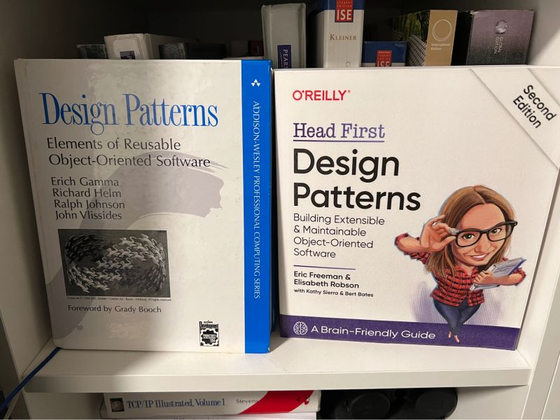

# POO_2
## Este é o repositório com o conteúdo da disciplina Programação Orientada a Objetos II.

O material está baseado em dois livros sobre a área. Veja a figura abaixo.

### Cada `branch` contém o assunto sobre um tipo de `Design Pattern` (i.e. **Padrão de Projeto**)

[Padroes_1_Strategy](https://github.com/csp1po/POO_2/tree/Padroes_1_Strategy)

[Padroes_2_Observer](https://github.com/csp1po/POO_2/tree/Padroes_2_Observer)

[Padroes_3_Decorator](https://github.com/csp1po/POO_2/tree/Padroes_3_Decorator)

[Padroes_4_Factory_Method](https://github.com/csp1po/POO_2/tree/Padroes_4_Factory_Method)

[Padroes_4_Abstract_Factory](https://github.com/csp1po/POO_2/tree/Padroes_4_Abstract_Factory)

[Padroes_5_Singleton](https://github.com/csp1po/POO_2/tree/Padroes_5_Singleton)

   
