# "Assando" a "Virtude" da Orientação a Objeto - OO✨✨


---

> Prepare-se para criar alguns Designs Orientados a Objeto fracamente acoplados. Criar objetos envolve uma série de circunstâncias. Você aprenderá que a instanciação é uma atividade que nem sempre deve ser realizada em público e muitas vezes pode levar a problemas de acoplamento. E não queremos isso, queremos? Descubra como o Padrão `Factory` pode ajudar a evitar dependências embaraçosas.
> 

---
## Introdução

Observe o trecho de código abaixo. Quando temos todo um conjunto de classes concretas relacionadas, muitas vezes acabamos escrevendo código como este:

```python
duck = None
if picnic:
  duck = MallardDuck()
elif hunting:
  duck = DecoyDuck()
elif inBathTub:
  duck = RubberDuck()
```

Aqui temos várias classes concretas sendo instanciadas, e a decisão sobre qual instanciar é feita em tempo de execução, dependendo de algum conjunto de condições.
Ao ver um código como este, você sabe que quando chegar a hora de alterações ou extensões, você terá que reabrir esse código e examinar o que precisa ser adicionado (ou excluído). Muitas vezes esse tipo de código acaba em diversas partes da aplicação, tornando a manutenção e atualizações mais difíceis e propensas a erros.

>Em outras palavras, quando você tem um código que faz uso de muitas classes concretas, você está procurando problemas porque esse código pode ter que ser alterado à medida que novas classes concretas são adicionadas. Ou seja, seu código não será “**fechado para modificação**”. Para estendê-lo com novos tipos concretos, você terá que reabri-lo.
>
>Então o que você pode fazer? É em momentos como este que você pode recorrer aos princípios de design em OO para procurar pistas. Lembre-se, nosso primeiro princípio trata da mudança e nos orienta a *identificar os aspectos que variam e separá-los daquilo que permanece igual*.


## Identificando os aspectos que variam

Digamos que você é proprietário de uma pizzaria de última geração em **Objectville**. Ver o diagrama de classes abaixo. 

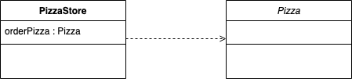

Então você pode acabar escrevendo um código como este.


Mas você precisa de mais de um tipo de pizza...
Então você adicionaria algum código que determina o tipo apropriado de pizza e então faria a pizza. Veja a figura abaixo.

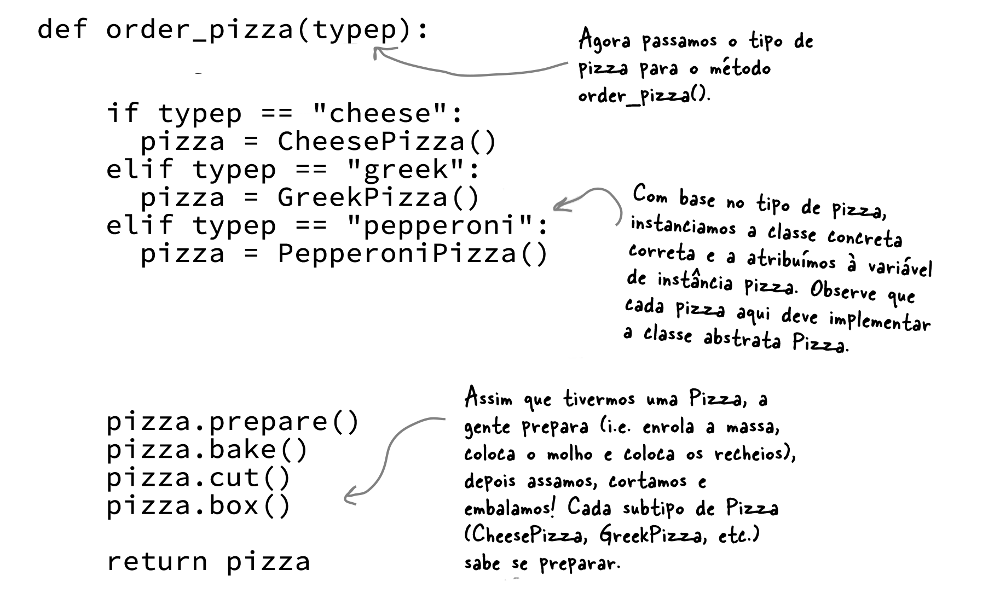


## Mas existe pressão para adicionar mais tipos de pizza

Você percebe que todos os seus concorrentes adicionaram algumas pizzas da moda aos seus cardápios: a **Clam Pizza** e a **Veggie Pizza**. Obviamente você precisa acompanhar a concorrência, por isso adicionará esses itens ao seu cardápio. E você não tem vendido muitas pizzas gregas (**Greek Pizza**) ultimamente, então decide tirá-la do cardápio.

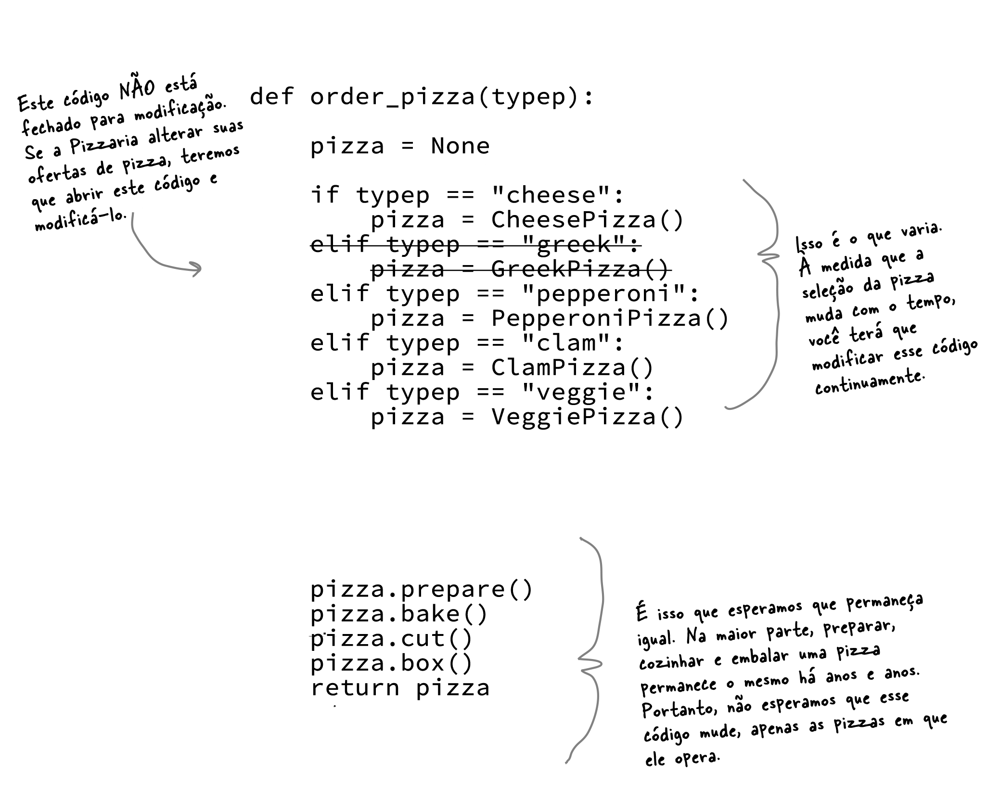

> Claramente, lidar com qual classe concreta é instanciada está realmente atrapalhando nosso método `order_pizza()` e impedindo que ele seja fechado para modificação. Mas agora que sabemos o que varia e o que não varia, provavelmente é hora de encapsular isso.

## Encapsulando a Criação de Objetos

Então agora sabemos que seria melhor mover a criação do objeto para fora do método `orderPizza()`. Mas como? Bem, o que vamos fazer é pegar o código de criação e movê-lo para outro objeto que se preocupará apenas com a criação de pizzas, conforme mostra a figura abaixo.

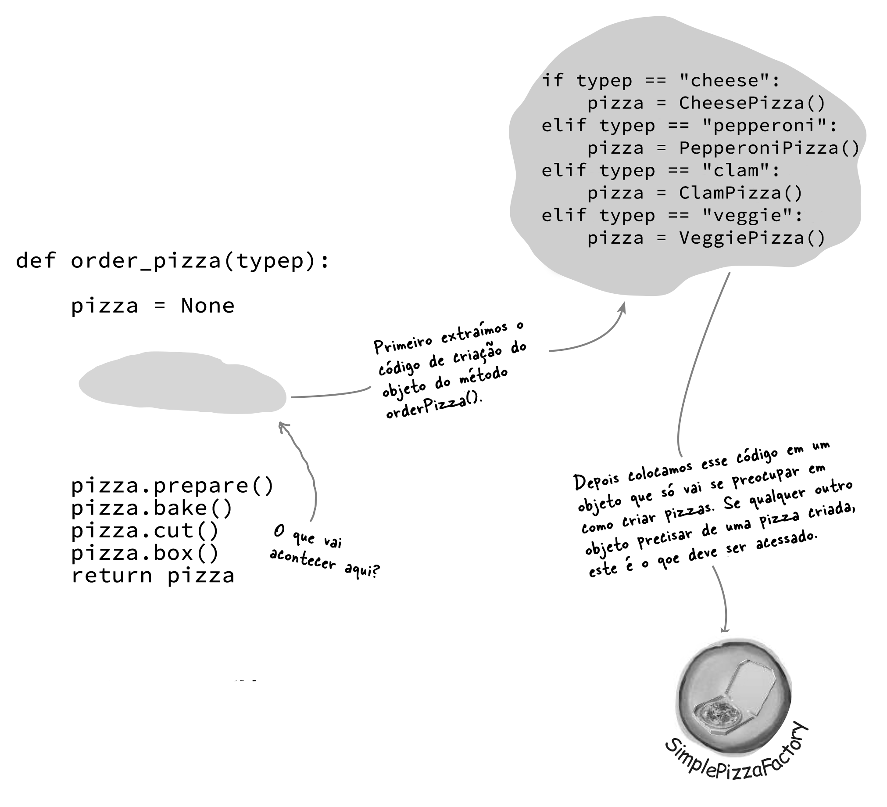

## Temos um nome para este novo objeto: vamos chamá-lo de Fábrica (_Factory_).

As fábricas cuidam dos detalhes da criação de objetos. Assim que tivermos uma `SimplePizzaFactory`, nosso método `orderPizza()` se torna um cliente desse objeto. Sempre que ele precisa de uma pizza, pede à pizzaria que faça uma. Já se foi o tempo em que o método `orderPizza()` precisava saber sobre pizzas gregas e de mexilhão. Agora, ele apenas se preocupa em obter uma pizza que implemente a classe abstrata `Pizza` para que possa chamar `prepare()`, `bake()`, `cut()` e `box()`.

Ainda temos alguns detalhes para preencher aqui; **por** exemplo, com o que o método `orderPizza()` substitui seu código de criação? Vamos implementar uma fábrica simples para pizzaria e descobrir...

## Construindo uma Fábrica de Pizza Simples

Começaremos com a própria fábrica. O que vamos fazer é definir uma classe que encapsule a criação de objetos para todas as pizzas. Veja a figura abaixo do diagrama de classes de nossa `SimplePizzaFactory`.

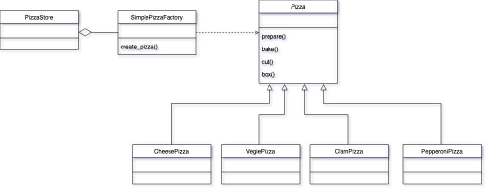

O código para o diagrama acima fica assim.

```python
from abc import ABC, abstractmethod

# Aqui está nossa nova classe, SimplePizzaFactory. 
# Só tem uma função na vida: criar pizzas para seus clientes.
class SimplePizzaFactory:
    # Primeiro definimos um método createPizza() na fábrica. 
    # Este é o método que todos os clientes usarão para instanciar novos objetos.
    def createPizza(self, type):
        pizza = None
        
        # Aqui está o trecho de código que extraímos do método orderPizza().
        if type == "cheese":
            pizza = CheesePizza()
        elif type == "pepperoni":
            pizza = PepperoniPizza()
        elif type == "clam":
            pizza = ClamPizza()
        elif type == "veggie":
            pizza = VeggiePizza()
        # O trecho de código acima ainda é parametrizado pelo tipo de pizza, 
        # assim como era no método orderPizza().

        return pizza

# Primeiro damos à classe PizzaStore uma referência a uma SimplePizzaFactory.
class PizzaStore:

    # PizzaStore obtém a fábrica passada para ela 
    # (no construtor)
    def __init__(self, factory):
        self.factory = factory

    def orderPizza(self, type):
        # O método orderPizza() utiliza a fábrica para criar suas pizzas 
        # simplesmente passando o tipo dela via pedido (type).
        pizza = self.factory.createPizza(type)
        pizza.prepare()
        pizza.bake()
        pizza.cut()
        pizza.box()
        return pizza


class Pizza(ABC):  # Definindo a classe Pizza como uma classe abstrata
    @abstractmethod
    def prepare(self):
        pass

    @abstractmethod
    def bake(self):
        pass

    @abstractmethod
    def cut(self):
        pass

    @abstractmethod
    def box(self):
        pass


class CheesePizza(Pizza):
    def prepare(self):
        super().prepare()
        print("Queijo Muzzarella, Roqueford, Prato")

    def bake(self):
        print("Baking Cheese Pizza")

    def cut(self):
        print("Cutting Cheese Pizza")

    def box(self):
        print("Boxing Cheese Pizza")


class PepperoniPizza(Pizza):
    def prepare(self):
        super().prepare()
        print("Queijo Muzzarella e Linguiça Pepperoni")

    def bake(self):
        print("Baking Pepperoni Pizza")

    def cut(self):
        print("Cutting Pepperoni Pizza")

    def box(self):
        print("Boxing Pepperoni Pizza")


class ClamPizza(Pizza):
    def prepare(self):
        super().prepare()
        print("Queijo Muzzarella, Atum e Cebola")

    def bake(self):
        print("Baking Clam Pizza")

    def cut(self):
        print("Cutting Clam Pizza")

    def box(self):
        print("Boxing Clam Pizza")


class VeggiePizza(Pizza):
    def prepare(self):
        super().prepare()
        print("Queijo, palmito, milho e ervilha")

    def bake(self):
        print("Baking Veggie Pizza")

    def cut(self):
        print("Cutting Veggie Pizza")

    def box(self):
        print("Boxing Veggie Pizza")


if __name__ == "__main__":
    spf = SimplePizzaFactory()
    ps = PizzaStore(spf)
    ps.orderPizza("cheese")
    ps.orderPizza("pepperoni")
```

## A `Simple Factory`(Fábrica Simples) definida


Freemam e Robson afirmam que `Simple Factory` não é realmente um `Design Pattern`. Ele é mais um _idioma_  de programação. Mas é comumente usado, então ele receberá uma **Menção Honrosa do Padrão Head First** (ver figura acima). 

Alguns desenvolvedores confundem esse idioma com o `Factory Pattern`. Porém, só porque `Simple Factory` não é um padrão REAL, não significa que não devemos verificar como ele é montado. Vamos dar uma olhada no diagrama de classes da nossa nova Pizzaria representado na figura abaixo.

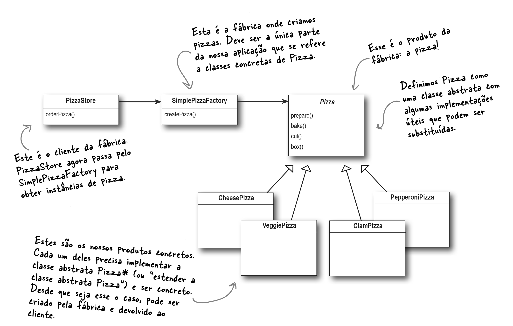

## Criando Franquias da Pizzaria

Nossa Pizzaria Objectville se saiu tão bem que derrotamos a concorrência e agora todo mundo quer uma Pizzaria em seu próprio bairro. Como franqueador, você deseja garantir a qualidade das operações de franquia e, portanto, deseja que eles usem seu código testado pelo tempo.
Mas e as diferenças regionais? Cada franquia pode querer oferecer diferentes estilos de pizzas (Nova York, Chicago e Califórnia, para citar alguns), dependendo de onde a loja da franquia está localizada e dos gostos dos conhecedores de pizza locais.

> A título de esclarecimento, diferentes áreas dos EUA servem estilos muito diferentes de pizza - desde as _deep-dish_ de Chicago, à de massa fina de Nova York, à pizza tipo biscoito da Califórnia (alguns diriam coberta com frutas e nozes).

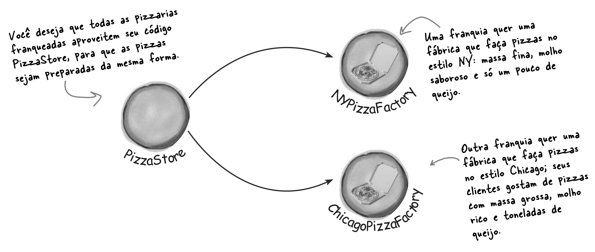

Se retirarmos a `SimplePizzaFactory` e criarmos três fábricas diferentes – `NYPizzaFactory`, `ChicagoPizzaFactory` e `CaliforniaPizzaFactory` – então poderemos simplesmente compor a `PizzaStore` com a fábrica apropriada e uma franquia estará pronta. Essa é uma abordagem. Vamos ver como seria...

```pytyhon
class PizzaFactory:
    def create_pizza(self, type):
        pass

class NYPizzaFactory(PizzaFactory):
    def create_pizza(self, type):
        if type == "Veggie":
            return NYVeggiePizza()
        # outras implementações de criação de pizza para NY

class ChicagoPizzaFactory(PizzaFactory):
    def create_pizza(self, type):
        if type == "Veggie":
            return ChicagoVeggiePizza()
        # outras implementações de criação de pizza para Chicago

class CaliforniaPizzaFactory(PizzaFactory):
    def create_pizza(self, type):
        if type == "Veggie":
            return CaliforniaVeggiePizza()
        # outras implementações de criação de pizza para Califórnia

class PizzaStore:
    def __init__(self, factory):
        self.factory = factory

    def order_pizza(self, type):
        pizza = self.factory.create_pizza(type)
        pizza.prepare()
        pizza.bake()
        pizza.cut()
        pizza.box()
        return pizza

class Pizza:
    def prepare(self):
        pass

    def bake(self):
        pass

    def cut(self):
        pass

    def box(self):
        pass

class NYVeggiePizza(Pizza):
    def prepare(self):
        print("Preparing NY Veggie Pizza")

class ChicagoVeggiePizza(Pizza):
    def prepare(self):
        print("Preparing Chicago Veggie Pizza")

class CaliforniaVeggiePizza(Pizza):
    def prepare(self):
        print("Preparing California Veggie Pizza")

# Código principal
ny_factory = NYPizzaFactory()
ny_store = PizzaStore(ny_factory)
ny_store.order_pizza("Veggie")

chicago_factory = ChicagoPizzaFactory()
chicago_store = PizzaStore(chicago_factory)
chicago_store.order_pizza("Veggie")

california_factory = CaliforniaPizzaFactory()
california_store = PizzaStore(california_factory)
california_store.order_pizza("Veggie")
```
Observe a figura com o trecho que representa o **código principal** acima.

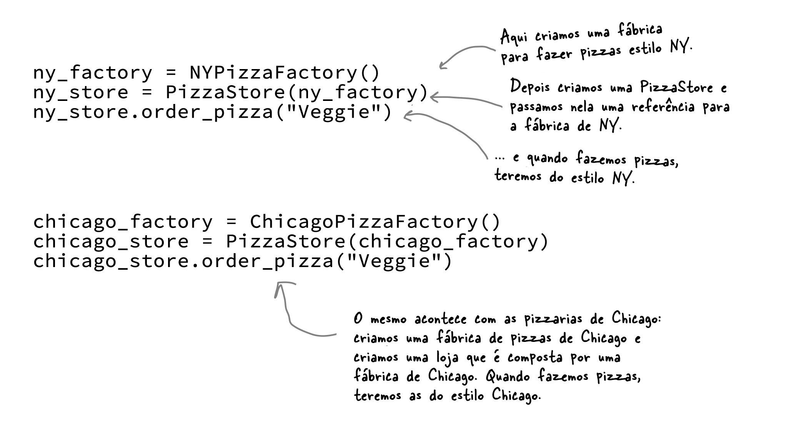

### Porém você gostaria de um pouco mais de controle de qualidade...

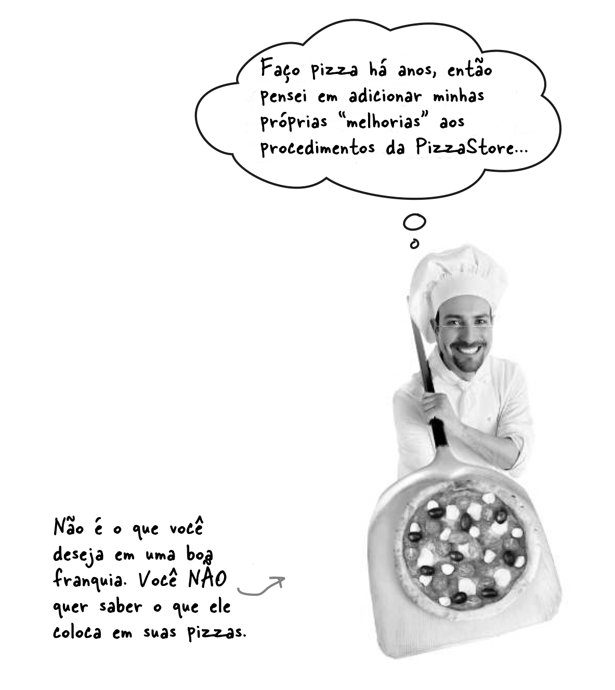

Então você testou a ideia do `SimpleFactory` e descobriu que as franquias estavam usando sua fábrica para criar pizzas, mas começando a empregar seus próprios procedimentos caseiros para o resto do processo: elas assavam coisas um pouco diferente, eles esqueceriam de cortar a pizza e usariam caixas de terceiros.
Repensando um pouco o problema, você percebe que o que realmente gostaria de fazer é criar uma estrutura que unisse a loja e a criação da pizza, mas ainda assim permitisse que as coisas permanecessem flexíveis.
Em nosso código inicial, antes do `SimplePizzaFactory`, tínhamos o código de fazer pizza vinculado à `PizzaStore`, mas não era flexível. Então, como podemos fazer?

## Um Framework Para a Pizzaria

Existe uma maneira de localizar todas as atividades de fabricação de pizzas para a classe `PizzaStore` e dar às franquias liberdade para terem seu próprio estilo regional.
O que vamos fazer é colocar o método `createPizza()` de volta no `PizzaStore`, mas desta vez como um método abstrato, e então criar uma subclasse `PizzaStore` para cada estilo regional.
Primeiro, vamos dar uma olhada nas mudanças na `PizzaStore` (trecho de código).

```python
from abc import ABC, abstractmethod

# PizzaStore agora é abstrata (veja o porquê abaixo).
class PizzaStore(ABC):
    
    def order_pizza(self, type):
        
        # Agora createPizza voltou a ser uma chamada 
        # para um método no PizzaStore em vez de 
        # um objeto de fábrica.
        pizza = self.create_pizza(type)
        
        # isto parece o mesmo
        pizza.prepare()
        pizza.bake()
        pizza.cut()
        pizza.box()
        
        return pizza

    # Agora movemos nosso objeto fábrica para este método.
    # Nosso “factory method” agora é abstrato na PizzaStore.
    @abstractmethod
    def create_pizza(self, type):
        pass
```

> Observação: Agora temos uma loja aguardando subclasses. Isto é,  vamos ter uma subclasse para cada tipo regional (`NYPizzaStore`, `ChicagoPizzaStore`, `CaliforniaPizzaStore`) e cada delas tomará a decisão sobre o que compõe uma pizza. Vamos dar uma olhada em como isso vai funcionar.

## Permitindo que as subclasses decidam

Lembre-se de que a Pizza Store já possui um sistema de pedidos bem aprimorado no método `orderPizza()` e você deseja garantir que ele seja consistente em todas as franquias.

O que varia entre as pizzarias regionais é o estilo das pizzas que elas fazem - a de Nova York tem massa fina, a de Chicago tem massa grossa e assim por diante - e vamos inserir todas essas variações no método `createPizza()` e torná-lo responsável para criar o tipo certo de pizza. 

A maneira como fazemos isso é deixar cada subclasse de `PizzaStore` definir a aparência do método `createPizza()`. Portanto, teremos uma série de subclasses concretas de `PizzaStore`, e cada uma com suas próprias variações de pizza, todas enquadradas na estrutura de superclasse (i.e. `PizzaStore`) e ainda fazendo uso do bem ajustado método `orderPizza()`. Veja a figura abaixo.

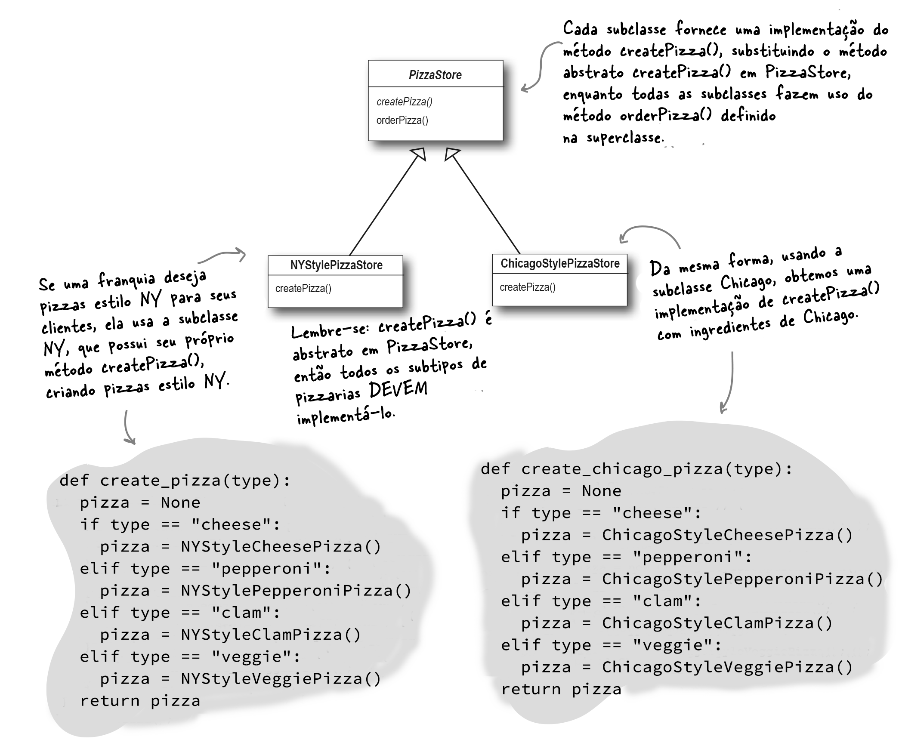

## Você esperou o suficiente. É hora de algumas pizzas!

O código da nossa `PizzaStore` com o sistema de "franchising" está aqui.

```python
from abc import ABC, abstractmethod
from typing import List


class Pizza(ABC):
    def __init__(self):
        self.name = ""
        self.dough = ""
        self.sauce = ""
        self.toppings = []

    @abstractmethod
    def prepare(self):
        pass

    def bake(self):
        print("Bake for 25 minutes at 350")

    def cut(self):
        print("Cut the pizza into diagonal slices")

    def box(self):
        print("Place pizza in official PizzaStore box")

    def get_name(self):
        return self.name

    def __str__(self):
        display = "---- " + self.name + " ----\n"
        display += self.dough + "\n"
        display += self.sauce + "\n"
        for topping in self.toppings:
            display += topping + "\n"
        return display


class PizzaStore(ABC):
    @abstractmethod
    def create_pizza(self, item):
        pass

    def order_pizza(self, type_):
        pizza = self.create_pizza(type_)
        print("--- Making a", pizza.get_name(), "---")
        pizza.prepare()
        pizza.bake()
        pizza.cut()
        pizza.box()
        return pizza


class NYStyleCheesePizza(Pizza):
    def __init__(self):
        super().__init__()
        self.name = "NY Style Sauce and Cheese Pizza"
        self.dough = "Thin Crust Dough"
        self.sauce = "Marinara Sauce"
        self.toppings.extend(["Grated Reggiano Cheese"])

    def prepare(self):
        print("Preparing NY style cheese pizza")


class NYStyleClamPizza(Pizza):
    def __init__(self):
        super().__init__()
        self.name = "NY Style Clam Pizza"
        self.dough = "Thin Crust Dough"
        self.sauce = "Marinara Sauce"
        self.toppings.extend(["Grated Reggiano Cheese", "Fresh Clams from Long Island Sound"])

    def prepare(self):
        print("Preparing NY style clam pizza")


class NYStylePepperoniPizza(Pizza):
    def __init__(self):
        super().__init__()
        self.name = "NY Style Pepperoni Pizza"
        self.dough = "Thin Crust Dough"
        self.sauce = "Marinara Sauce"
        self.toppings.extend(["Grated Reggiano Cheese", "Sliced Pepperoni", "Garlic", "Onion", "Mushrooms", "Red Pepper"])

    def prepare(self):
        print("Preparing NY style pepperoni pizza")


class NYStyleVeggiePizza(Pizza):
    def __init__(self):
        super().__init__()
        self.name = "NY Style Veggie Pizza"
        self.dough = "Thin Crust Dough"
        self.sauce = "Marinara Sauce"
        self.toppings.extend(["Grated Reggiano Cheese", "Garlic", "Onion", "Mushrooms", "Red Pepper"])

    def prepare(self):
        print("Preparing NY style veggie pizza")


class NYPizzaStore(PizzaStore):
    def create_pizza(self, item):
        if item == "cheese":
            return NYStyleCheesePizza()
        elif item == "veggie":
            return NYStyleVeggiePizza()
        elif item == "clam":
            return NYStyleClamPizza()
        elif item == "pepperoni":
            return NYStylePepperoniPizza()
        else:
            return None


class ChicagoStyleCheesePizza(Pizza):
    def __init__(self):
        super().__init__()
        self.name = "Chicago Style Deep Dish Cheese Pizza"
        self.dough = "Extra Thick Crust Dough"
        self.sauce = "Plum Tomato Sauce"
        self.toppings.extend(["Shredded Mozzarella Cheese"])

    def prepare(self):
        print("Preparing Chicago style cheese pizza")
        print("Adding deep-dish dough, plum tomato sauce, and shredded mozzarella cheese")


class ChicagoStyleClamPizza(Pizza):
    def __init__(self):
        super().__init__()
        self.name = "Chicago Style Clam Pizza"
        self.dough = "Extra Thick Crust Dough"
        self.sauce = "Plum Tomato Sauce"
        self.toppings.extend(["Shredded Mozzarella Cheese", "Frozen Clams from Chesapeake Bay"])

    def prepare(self):
        print("Preparing Chicago style clam pizza")
        print("Adding deep-dish dough, plum tomato sauce, shredded mozzarella cheese, and frozen clams")


class ChicagoStylePepperoniPizza(Pizza):
    def __init__(self):
        super().__init__()
        self.name = "Chicago Style Pepperoni Pizza"
        self.dough = "Extra Thick Crust Dough"
        self.sauce = "Plum Tomato Sauce"
        self.toppings.extend(["Shredded Mozzarella Cheese", "Black Olives", "Spinach", "Eggplant", "Sliced Pepperoni"])

    def prepare(self):
        print("Preparing Chicago style pepperoni pizza")
        print("Adding deep-dish dough, plum tomato sauce, shredded mozzarella cheese, black olives, spinach, eggplant, and sliced pepperoni")


class ChicagoStyleVeggiePizza(Pizza):
    def __init__(self):
        super().__init__()
        self.name = "Chicago Deep Dish Veggie Pizza"
        self.dough = "Extra Thick Crust Dough"
        self.sauce = "Plum Tomato Sauce"
        self.toppings.extend(["Shredded Mozzarella Cheese", "Black Olives", "Spinach", "Eggplant"])

    def prepare(self):
        print("Preparing Chicago style veggie pizza")
        print("Adding deep-dish dough, plum tomato sauce, shredded mozzarella cheese, black olives, spinach, and eggplant")


class ChicagoPizzaStore(PizzaStore):
    def create_pizza(self, item):
        if item == "cheese":
            return ChicagoStyleCheesePizza()
        elif item == "veggie":
            return ChicagoStyleVeggiePizza()
        elif item == "clam":
            return ChicagoStyleClamPizza()
        elif item == "pepperoni":
            return ChicagoStylePepperoniPizza()
        else:
            return None


# Ambas as pizzas são preparadas, 
# as coberturas são adicionadas e as pizzas são assadas, cortadas e embaladas. 
# Nossa superclasse nunca precisou conhecer os detalhes; 
# a subclasse cuidou de tudo isso apenas instanciando a pizza certa.
class PizzaTestDrive:
    def main(self):
        ny_store = NYPizzaStore()
        chicago_store = ChicagoPizzaStore()

        pizza = ny_store.order_pizza("cheese")
        print("Ethan ordered a", pizza.get_name(), "\n")

        pizza = chicago_store.order_pizza("cheese")
        print("Joel ordered a", pizza.get_name(), "\n")

        pizza = ny_store.order_pizza("clam")
        print("Ethan ordered a", pizza.get_name(), "\n")

        pizza = chicago_store.order_pizza("clam")
        print("Joel ordered a", pizza.get_name(), "\n")

        pizza = ny_store.order_pizza("pepperoni")
        print("Ethan ordered a", pizza.get_name(), "\n")

        pizza = chicago_store.order_pizza("pepperoni")
        print("Joel ordered a", pizza.get_name(), "\n")

        pizza = ny_store.order_pizza("veggie")
        print("Ethan ordered a", pizza.get_name(), "\n")

        pizza = chicago_store.order_pizza("veggie")
        print("Joel ordered a", pizza.get_name(), "\n")


if __name__ == "__main__":
    PizzaTestDrive().main()
```
---

## Finalmente chegou a hora de conhecer o `Factory Method Pattern`

Todos os padrões de fábrica encapsulam a criação de objetos. O `Factory Method Pattern` encapsula a criação de objetos, permitindo que as subclasses decidam quais objetos criar. Observe os diagramas de classes abaixo para ver quem são os participantes deste padrão.

#### Classes de Criação (Creator Classes)

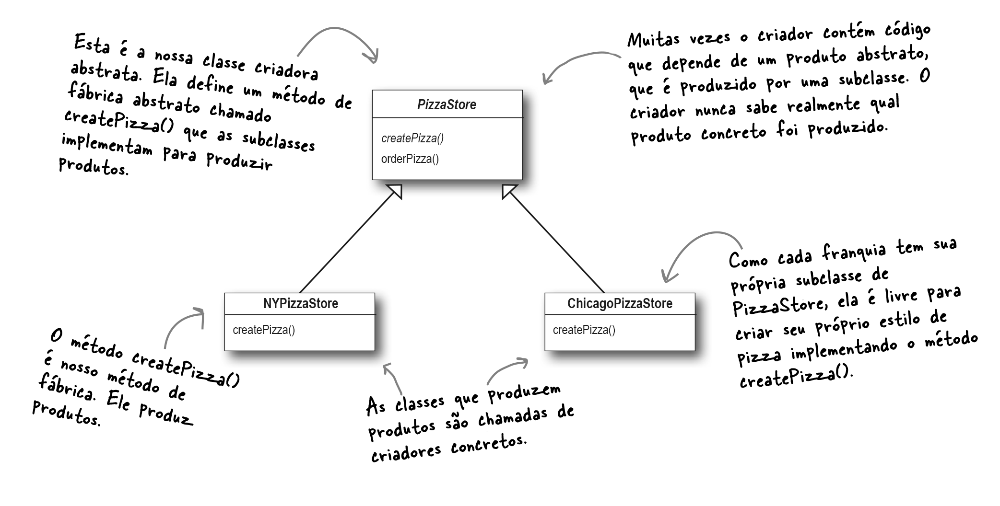

---
#### Classes de Produto (Product Classes)

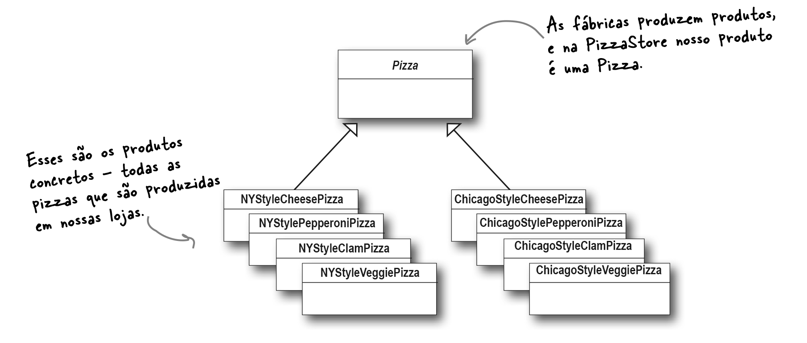

---

## Visualizando os Criadores e Produtos em paralelo

Para cada Criador concreto, normalmente existe todo um conjunto de produtos que ele cria. Os criadores de pizza de Chicago criam diferentes tipos de pizza no estilo de Chicago, os criadores de pizza de Nova York criam diferentes tipos de pizza no estilo de Nova York e assim por diante. Na verdade, podemos ver nossos conjuntos de classes `Creator` e suas classes `Product` correspondentes como _hierarquias paralelas_.

Observe a figura que mostra as duas hierarquias de classes paralelas e como elas se relacionam.

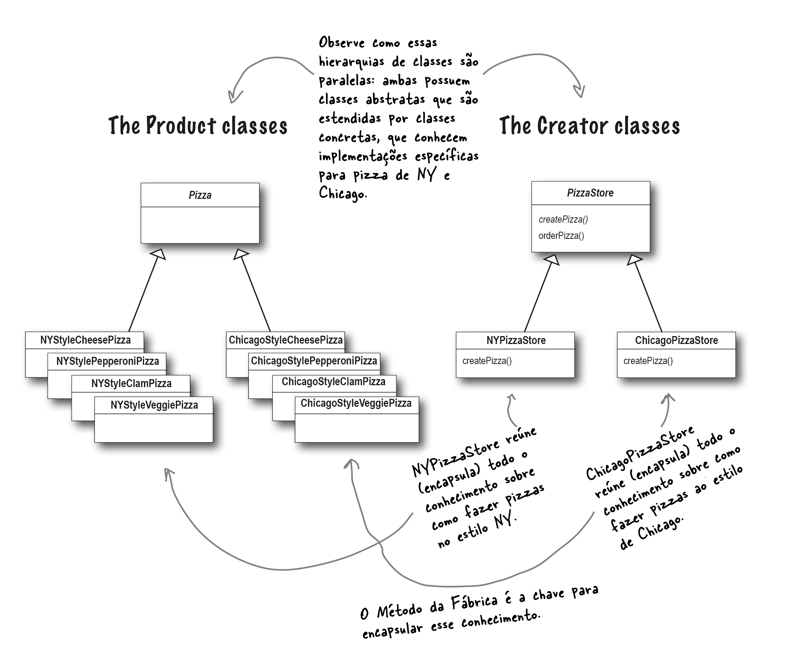


## Um pouco de formalidade...

É hora de lançar a definição oficial do `Factory Method Pattern`:

> **O `Factory Method Pattern` define uma interface para criar um objeto, mas permite que as subclasses decidam qual classe instanciar. Ele permite que uma classe adie a instanciação para subclasses.**
> 
> **Ver figura abaixo.**

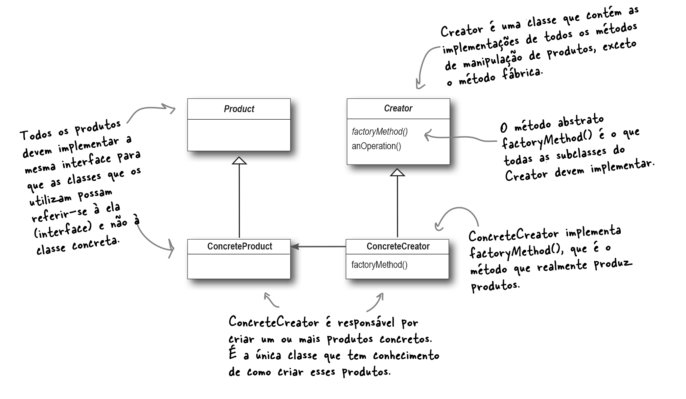

> Como acontece com toda fábrica, o `Factory Method Pattern` nos dá uma maneira de encapsular as instanciações de tipos concretos. Observando o diagrama de classes acima, você pode ver que a classe abstrata `Creator` fornece uma interface com um método para criar objetos, também conhecido como “**método da fábrica**”. Quaisquer outros métodos implementados no `Creator` abstrato são escritos para operar em produtos produzidos por esse **método da fábrica**. Somente as subclasses realmente o implementam e criam produtos.
> 
> Como na definição oficial, você frequentemente ouvirá os desenvolvedores dizerem: “o padrão `Factory Method` permite que as subclasses decidam qual classe instanciar”. Como a classe `Creator` é escrita sem o conhecimento dos produtos reais que serão criados, dizemos “decidir” não porque o padrão permite que as próprias subclasses decidam, mas sim porque a decisão na verdade se resume a qual subclasse será usada para criar o produto.

---

### Caso não tivéssemos uma `Factory` ("Fábrica") ...

Vamos fingir que você nunca ouviu falar de uma fábrica OO. Aqui está uma versão “muito dependente” da `PizzaStore` que não usa fábrica. Precisamos que você faça uma contagem do número de classes concretas de pizza das quais esta classe depende. Se você adicionasse pizzas ao estilo californiano a esta `PizzaStore`, de quantas classes ela dependeria? Observe o código abaixo.

```python
class DependentPizzaStore:
    def createPizza(self, style, type):
        pizza = None
        
        if style == "NY":
            if type == "cheese":
                pizza = NYStyleCheesePizza()
            elif type == "veggie":
                pizza = NYStyleVeggiePizza()
            elif type == "clam":
                pizza = NYStyleClamPizza()
            elif type == "pepperoni":
                pizza = NYStylePepperoniPizza()
        elif style == "Chicago":
            if type == "cheese":
                pizza = ChicagoStyleCheesePizza()
            elif type == "veggie":
                pizza = ChicagoStyleVeggiePizza()
            elif type == "clam":
                pizza = ChicagoStyleClamPizza()
            elif type == "pepperoni":
                pizza = ChicagoStylePepperoniPizza()
        else:
            print("Error: invalid type of pizza")
            return None
        
        pizza.prepare()
        pizza.bake()
        pizza.cut()
        pizza.box()
        
        return pizza
```

## Olhando para as dependências dos objetos

Ao instanciar diretamente um objeto, você depende de sua classe concreta. Dê uma olhada em nossa PizzaStore muito dependente, uma página atrás. Ele cria todos os objetos pizza diretamente na classe `PizzaStore`, em vez de delegar a uma fábrica.

Se desenharmos um diagrama representando essa versão da `PizzaStore` e todos os objetos dos quais ela depende, ele ficará assim.

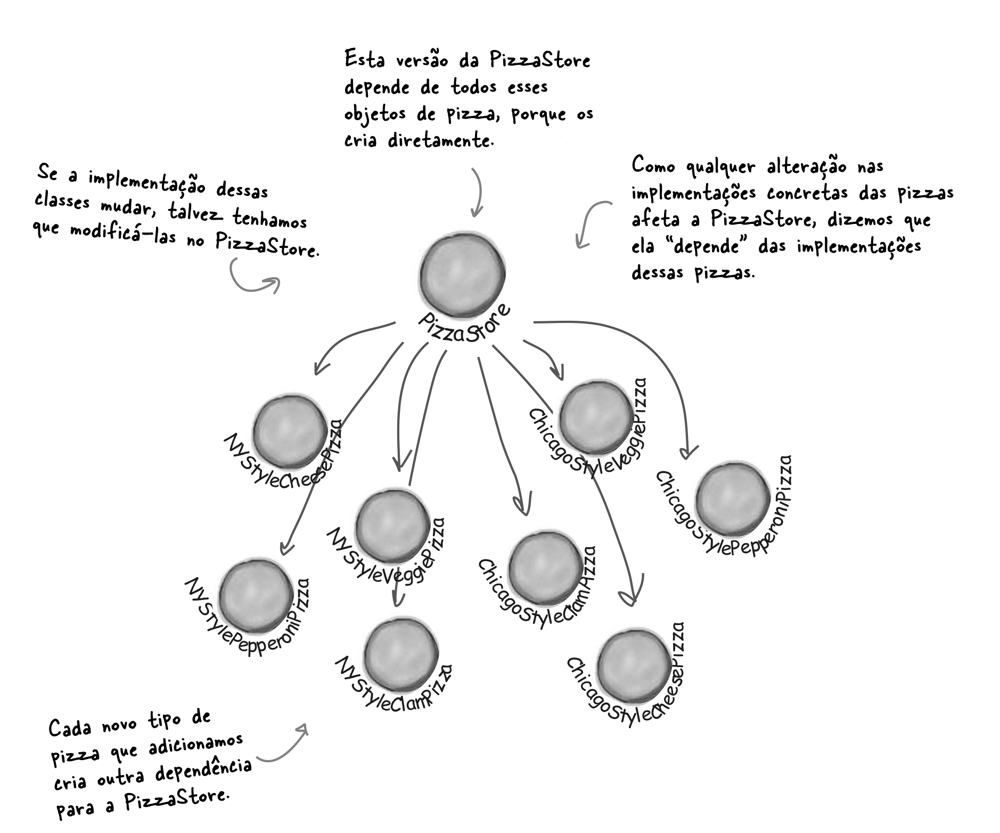

---

## O Princípio da Inversão de Dependência

Deve ficar bem claro que reduzir dependências a classes concretas em nosso código é uma “coisa boa”. Na verdade, temos um princípio de design OO que formaliza essa noção. Ele ainda tem um nome grande e formal: **Princípio da Inversão de Dependência**.
Aqui está o princípio geral.

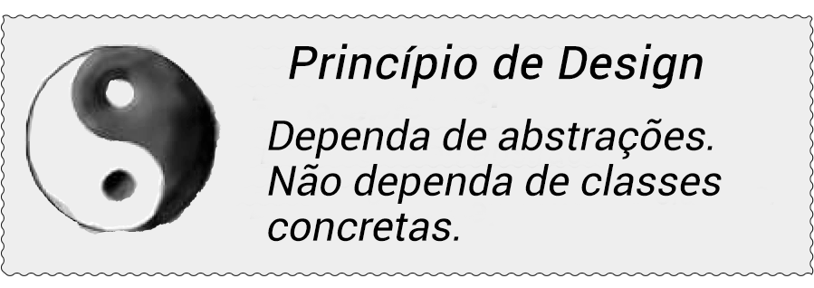

À primeira vista, esse princípio parece muito com “**Programe para uma interface, não para uma implementação**”, certo? 

É semelhante. Entretanto, o **Princípio da Inversão de Dependência** faz uma afirmação ainda mais forte sobre a abstração. Sugere que os nossos componentes de alto nível não devem depender dos nossos componentes de baixo nível; em vez disso, ambos deveriam depender de abstrações.

> Observação: Um componente de “alto nível” é uma classe com comportamento definido em termos de outros componentes de “baixo nível”.
> Por exemplo, `PizzaStore` é um componente de alto nível porque
seu comportamento é definido em termos de pizzas. Ou seja, ele cria todos os diferentes objetos de pizza e os prepara, assa, corta e embala, enquanto as pizzas que usa são componentes de baixo nível.


Mas o que isso significa?
Bem, vamos começar examinando novamente o diagrama da pizzaria na página anterior. `PizzaStore` é nosso “componente de alto nível” e as implementações de pizza são nossos “componentes de baixo nível”, e claramente `PizzaStore` depende das classes concretas de pizza.

Agora, este princípio nos diz que devemos escrever nosso código de forma que dependamos de abstrações, não de classes concretas. Isso vale tanto para nossos módulos de alto nível quanto para nossos módulos de baixo nível.

Mas como se faz isso? Vamos pensar em como aplicaríamos esse princípio à nossa implementação muito dependente da `PizzaStore`...

## Aplicando o Princípio

Agora, o principal problema com `PizzaStore` muito dependente é que ela depende de cada tipo de pizza porque na verdade instancia tipos concretos em seu método `orderPizza()`.

Embora tenhamos criado uma abstração chamada `Pizza`, ainda assim estamos criando pizzas concretas neste código, portanto, não tiramos muita vantagem dessa abstração.

Surge a pergunta: como podemos obter essas instanciações do método `orderPizza()`? Bem, como sabemos, o `Factory Method Pattern` nos permite fazer exatamente isso.

Então, depois de aplicarmos este padrão, nosso diagrama fica de acordo com a figura abaixo.

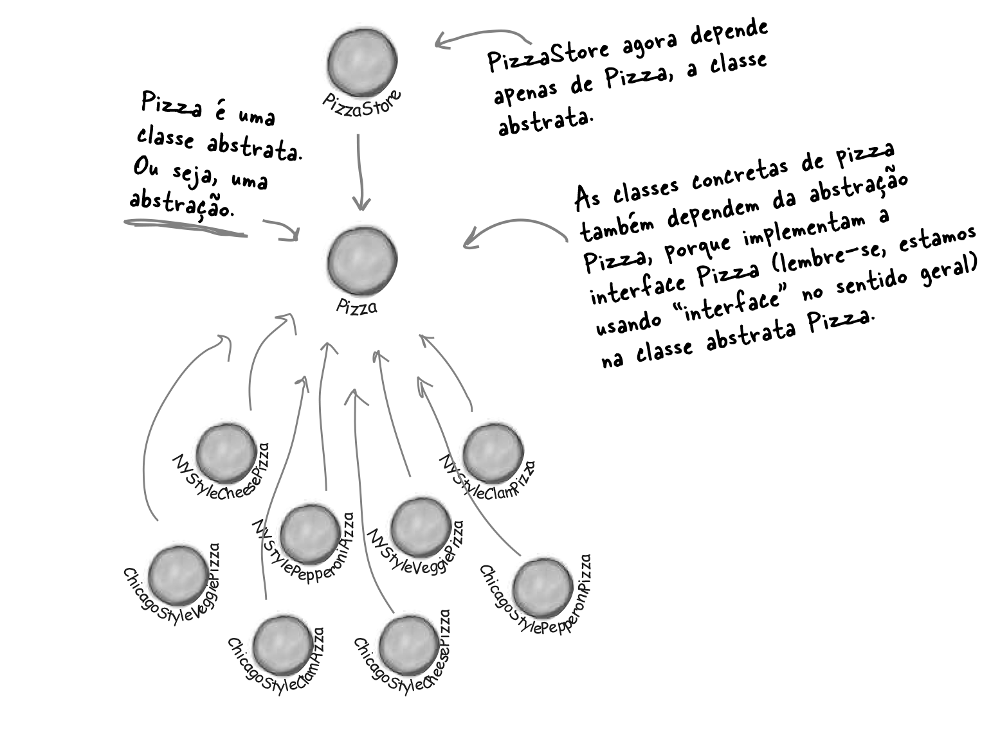

> Depois de aplicar o `Factory Method`, observe que nosso componente de alto nível, a `PizzaStore`, e nossos componentes de baixo nível, as pizzas, dependem de "abstração" `Pizza`. 
> 
> O Método da Fábrica não é a única técnica para aderir ao **Princípio da Inversão de Dependência**, mas é uma das mais poderosas. Veremos isto mais adiante.


> A “**inversão**” no nome **Princípio de Inversão de Dependência** existe porque inverte a maneira como você normalmente pensa sobre seu design OO. 

> Observe o diagrama apresentado acima (Aplicando o Princípio). 

> Os componentes de baixo nível agora dependem de uma abstração de nível superior. Da mesma forma, o componente de alto nível também está vinculado à mesma abstração. 

> Para esclarecer melhor, vamos examinar o pensamento por trás do processo de design típico e ver como a introdução do princípio pode inverter a maneira como pensamos sobre o design...

## Invertendo seu Pensamento...

Vamos analisar o **Princípio da Inversão**

* Você precisa implementar uma Pizzaria. Qual é o primeiro pensamento que vem à sua cabeça?


* Certo, você começa no topo e segue até as classes concretas. Mas, como você viu, você não quer que sua pizzaria saiba sobre os tipos concretos de pizza, porque então ela dependerá de todas essas classes concretas! Agora vamos “inverter” o seu pensamento...em vez de começar do topo, comece pelas Pizzas e pense no que você pode abstrair.


* Certo! Você está pensando na abstração `Pizza`. Então agora volte e pense novamente no design da Pizzaria.


* Quase. Mas para fazer isso você terá que contar com uma fábrica para obter essas classes concretas de sua pizzaria. Depois de fazer isso, seus diferentes tipos concretos de pizza dependem apenas de uma abstração, assim como sua loja. Pegamos um design onde a loja dependia de classes concretas e invertemos essas dependências (junto com o seu pensamento).

### Algumas dicas para seguir o Princípio...

As diretrizes a seguir podem ajudá-lo a evitar designs OO que violem o **Princípio de Inversão de Dependência**:

1. Nenhuma variável deve conter uma referência a uma classe concreta.
	* 	Se você criar um objeto, estará mantendo uma referência a uma classe concreta. Use uma fábrica (`Factory`) para contornar isso!
2. Nenhuma classe deve derivar de uma classe concreta.
	* Se você deriva de uma classe concreta, você depende de uma classe concreta. Derive de uma abstração, como uma interface ou uma classe abstrata.

3. Nenhum método deve substituir um método implementado de qualquer uma de suas classes base.
	* Se você substituir um método implementado, então sua classe base não será realmente uma abstração para começar. Esses métodos implementados na classe base devem ser compartilhados por todas as suas subclasses.

> **Observação: os itens acima formam diretrizes que você deve se esforçar para usá-las em vez de uma regra que deve seguir o tempo todo.**

---
---

## Um pouco de formalidade (novamente) ...

## Padrão Factory Method (107)

### Objetivo
Define uma interface para criar um objeto, mas deixa as subclasses decidirem qual classe instanciar. O `Factory Method` permite que uma classe adie a instanciação para subclasses.

Em outras palavras, é um padrão criacional de projeto que fornece uma interface para criar objetos em uma superclasse, mas permite que as essas subclasses alterem o tipo de objetos que serão criados.

### Características

* **Desacoplamento**:
O padrão promove o desacoplamento entre o código cliente que solicita um objeto e a classe concreta que o cria. O cliente usa apenas a interface ou a classe abstrata do `Factory`, sem se preocupar com a implementação concreta.

* **Flexibilidade**:
Permite que você adicione novas classes de produtos (objetos) sem modificar o código existente. Basta criar uma nova classe de fábrica que implemente a interface ou herde da classe abstrata existente.

* **Encapsulamento**:
O código de criação de objetos é encapsulado em classes de fábrica dedicadas, tornando-o mais fácil de gerenciar e modificar conforme necessário.

* **Extensibilidade**:
O padrão suporta a criação de famílias de objetos relacionados. Cada família de objetos é representada por uma fábrica específica.


### Aplicações (casos de uso)

1. **Criação de Documentos em Editores de Texto:**
	* Um editor de texto pode ter um `Factory Method` para criar documentos. As subclasses desse método podem implementar diferentes tipos de documentos, como Documento de Texto, Documento HTML ou Documento PDF.

2. **Conexões de Banco de Dados:**
	* Um framework de acesso a banco de dados pode usar um `Factory Method` para criar conexões com diferentes tipos de bancos de dados, como MySQL, PostgreSQL ou SQLite. Cada uma das subclasses deste método pode lidar com a criação da conexão específica para o BD correspondente.

3. **Criação de Personagens em Jogos:**
	* Em um jogo de RPG, o `Factory Method` pode ser usado para criar personagens. Cada tipo de personagem (e.g. guerreiro, mago, arqueiro, etc.) pode ser implementado por uma subclasse, e ele decide qual tipo de personagem criar com base nas necessidades do jogo.

4. **Renderização Gráfica em Frameworks:**
	* Um framework de renderização gráfica pode usar um `Factory Method` para criar objetos gráficos, como círculos, retângulos ou polígonos. As suas subclasses podem implementar a criação de cada tipo específico de objeto.

5. **UI Widgets em Interfaces Gráficas:**
	* Em uma biblioteca de interfaces gráficas, um `Factory Method` pode ser usado para criar widgets (botões, caixas de texto, listas, etc.). Isso permite que o código cliente crie esses widgets sem se preocupar com as complexidades da criação.

6. **Criação de Carros em uma Fábrica de Automóveis:**
	* Uma fábrica de automóveis pode usar um `Factory Method` para criar diferentes modelos de carros. As suas subclasses podem lidar com a montagem de carros específicos, como Sedans, SUVs, Hatchbacks, etc.

7. **Criação de Componentes em Frameworks Web:**
	* Em um framework web, um `Factory Method` pode ser usado para criar componentes reutilizáveis, como caixas de diálogo, barras de navegação ou formulários. Isso ajuda a centralizar a lógica de criação desses componentes.

8. **Criação de Inimigos em um Jogo de Plataforma:**
	* Em um jogo de plataforma, o `Factory Method` pode ser aplicado para criar inimigos. Cada tipo de inimigo (e.g. zumbi, esqueleto, monstro) pode ser implementado por uma subclasse, permitindo que ele crie inimigos de acordo com a lógica do jogo.


### Estrutura Básica

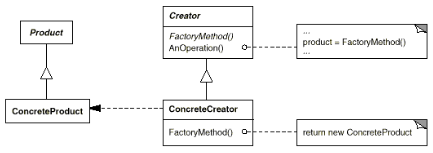

> A descrição da **Estrutura Básica** segue abaixo.
> 
> Temos o `ConcreteCreator` (Criador Concreto), que é a aplicação cliente, classe ou método que chama o `Creator` (`FactoryMethod()`).
> 
> Temos também a `Product` interface (interface Produto), é a interface que descreve os atributos e métodos que a Fábrica exigirá para criar o produto/objeto final.
> 
> E o que o ``Creator`` (Criador) faz? É classe `Factory`. Declara o `FactoryMethod()` que retornará o objeto solicitado.
> 
> E por último, temos o `ConcreteProduct` que é o objeto devolvido da Fábrica. O objeto implementa a interface `Product`.


### Participantes

* `Product`
	* Define a interface dos objetos que o método fábrica cria.

* `ConcreteProduct`
	* Implementa a interface `Product`.

* `Creator`
	* Declara o `FactoryMethod()`, que retorna um objeto do tipo `Product`. `Creator` também pode definir um implementação padrão do `FactoryMethod()` que retorna um objeto `ConcreteProduct` por default.
	*  Pode chamar o `FactoryMethod()` para criar um objeto `Product`.

* `ConcreteCreator`
	* Substitui o método fábrica para retornar uma instância de `ConcreteProduct`.


### Colaborações

* `Creator` depende de suas subclasses para definir o `FactoryMethod()` para que ele retorne uma instância do `ConcreteProduct` apropriado.


### Exemplos de Código

#### Exemplo #1: Interface de usuário onde ele pode selecionar itens em um menu, como cadeiras (extraído do livro "Design Patterns in Python de Sean Bradley").
Considere um sistema operacional de smartphone como iOS, por exemplo, onde cada "novidade" de um aplicativo é notificada para áreas específicas da interface do usuário, conforme as figuras abaixo.

O usuário teve a opção de usar algum tipo de interface de navegação e não se sabe qual escolha ou quantas opções ele fará até que o aplicativo esteja realmente em execução e o usuário comece a usá-lo.

Assim, quando o usuário seleciona a cadeira, a fábrica (`Factory`)  pega alguma propriedade envolvida com essa seleção, como um `ID`, `Tipo` ou outro atributo e então decide qual subclasse relevante instanciar para retornar o objeto apropriado.

Veja o diagrama de classes que representa o cenário descrito acima.

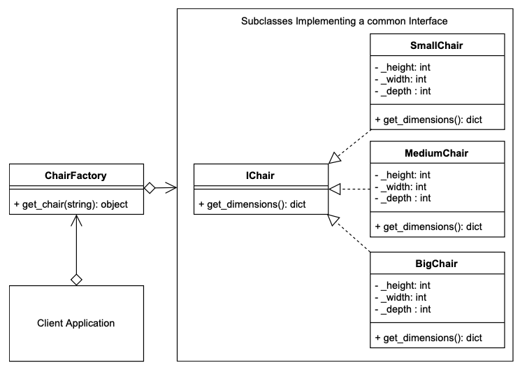

O código ficaria assim.

```python
from abc import ABC, abstractmethod

# "The Chair Interface"
class IChair(ABC):
  # The Chair Interface (Product)
  @abstractmethod
  def get_dimensions():
    # "A static interface method"
    pass


# "The Factory Class"
class ChairFactory: 
  def get_chair(self, chair):
    # "A static method to get a chair" 
    if chair == 'BigChair':
      return BigChair()
    if chair == 'MediumChair':
      return MediumChair() 
    if chair == 'SmallChair':
       return SmallChair() 
    
    return None


# "A Class of Chair"
class SmallChair(IChair):
  # "The Small Chair Concrete Class implements the IChair interface"
  def __init__(self): 
    self._height = 40 
    self._width = 40 
    self._depth = 40

  def get_dimensions(self): 
    return {"width": self._width, "depth": self._depth, "height": self._height}


#"A Class of Chair"
class MediumChair(IChair):
  # "The Medium Chair Concrete Class implements the IChair interface"
  def __init__(self): 
    self._height = 60 
    self._width = 60 
    self._depth = 60

  def get_dimensions(self): 
    return {"width": self._width, "depth": self._depth, "height": self._height}


# "A Class of Chair"
class BigChair(IChair):
  # "The Big Chair Concrete Class implements the IChair interface"
  def __init__(self): 
    self._height = 80 
    self._width = 80 
    self._depth = 80

  def get_dimensions(self): 
    return {"width": self._width, "depth": self._depth, "height": self._height}


# The Client
CHAIR = ChairFactory().get_chair("SmallChair") 
print(CHAIR.get_dimensions())
```

---

#### Exemplo #2: Jogo: crie um avião diferente usando ``Factory Method` e depois atire balas diferentes. (extraído do livro "Easy Learning Design Patterns Python 3: Reusable Object-Oriented Software de Yang Hu")


O diagrama de classes que representa o jogo está abaixo.

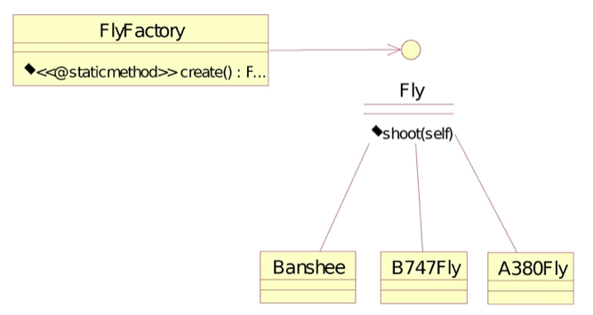

O código ficaria assim:

```python
############### Fly #################
class Fly:

  def shoot(self):
    # firing bullets 
    pass


############### Banshee #################
class Banshee(Fly):

  def shoot(self):
    print("Banshee fire the laser")


############### B747Fly #################
class B747Fly(Fly):
  def shoot(self):
    print("B747 fire the missile")


############### A380Fly #################
class A380Fly(Fly):
  def shoot(self):
    print ("A380 fire the trigeminal shot")


############### FlyFactory #################
class FlyFactory:
 
  @staticmethod
  def create(type):
    fly = None

    if (type == 1 ):
      fly = Banshee()
    elif (type == 2):
      fly = B747Fly()
    elif (type == 3):
      fly = A380Fly()
  
    return fly


############### test #################
type = int(input("Please select fly 1: Banshee 2: B747 3: A380 \n"))
fly = FlyFactory.create(type)

fly.shoot()  

```

---

#### Exemplo #3: Imagine que você precisa desenvolver um sistema para um banco que permita aos seus clientes abrir contas bancárias e obter detalhes de contas bancárias.

Digamos que inicialmente seu aplicativo deva suportar a criação de 3 tipos de contas (conta pessoal, empresarial e conta corrente) e, no futuro, poderá haver mais tipos de contas. Veja o diagrama abaixo.

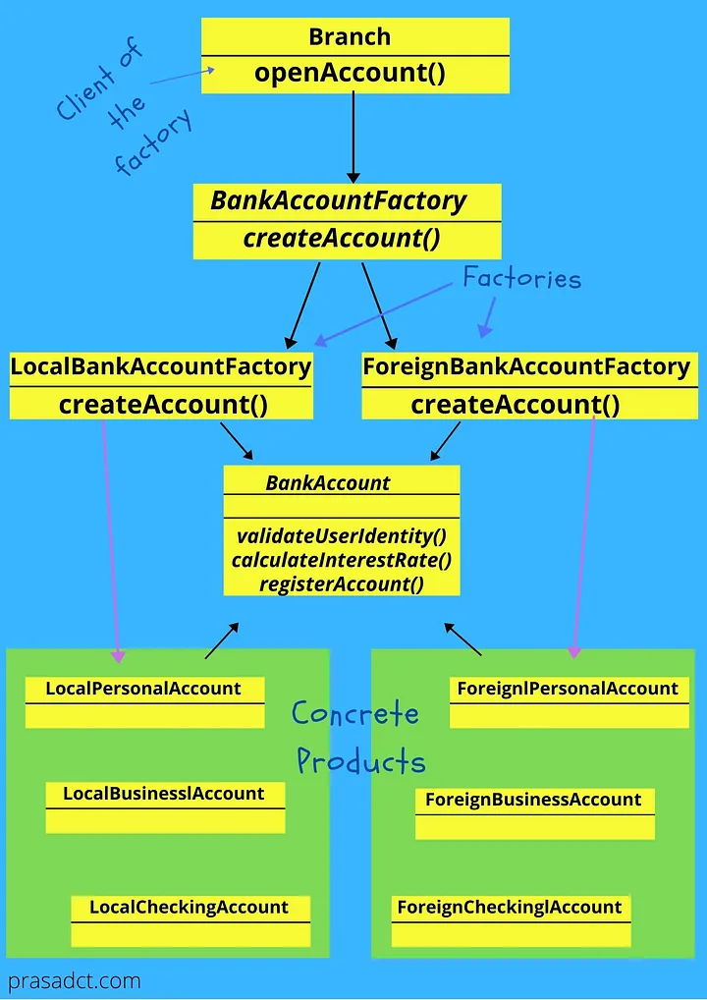

O código ficaria assim:

```python
from abc import ABC, abstractmethod

class BankAccountFactory(ABC):
    @abstractmethod
    def create_account(self, type):
        pass

class ForeignBankAccountFactory(BankAccountFactory):
    def create_account(self, type):
        bank_account = None
        if type == "P":
            bank_account = ForeignPersonalAccount()
        elif type == "B":
            bank_account = ForeignBusinessAccount()
        elif type == "C":
            bank_account = ForeignCheckingAccount()
        else:
            print("Invalid input")
        return bank_account

class LocalBankAccountFactory(BankAccountFactory):
    def create_account(self, type):
        bank_account = None
        if type == "P":
            bank_account = LocalPersonalAccount()
        elif type == "B":
            bank_account = LocalBusinessAccount()
        elif type == "C":
            bank_account = LocalCheckingAccount()
        else:
            print("Invalid input")
        return bank_account

class BankAccount(ABC):
    @abstractmethod
    def validate_user_identity(self):
        pass

    @abstractmethod
    def calculate_interest_rate(self):
        pass

    @abstractmethod
    def register_account(self):
        pass

class ForeignBusinessAccount(BankAccount):
    def __init__(self):
        self.name = "Foreign Business account"

    def validate_user_identity(self):
        print(self.name + ": Validating identity")

    def calculate_interest_rate(self):
        print(self.name + ": Calculating interest rate")

    def register_account(self):
        print(self.name + ": Registering account")

class ForeignCheckingAccount(BankAccount):
    def __init__(self):
        self.name = "Foreign Checking account"

    def validate_user_identity(self):
        print(self.name + ": Validating identity")

    def calculate_interest_rate(self):
        print(self.name + ": Calculating interest rate")

    def register_account(self):
        print(self.name + ": Registering account")

class ForeignPersonalAccount(BankAccount):
    def __init__(self):
        self.name = "Foreign Personal account"

    def validate_user_identity(self):
        print(self.name + ": Validating identity")

    def calculate_interest_rate(self):
        print(self.name + ": Calculating interest rate")

    def register_account(self):
        print(self.name + ": Registering account")

class LocalBusinessAccount(BankAccount):
    def __init__(self):
        self.name = "Local Business account"

    def validate_user_identity(self):
        print(self.name + ": Validating identity")

    def calculate_interest_rate(self):
        print(self.name + ": Calculating interest rate")

    def register_account(self):
        print(self.name + ": Registering account")

class LocalCheckingAccount(BankAccount):
    def __init__(self):
        self.name = "Local Checking account"

    def validate_user_identity(self):
        print(self.name + ": Validating identity")

    def calculate_interest_rate(self):
        print(self.name + ": Calculating interest rate")

    def register_account(self):
        print(self.name + ": Registering account")

class LocalPersonalAccount(BankAccount):
    def __init__(self):
        self.name = "Local Personal account"

    def validate_user_identity(self):
        print(self.name + ": Validating identity")

    def calculate_interest_rate(self):
        print(self.name + ": Calculating interest rate")

    def register_account(self):
        print(self.name + ": Registering account")

class Branch:
    def __init__(self, bank_account_factory):
        self.bank_account_factory = bank_account_factory

    def create_bank_account(self, type):
        bank_account = self.bank_account_factory.create_account(type)
        bank_account.validate_user_identity()
        bank_account.calculate_interest_rate()
        bank_account.register_account()
        return bank_account

class Main:
    @staticmethod
    def main():
        bank_account = None

        print("Please enter\n" +
              " P for Personal account\n" +
              " B for Business account\n" +
              " C for Checking account\n" +
              "----------------------------")

        type = input()

        print("Please enter\n" +
              " 1 for Local\n" +
              " 2 for Foreign\n" +
              "----------------------------")

        branch = int(input())

        if branch == 1:
            local_branch = Branch(LocalBankAccountFactory())
            bank_account = local_branch.create_bank_account(type)
        elif branch == 2:
            foreign_branch = Branch(ForeignBankAccountFactory())
            bank_account = foreign_branch.create_bank_account(type)

        if bank_account:
            bank_account.validate_user_identity()
            bank_account.calculate_interest_rate()
            bank_account.register_account()

if __name__ == "__main__":
    Main.main()
```
---

#### Exemplo #4: Cálculo da Conta de Luz: um exemplo real de método da Fábrica.

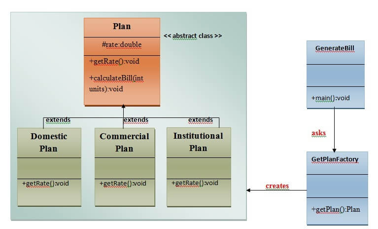

O código ficaria assim:

```python
from abc import ABC, abstractmethod

class Plan(ABC):
    def __init__(self):
        self.rate = 0.0

    @abstractmethod
    def calculate_bill(self, units):
        pass

    @abstractmethod
    def get_rate(self):
        pass

class DomesticPlan(Plan):
    def get_rate(self):
        self.rate = 3.50

    def calculate_bill(self, units):
        print(units * self.rate)

class CommercialPlan(Plan):
    def get_rate(self):
        self.rate = 7.50

    def calculate_bill(self, units):
        print(units * self.rate)

class InstitutionalPlan(Plan):
    def get_rate(self):
        self.rate = 5.50

    def calculate_bill(self, units):
        print(units * self.rate)

class GetPlanFactory:
    def get_plan(self, plan_type):
        if plan_type is None:
            return None
        if plan_type.upper() == "DOMESTICPLAN":
            return DomesticPlan()
        elif plan_type.upper() == "COMMERCIALPLAN":
            return CommercialPlan()
        elif plan_type.upper() == "INSTITUTIONALPLAN":
            return InstitutionalPlan()
        return None

class GenerateBill:
    def main(self):
        plan_factory = GetPlanFactory()

        plan_name = input("Enter the name of plan for which the bill will be generated: ")
        units = int(input("Enter the number of units for which bill will be calculated: "))

        plan = plan_factory.get_plan(plan_name)
        if plan:
            print(f"Bill amount for {plan_name} of {units} units is:", end=" ")
            plan.get_rate()
            plan.calculate_bill(units)

if __name__ == "__main__":
    bill_generator = GenerateBill()
    bill_generator.main()
```

---
