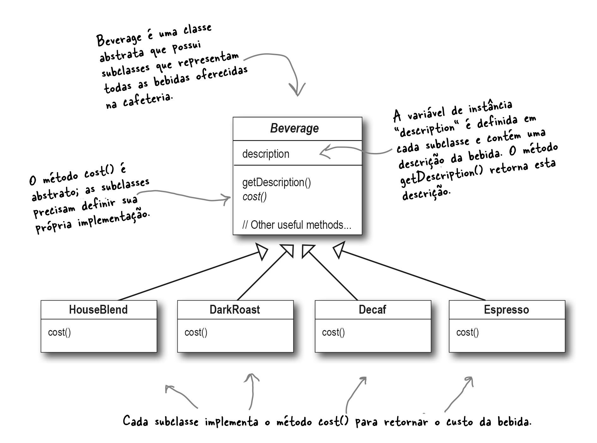
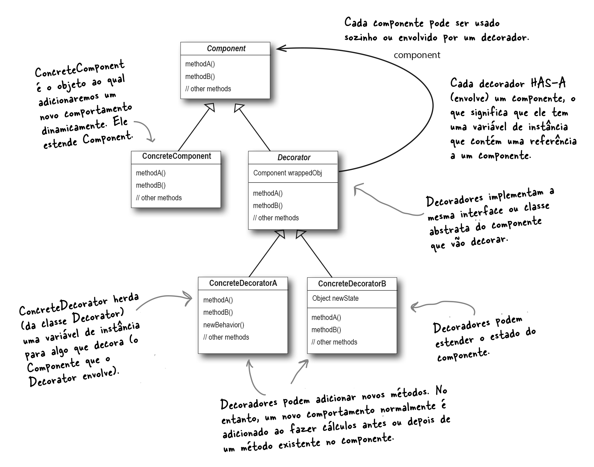

# Decorando Seus Objetos✨✨

---

> Iremos ver o caso típico do uso excessivo de herança e você aprenderá como decorar suas classes em tempo de execução usando uma forma de composição de objeto. Por que? Depois de conhecer as técnicas de _decoração_, você será capaz de atribuir novas responsabilidades aos seus objetos (ou aos de outra pessoa) sem fazer alterações de código nas classes subjacentes.
> 

---


## Bem-vindo ao StartBuzz Coffee

A **Starbuzz Coffee** tornou-se conhecida como a cafeteria de crescimento mais rápido do mercado. Se você viu um na sua esquina, olhe do outro lado da rua; você verá outro.
Como eles cresceram tão rapidamente, eles estão se esforçando para atualizar seus sistemas de pedidos para corresponder às suas ofertas de bebidas.
Quando eles entraram no negócio, eles projetaram suas classes assim (veja a figura abaixo).



> Além do café, você também pode pedir vários condimentos como leite vaporizado, soja, chocolate e rematar com leite batido. O Starbuzz cobra um pouco por cada condimento, então eles realmente precisam incorporá-los ao sistema de pedidos. Aqui está a primeira tentativa deles...


> Cada método de custo calcula o custo do café junto com os outros condimentos no pedido.


> Respondendo ao questionamento da Sue: 
> 
> OK, vamos tentar melhorar. Vamos começar com a classe base `Beverage` e adicionar **variáveis de instância** para representar se cada bebida contém ou não leite, soja, mocha e chantilly, e etc... (**veja a figura acima**).
> 
> Agora vamos adicionar as subclasses, uma para cada bebida do cardápio, como mostra a figura abaixo.


---


#### Quais requisitos ou fatores poderiam mudar e/ou afetar esse projeto?

* Mudanças de preços dos condimentos irão nos forçar a alterar o código existente

* Novos condimentos irão nos forçar a adicionar novos métodos e alterar métodos na superclasse

* E se tivermos outro tipo de bebida? 
	* Para algumas dessas bebidas (e.g. chá gelado?), os condimentos podem não ser apropriados.

* E se um cliente quiser um moca duplo?

---

## O Princípio Aberto-Fechado (Open-Closed Principle)

Os fatores e requisitos mencionados acima nos leva a mais um **Princípio de Design**, mostrado na figura abaixo.


Analisando o princípio acima, duas situações vem a mente.


> **Entre. Estamos abertos. Sinta-se à vontade para estender nossas classes com qualquer novo comportamento que desejar. Se suas necessidades ou requisitos mudarem (e elas irão mudar), vá em frente e faça suas próprias extensões.**


> **Desculpe, estamos fechados. É isso mesmo, gastamos muito tempo corrigindo esse código e deixando-o livre de bugs, então não podemos permitir que você altere o código existente. Deve permanecer fechado para modificações. Se não gostar, pode falar com o gerente.**

##### Para concluir:

**Nosso objetivo é permitir que as classes sejam facilmente estendidas para incorporar novos comportamentos sem modificar o código existente. O que ganhamos se conseguirmos isso?** 

**Teremos projetos que são resilientes a mudanças e flexíveis o suficiente para assumir novas funcionalidades para atender aos requisitos de mudança.**


### **Dúvidas**

Pergunta     | Resposta
-------------|----------
Aberto para extensão e fechado para modificação? Isso soa muito contraditório. Como um design pode ser ambos?     | Certamente soa contraditório no começo. Afinal, quanto menos modificável algo é, mais difícil é estender, certo? Pense no Padrão `Observer` que aprendemos. Adicionando novos `Observers`, podemos estender o `Subject` a qualquer momento, sem adicionar código a ele.
Ok, entendo o padrão `Observer`, mas como eu projeto algo para ser extensível, mas fechado para modificação?      | Muitos dos padrões nos fornecem designs testados pelo tempo que protegem seu código de ser modificado, fornecendo um meio de extensão.
Como posso fazer com que todas as partes do meu design sigam o **Princípio Aberto-Fechado**?     | Normalmente, você não pode. Tornar o design OO flexível e aberto à extensão sem modificar o código existente leva tempo e esforço.
Como sei quais áreas de mudança são mais importantes?  | Isso é, em parte, uma questão de experiência em projetar sistemas OO. Observar outros exemplos também ajudará você a aprender a identificar áreas de mudança em seus próprios projetos.

### Lições importantes que podem ser tiradas das dúvidas acima

1. Embora possa parecer uma contradição, existem técnicas para permitir que o código seja estendido sem modificação direta.

2. Tenha cuidado ao escolher as áreas do código que precisam ser estendidas. 

3. Aplicar o **Princípio Aberto-Fechado** **EM TODA PARTE** é um desperdício desnecessário e pode levar a um código complexo e difícil de entender.

---


---
## Conhecendo o Padrão `Decorator`

Vimos que representar nossas bebidas e condimentos com herança não funcionou muito bem. Ou se obtém uma _explosão_ de classes e designs rígidos ou adicionamos funcionalidades à classe base que não são apropriadas para algumas das subclasses.

Então, vamos fazer o seguinte: vamos começar com uma bebida e “**decorar**” esta bebida com os condimentos em tempo de execução. 

Por exemplo, se o cliente quiser um **Dark Roast** com **Mocha** e **Whip**, então:

1. Comece com um objeto `DarkRoast`.

2. Decore com um objeto `Mocha`.

3. Decore-o com um objeto `Whip`.

4. Chame o método `cost()` e confie na delegação para somar os custos do condimento.

> Mas como você “decora” um objeto e como a delegação entra nisso? Uma dica: pense nos objetos do decorador como “**invólucros**” (_wrappers_). Vamos ver como isso funciona...

___

### Construindo um pedido de bebida com decoradores (Passo a Passo)

#### Passo 1: **Começamos com nosso objeto `DarkRoast`**


---

#### Passo 2: **O cliente quer um Mocha, por isso criamos um objeto `Mocha` e o envolvemos (embrulhamos) em torno do ``DarkRoast``.**


---

#### Passo 3: **O cliente também quer Whip, então criamos um decorador Whip e colocamos Mocha dentro dele.**


---

#### Passo 4: **Agora é hora de calcular o custo para o cliente. Fazemos isso chamando o método `cost()` no decorador mais externo, que é o `Whip`, e ele vai delegar o cálculo do custo aos objetos que ele decora. Vejamos como isso funciona:**


---


## O que sabemos até agora

* Os Decoradores tem o mesmo supertipo que os objetos que eles decoram

* Você pode usar um ou mais decoradores para englobar um objeto

* Uma vez que o decorador tem o mesmo supertipo que o objeto decorado, podemos passá-lo no lugar do objeto original

* **O decorador adiciona seu próprio comportamento antes e/ou depois de delegar para o objeto que ele decora o resto do trabalho** 

* Os objetos podem ser decorados a qualquer momento, então podemos decorá-los de maneira dinâmica no tempo de execução com quantos decoradores desejarmos

---

## Um pouco de formalidade...

O *Decorator Pattern* poder ser definido assim:

> **O Padrão Decorator atribui responsabilidades adicionais a um objeto dinamicamente. Os decoradores fornecem uma alternativa flexível à subclasse para estender a funcionalidade..**
>
> Embora isso descreva o _papel_ do Padrão `Decorator`, a definição não nos dá muitas informações sobre como aplicaríamos o padrão à nossa própria implementação. Vamos dar uma olhada no diagrama de classes (figura abaixo), que é um pouco mais revelador (logo veremos a mesma estrutura aplicada ao problema da bebida). 

## Padrão `Decorator` (Diagrama de Classes)

O diagrama de classes para este padrão está representado na figura abaixo (com comentários).




### Decorando nossas bebidas

Vamos retrabalhar nossas bebidas **Starbuzz** usando o Padrão `Decorator`.

Observe o diagrama de classes para o **StarBuzz Coffee** abaixo.


> Na verdade o código abaixo dá como exemplo de uma cafeteria (i.e. _coffee shop_) com diferentes opções, como chantilly (_whip_) sendo adicionado ao produto. A adição de cada novo condimento envolve o objeto da bebida e adiciona um novo comportamento à descrição e ao preço.

#### O código para o diagrama de classes acima

```python
from abc import ABC, abstractmethod
from enum import Enum, auto


class Size(Enum):
    TALL = auto()
    GRANDE = auto()
    VENTI = auto()


class Beverage(ABC):
    """Abstract component class"""

    def __init__(self, description, cost, size=Size.TALL):
        self.description = description
        self.cost = cost
        self.size = size

    def get_description(self):
        return self.description

    def get_cost(self):
        return self.cost

    def get_size(self):
        return self.size


class HouseBlend(Beverage):
    def __init__(self, size=Size.TALL):
        super().__init__("House Blend Coffee", 0.89, size)


class DarkRoast(Beverage):
    def __init__(self, size=Size.TALL):
        super().__init__("Dark Roast Coffee", 0.99, size)


class Decaf(Beverage):
    def __init__(self, size=Size.TALL):
        super().__init__("Decaf Coffee", 1.05, size)


class Espresso(Beverage):
    def __init__(self, size=Size.TALL):
        super().__init__("Espresso Coffee", 1.99, size)


class CondimentDecorator(Beverage, ABC):
    """Abstract decorator class"""

    def __init__(self, description, cost, beverage):
        super().__init__(description, cost, beverage.size)
        self.beverage = beverage

    @abstractmethod
    def get_description(self):
        pass

    @abstractmethod
    def get_cost(self):
        pass


class SteamedMilk(CondimentDecorator):
    def __init__(self, beverage):
        super().__init__("Steamed Milk", 0.10, beverage)

    def get_description(self):
        return self.beverage.get_description() + ", " + self.description

    def get_cost(self):
        return self.beverage.get_cost() + self.cost


class Mocha(CondimentDecorator):
    def __init__(self, beverage):
        super().__init__("Mocha", 0.20, beverage)

    def get_description(self):
        return self.beverage.get_description() + ", " + self.description

    def get_cost(self):
        return self.beverage.get_cost() + self.cost


class Soy(CondimentDecorator):
    def __init__(self, beverage):
        super().__init__("Soy", 0.15, beverage)

    def get_description(self):
        return self.beverage.get_description() + ", " + self.description

    def get_cost(self):
        if self.beverage.get_size() == Size.TALL:
            self.cost = 0.10
        elif self.beverage.get_size() == Size.GRANDE:
            self.cost = 0.15
        else:
            self.cost = 0.20

        return self.beverage.get_cost() + self.cost


class Whip(CondimentDecorator):
    def __init__(self, beverage):
        super().__init__("Whip", 0.10, beverage)

    def get_description(self):
        return self.beverage.get_description() + ", " + self.description

    def get_cost(self):
        return self.beverage.get_cost() + self.cost


# Aqui está um código de teste para fazer pedidos
if __name__ == "__main__":
    # simple espresso (no decorators)
    # Order up a simple espresso with no condiments
    beverage = Espresso()
    #print(beverage.get_description(), f"${beverage.get_cost():.2f}")
    print("\nFinal order: " + beverage.get_description())
    print("Total cost: $" + f"{beverage.get_cost():.2f}")

    # double mocha dark roast with whip
    beverage2 = DarkRoast()
    beverage2 = Mocha(beverage2)
    beverage2 = Mocha(beverage2)
    beverage2 = Whip(beverage2)
    #print(beverage2.get_description(), f"${beverage2.get_cost():.2f}")
    print("\nFinal order: " + beverage2.get_description())
    print("Total cost: $" + f"{beverage2.get_cost():.2f}")

    # soy mocha house blend with whip
    beverage3 = HouseBlend()
    beverage3 = Soy(beverage3)
    beverage3 = Mocha(beverage3)
    beverage3 = Whip(beverage3)
    #print(beverage3.get_description(), f"${beverage3.get_cost():.2f}")
    print("\nFinal order: " + beverage3.get_description())
    print("Total cost: $" + f"{beverage3.get_cost():.2f}")

    # double mocha house blend soy latte with whip
    beverage4 = HouseBlend()
    beverage4 = Mocha(beverage4)
    beverage4 = Mocha(beverage4)
    beverage4 = Soy(beverage4)
    beverage4 = Whip(beverage4)
    #print(beverage4.get_description(), f"${beverage4.get_cost():.2f}")
    print("\nFinal order: " + beverage4.get_description())
    print("Total cost: $" + f"{beverage4.get_cost():.2f}")
```

---

## Mais um pouco de formalidade...

## Padrão `Decorator` (175)

### Objetivo
Anexar (ou acoplar) responsabilidades adicionais a um objeto dinamicamente. Ele fornece uma alternativa flexível à subclasse para estender a funcionalidade. Em outras palavras, ele permite que você acople novos comportamentos para objetos ao colocá-los dentro de invólucros (_wrappers_) de objetos que contém os comportamentos.

### Características

1. **Separação de Responsabilidades:** O padrão `Decorator` segue o princípio da "**Open-Closed Principle**", que diz que as classes devem estar abertas para extensão, mas fechadas para modificação. Ele permite a adição de novos comportamentos sem alterar o código existente.

2. **Composição:** O padrão utiliza a composição em vez da herança para adicionar funcionalidades aos objetos. Isso reduz a complexidade e evita a criação de uma hierarquia de classes excessivamente profunda.

3. **Empilhamento de Decoradores:** Uma das características mais poderosas desse padrão é a possibilidade de empilhar vários decoradores uns sobre os outros para criar combinações complexas de comportamentos. Isso é possível porque todos os decoradores compartilham a mesma interface base.

4. **Flexibilidade:** A capacidade de adicionar ou remover decoradores em tempo de execução proporciona flexibilidade na construção de objetos com comportamentos personalizados sob demanda.

Em resumo, o padrão de projeto `Decorator` é uma abordagem eficaz para estender a funcionalidade de objetos de maneira flexível e modular, mantendo a coesão e evitando a criação de uma hierarquia de classes complicada. Ele promove a reutilização de código e facilita a adição de novas funcionalidades sem alterar o código existente.


### Aplicações (casos de uso)

1. **Manipulação de Fluxos de Dados:** Uma aplicação comum do padrão `Decorator` é em sistemas que envolvem a leitura e escrita de fluxos de dados, como arquivos ou sockets. O padrão permite adicionar funcionalidades como compressão, criptografia ou buffering aos fluxos de dados sem afetar a estrutura fundamental do sistema.

2. **Renderização de Interface Gráfica:** Em ambientes gráficos, o padrão `Decorator` pode ser usado para adicionar elementos gráficos adicionais a componentes de interface básicos. Isso é útil quando você deseja adicionar bordas, sombras, animações ou outros efeitos visuais a elementos de interface existentes.

3. **Criação de Relatórios Customizados:** No contexto de geração de relatórios, ele pode ser aplicado para adicionar informações adicionais aos relatórios básicos, como cabeçalhos, rodapés, gráficos, tabelas e formatação personalizada, sem precisar criar inúmeras classes de relatórios diferentes.

4. **Camadas de Autenticação e Autorização:** Em sistemas de autenticação e autorização, o padrão pode ser usado para adicionar camadas adicionais de verificações de segurança, como autenticação de dois fatores, controle de acesso baseado em funções (RBAC) e restrições de acesso, sem alterar a lógica subjacente de autenticação.

5. **Composição de Texto e Formatação:** No processamento de texto, o padrão `Decorator` pode ser aplicado para adicionar formatação adicional a um texto básico, como adicionar negrito, itálico, hiperlinks, estilos de fonte e outras formatações sem modificar o conteúdo original.

6. **Cache com Decoradores:** Em sistemas que envolvem acesso a dados remotos, como Bancos de Dados ou APIs, o padrão pode ser usado para implementar uma camada de cache. Dessa forma, os resultados de consultas frequentes podem ser armazenados em cache e reutilizados, economizando tempo e recursos.

7. **Logging e Monitoramento:** `Decorator` pode ser aplicado para adicionar funcionalidades de logging e monitoramento a componentes existentes. Isso é útil para rastrear a execução do código, depurar problemas e coletar métricas sem modificar o comportamento principal do sistema.

Sua flexibilidade e capacidade de adicionar responsabilidades de forma dinâmica fazem dele uma ferramenta valiosa para projetar sistemas modulares e extensíveis.


### Estrutura Básica


> A descrição da **Estrutura Básica** segue abaixo.
> 
> 
- A interface `Component` define os métodos que serão implementados pelo objeto que será decorado e pelos decoradores. No exemplo, a interface `Component` tem um método `operation()`.
- A classe concreta `ConcreteComponent` implementa a interface `Component` e representa o objeto que será decorado. No exemplo, a classe `ConcreteComponent` implementa o método `operation()` de forma simples.
- A classe abstrata `Decorator` implementa a interface `Component` e tem uma referência para um objeto da interface `Component`. A classe `Decorator` serve como uma superclasse para os decoradores concretos e delega a execução do método `operation()` para o objeto referenciado.
- As classes concretas `ConcreteDecoratorA` e `ConcreteDecoratorB` são subclasses da classe `Decorator` e representam os decoradores concretos que irão adicionar novos comportamentos ao objeto decorado. No exemplo, as classes `ConcreteDecoratorA` e `ConcreteDecoratorB` têm atributos adicionais `addedState` e `addedBehavior`, respectivamente, e implementam o método `operation()` adicionando alguma funcionalidade extra ao objeto referenciado.


### Participantes

* **Component** 
	* Define a interface para objetos que podem ter responsabilidades adicionadas a eles dinamicamente.
	
* **ConcreteComponent** 
	* Define um objeto ao qual podem ser anexadas responsabilidades adicionais.

* **Decorator** 
	* Mantém uma referência a um objeto `Component` e define uma interface que está de acordo com a interface do `Componente`.	
* **ConcreteDecorator** 
	* Adiciona responsabilidades ao componente.

	
### Colaborações

* `Decorator` encaminha as solicitações para seu objeto `Component`. Ele pode, opcionalmente, realizar operações adicionais antes e depois de encaminhar a solicitação.


### Exemplos de Código

#### Exemplo #1: Aplicativo para comprimir e encriptar arquivos. (extraído do livro "Dive Into Design Patterns de Alexander Shvets")


Aqui o Padrão `Decorator` permite comprimir e encriptar dados sensíveis independentemente do código que verdadeiramente usa esses dados.


O código ficaria assim.

```python
#Padrão Decorator lhe permite comprimir e encriptar dados sensíveis 
#independentemente do código que verdadeiramente usa esses dados.
from abc import ABC, abstractmethod

# A interface componente define operações que podem ser
# alteradas por decoradores.
class DataSource(ABC):
    @abstractmethod
    def writeData(self, data):
        pass

    @abstractmethod
    def readData(self):
        pass

# Componentes concretos fornecem uma implementação padrão para
# as operações. Pode haver diversas variações dessas classes em
# um programa.
class FileDataSource(DataSource):
    def __init__(self, filename):
        self.filename = filename

    def writeData(self, data):
        with open(self.filename, 'w') as file:
            file.write(data)

    def readData(self):
        with open(self.filename, 'r') as file:
            return file.read()

# A classe decorador base segue a mesma interface que os outros
# componentes. O propósito primário dessa classe é definir a
# interface que envolve todos os decoradores concretos. A
# implementação padrão do código de envolvimento pode também
# incluir um campo para armazenar um componente envolvido e os
# meios para inicializá-lo.
class DataSourceDecorator(DataSource):
    def __init__(self, source):
        self.wrappee = source

    # O decorador base simplesmente delega todo o trabalho para
    # a o componente envolvido. Comportamentos extra podem ser
    # adicionados em decoradores concretos.
    def writeData(self, data):
        self.wrappee.writeData(data)

    # Decoradores concretos podem chamar a implementação pai da
    # operação ao invés de chamar o objeto envolvido
    # diretamente. Essa abordagem simplifica a extensão de
    # classes decorador.
    def readData(self):
        return self.wrappee.readData()

# Decoradores concretos devem chamar métodos no objeto
# envolvido, mas podem adicionar algo próprio para o resultado.
# Os decoradores podem executar o comportamento adicional tanto
# antes como depois da chamada ao objeto envolvido.
class EncryptionDecorator(DataSourceDecorator):
    def writeData(self, data):
        encrypted_data = self.encrypt(data)
        self.wrappee.writeData(encrypted_data)

    def readData(self):
        encrypted_data = self.wrappee.readData()
        return self.decrypt(encrypted_data)

    def encrypt(self, data):
        # Implemente a lógica de encriptação aqui
        pass

    def decrypt(self, data):
        # Implemente a lógica de decriptação aqui
        pass

# Você pode envolver objetos em diversas camadas de
# decoradores.
class CompressionDecorator(DataSourceDecorator):
    def writeData(self, data):
        compressed_data = self.compress(data)
        self.wrappee.writeData(compressed_data)

    def readData(self):
        compressed_data = self.wrappee.readData()
        return self.decompress(compressed_data)

    def compress(self, data):
        # Implemente a lógica de compressão aqui
        pass

    def decompress(self, data):
        # Implemente a lógica de descompressão aqui
        pass

# Um exemplo simples de uma montagem decorador.
class Application:
    def dumbUsageExample(self):
        source = FileDataSource("somefile.dat")
        source.writeData("Sample data")
        print(source.readData())  # Output: Sample data

        source = CompressionDecorator(source)
        source.writeData("Compressed data")
        print(source.readData())  # Output: Compressed data

        source = EncryptionDecorator(source)
        source.writeData("Encrypted data")
        print(source.readData())  # Output: Encrypted data

if __name__ == "__main__":
    app = Application()
    app.dumbUsageExample()

```

---

#### Exemplo #2: Decoradores fornecem uma alternativa flexível para subclassificação a fim de estender a funcionalidade”. (extraído do livro "Easy Learning Design Patterns Python 3: Reusable Object-Oriented Software de Yang Hu")


O código ficaria assim:

```python
from abc import ABC, abstractmethod

############### Person #################
class Person(ABC):
    @abstractmethod
    def show(self):
        pass

############### Man #################
class Man(Person):
    def show(self):
        print("I am a man")

############### Decorator #################
class Decorator(Person):
    _person = None
    
    def __init__(self, person):
        self._person = person

############### ManagerDecorator #################
class ManagerDecorator(Decorator):
    def show(self):
        self._person.show()
        print("I am still a manager")

############### ActorDecorator #################
class ActorDecorator(Decorator):
    def show(self):
        self._person.show()
        print("I am still an international actor.")

############### teste #################
person = Man()
person.show()
print("------------------------------------")

person = ManagerDecorator(person)
person.show()
print("------------------------------------")

person = ActorDecorator(person)
person.show()
```

---

#### Exemplo #3: Em um voo, ao reservar um assento na cabine principal, você pode escolher facilidades como Wi-Fi, TV ao vivo, fones de ouvido etc. Ao final, você deve mostrar o preço do assento após incluir o preço individual de cada facilidade que o usuário escolheu.


O código ficaria assim:

```python
from abc import ABC, abstractmethod

class FlightSeat(ABC):
    @abstractmethod
    def get_facilities(self):
        pass
    
    @abstractmethod
    def get_cost(self):
        pass

class FlightSeatDecorator(FlightSeat):
    def __init__(self, flight_seat):
        self._flight_seat = flight_seat
    
    @abstractmethod
    def get_facilities(self):
        pass
    
    @abstractmethod
    def get_cost(self):
        pass

class HeadPhone(FlightSeatDecorator):
    def get_facilities(self):
        return self._flight_seat.get_facilities() + "\nHead Phones"
    
    def get_cost(self):
        return self._flight_seat.get_cost() + 7.0

class LiveTV(FlightSeatDecorator):
    def get_facilities(self):
        return self._flight_seat.get_facilities() + "\nLive TV"
    
    def get_cost(self):
        return self._flight_seat.get_cost() + 5.0

class WiFi(FlightSeatDecorator):
    def get_facilities(self):
        return self._flight_seat.get_facilities() + "\nWiFi"
    
    def get_cost(self):
        return self._flight_seat.get_cost() + 10.0

class MainCabinSeat(FlightSeat):
    def get_facilities(self):
        return "Free Food"
    
    def get_cost(self):
        return 5000.0

def main():
    main_cabin_seat = WiFi(HeadPhone(LiveTV(MainCabinSeat())))

    print("Chosen Facilities for your seat:")
    print(main_cabin_seat.get_facilities())
    print("Total Cost:", main_cabin_seat.get_cost())

if __name__ == "__main__":
    main()
```

---

#### Exemplo #4: Vamos usar o seguinte cenário: carros e seus opcionais. 

Imagine um carro , pode ser de qualquer marca ou modelo, e , no nosso exemplo será uma Ferrari.

Geralmente um carro é oferecido na configuração padrão que pode ser acrescida de opcionais que tem um valor que deve ser somando ao valor do carro.

Assim uma Ferrari é vendida com uma configuração padrão e no nosso exemplo vamos decorá-la com dois opcionais : Motor Turbo e Bancos de Couro.


O código ficaria assim:

```python
from abc import ABC, abstractmethod

class Carro(ABC):
    def __init__(self):
        self._preco = -1
        self._descricao = "Carro Abstrato."
    
    @property
    @abstractmethod
    def preco(self):
        pass
    
    @property
    @abstractmethod
    def descricao(self):
        pass


class DecoratorCarro(Carro):
    def __init__(self):
        self._preco = -1
        self._descricao = "Decorador Abstrato de Carro"
    
    @property
    @abstractmethod
    def preco(self):
        pass
    
    @property
    @abstractmethod
    def descricao(self):
        pass


class Ferrari_Couro(DecoratorCarro):
    def __init__(self, carro):
        self._preco = 4250.25
        self._descricao = "Banco de Couros, "
        self._carro = carro
    
    @property
    def preco(self):
        return self._carro.preco + self._preco
    
    @property
    def descricao(self):
        return self._carro.descricao + self._descricao


class Ferrari_Turbo(DecoratorCarro):
    def __init__(self, carro):
        self._preco = 9500.50
        self._descricao = "Turbo, "
        self._carro = carro
    
    @property
    def preco(self):
        return self._carro.preco + self._preco
    
    @property
    def descricao(self):
        return self._carro.descricao + self._descricao


class FerrariSpider(Carro):
    def __init__(self):
        self._preco = 255000.99
        self._descricao = "Ferrari Spider, "
    
    @property
    def preco(self):
        return self._preco
    
    @property
    def descricao(self):
        return self._descricao


if __name__ == "__main__":
    print(" --------------Ferrari Padrão-----------------------")
    carro = FerrariSpider()
    print("Descricao -->", carro.descricao.rstrip(' ,'))
    print("Preco -->", carro.preco)

    print(" --------------Ferrari Decorada---------------------")
    carro = Ferrari_Couro(carro)
    carro = Ferrari_Turbo(carro)
    print("Descricao -->", carro.descricao.rstrip(' ,'))
    print("Preco -->", carro.preco)
```

---
#### Exemplo #5: Vamos usar o seguinte cenário: restaurante que prepara pizzas (simples, frango e vegana)

Suponha que você queira preparar pizza de frango ou pizza de legumes. Então o que você precisa fazer é primeiro preparar a pizza simples. Em seguida, o Pizza Decorator adicionará frango à pizza simples se você quiser pizza de frango ou adicionará vegetais à pizza simples se desejar pizza de vegetais. Então, você está obtendo pizza de frango ou pizza de vegetais adicionando frango ou vegetais à pizza simples pelo decorador de pizza.


O código ficaria assim:

```python
from abc import ABC, abstractmethod

# This is the Base Component interface that defines operations that can be altered by decorators
class Pizza(ABC):
    @abstractmethod
    def make_pizza(self):
        pass

# Concrete Components provide default implementations of the operations.
class PlainPizza(Pizza):
    # The following make_pizza method returns the default Pizza
    def make_pizza(self):
        return "Plain Pizza"

# Inherited from the Base Component Interface
class PizzaDecorator(Pizza):
    def __init__(self, pizza):
        # Store the existing pizza object in the pizza variable
        self._pizza = pizza

    # Providing implementation for Pizza Interface i.e. make_pizza Method
    # Here, we are just calling the Concrete Component make_pizza Method using the existing pizza object
    # We are making this method a virtual method to allow the Child Concrete Decorator classes to override
    def make_pizza(self):
        return self._pizza.make_pizza()

# The following Concrete Decorator class will add Chicken to Existing Pizza
class ChickenPizzaDecorator(PizzaDecorator):
    def __init__(self, pizza):
        super().__init__(pizza)

    # Overriding the make_pizza method to add Chicken
    def make_pizza(self):
        # First call the Concrete Component make_pizza Method and then the add_chicken method
        return self._pizza.make_pizza() + self._add_chicken()

    def _add_chicken(self):
        return ", Chicken added"

# The following Concrete Decorator class will add Vegetables to the Existing Pizza
class VegPizzaDecorator(PizzaDecorator):
    def __init__(self, pizza):
        super().__init__(pizza)

    # Overriding the make_pizza method to add Vegetables
    def make_pizza(self):
        # First call the Concrete Component make_pizza Method and then the add_vegetables method
        return self._pizza.make_pizza() + self._add_vegetables()

    def _add_vegetables(self):
        return ", Vegetables added"

# test code
def main():
    # Create an instance of Concrete Component
    plain_pizza_obj = PlainPizza()
    # Calling the make_pizza method will create the pizza without chicken and vegetables
    plain_pizza = plain_pizza_obj.make_pizza()
    print(plain_pizza)

    # Adding Chicken to the Plain Pizza
    # Create an instance of the PizzaDecorator class and
    # pass existing plain_pizza_obj as a parameter to the Constructor which we want to decorate
    chicken_pizza_decorator = ChickenPizzaDecorator(plain_pizza_obj)
    # Calling the make_pizza Method using the chicken_pizza_decorator object will add Chicken to the existing Plain Pizza
    chicken_pizza = chicken_pizza_decorator.make_pizza()
    print("\n'" + chicken_pizza + "' using ChickenPizzaDecorator")

    # The Process is the same for adding vegetables to the existing pizza
    veg_pizza_decorator = VegPizzaDecorator(plain_pizza_obj)
    veg_pizza = veg_pizza_decorator.make_pizza()
    print("\n'" + veg_pizza + "' using VegPizzaDecorator")

if __name__ == "__main__":
    main()

```
