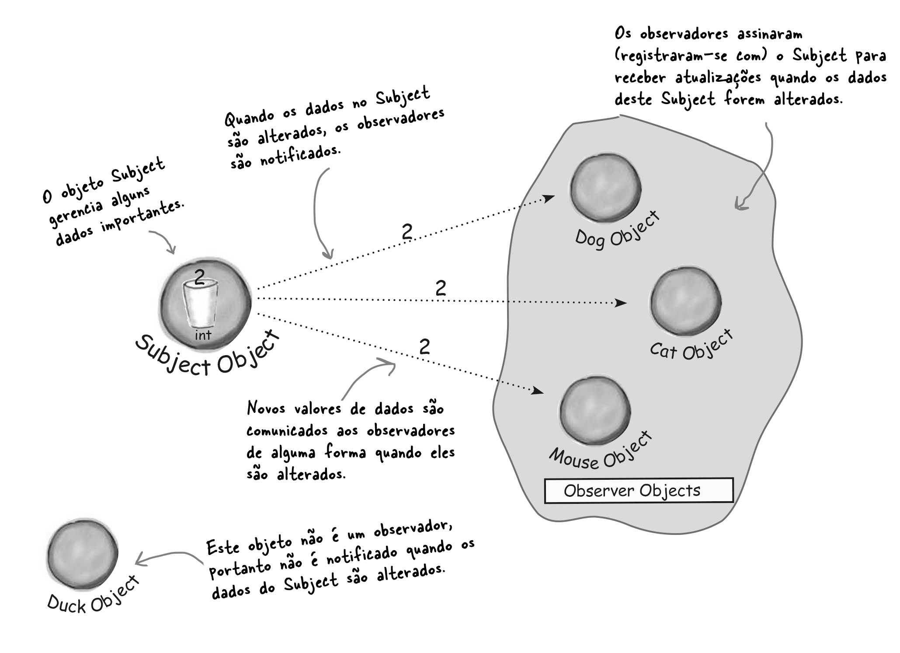
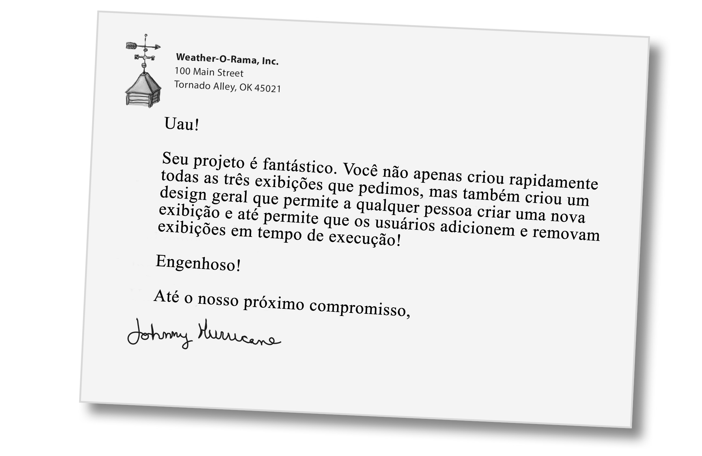
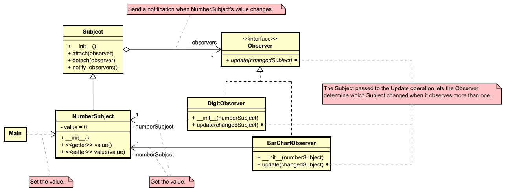

# Mantendo Seus Objetos Informados✨✨


---

> Você não quer perder quando algo interessante acontece, não é? Temos um padrão que mantém seus objetos informados quando algo importante para eles acontece. É o **Padrão Observer**. É um dos *Design Patterns* mais usados e é incrivelmente útil. Vamos examinar todos os tipos de aspectos interessantes dele, como seus relacionamentos *um-para-muitos* e *acoplamento flexível*.
> 

---


## Fechamento de Contrato de Trabalho

Parabéns!! 

Sua equipe acaba de ganhar o contrato para construir a próxima geração de **Weather-O-Rama, Inc.**, a Estação de Monitoramento Meteorológico baseada na Internet (*Weather Monitoring Station*).

Essa estação será construída com nosso objeto *WeatherData*, que é coberto por uma patente pendente e acompanha a temperatura, umidade e pressão atmosférica em tempo real.

Gostaríamos que você criasse um aplicativo que fornecesse inicialmente três elementos de exibição: condições atuais, estatísticas meteorológicas e uma simples previsão, todas 
atualizadas em tempo real à medida que o objeto *WeatherData* adquirir as medições mais recentes.

Além disso, essa será uma estação meteorológica expansível. **Weather-O-Rama** deseja lançar uma **API** para que outros desenvolvedores possam escrever suas próprias exibições meteorológicas e as conectem diretamente. Portanto, gostaríamos que você fornecesse essa API!


## Visão Geral do Aplicativo Weather Monitoring

Nossa tarefa, se optarmos por aceitá-la, é criar um aplicativo que utilize o objeto WeatherData para atualizar três exibições de condições atuais, status meteorológico e uma previsão. Veja a figura abaixo.


## Analisando a Classe WeatherData


> **Nossa tarefa é implementar o método ``measurementsChanged()`` de modo que ele atualize as três exibições para as condições atuais, status meteorológico e previsão.**


###O que sabemos até agora?

* A classe ``WeatherData`` tem métodos do tipo _getter_ para três valores de medição: temperatura, umidade e pressão barométrica

* O método ``measuramentsChanged()` é chamado sempre que dados de medição meteorológica estão disponíveis

* Precisamos implementar três elementos de exibição que use os dados meteorológicos: *condições atuais*, *estatísticas* e *previsão*

* Essas exibições devem ser atualizadas sempre que o ``WeatherData`` tiver novas medições.

* Para atualizar as exibições, adicionaremos código ao método ``measurementChanged()``.


###Uma primeira OLHADA na Estação Meteorológica (Weather Station)

O código da Classe está abaixo:

```python
class WeatherData:
    
    def measurementsChanged(self):
       temp = self.getTemperature()
       humidity = self.getHumidity()
       pressure = self.getPressure()
       
       current_conditions_display.update(temp, humidity, pressure)
       statistics_display.update(temp, humidity, pressure)
       forecast_display.update(temp, humidity, pressure)
    
    # Other WeatherData methods here
    # Outros métodos da classe vão aqui
```

###Uma primeira OLHADA na Estação Meteorológica (Weather Station) - continuação


---
## Conhecendo o Padrão Observer


Você sabe como funcionam as assinaturas de jornais ou revistas:

1. Uma editora de jornais abre um negócio e começa a publicá-los.

2. Você assina uma editora específica e, toda vez que há uma nova edição, ela é entregue a você. Enquanto você permanecer assinante, receberá novos jornais.

3. Você cancela a assinatura quando não quer mais os jornais e eles param de ser entregues.

4. Enquanto a editora permanece no mercado, pessoas, hotéis, companhias aéreas e outras empresas constantemente assinam e cancelam a assinatura do jornal.

Temos então uma fórmula:

**Editores + Assinantes = Padrão de Observer**

> O **Padrão Observer** é semelhante a um sistema de assinaturas 
de jornais, onde chamamos a editora de **SUBJECT** e os
assinantes de **OBSERVER**

Vamos dar uma olhada mais de perto.



___

### Um dia na vida do Padrão Observer (Passo a Passo)

#### Passo 1


**Um objeto ``Duck`` aparece e diz ao objeto ``Subject`` que ele quer se tornar um Observador (Observer).**

---

#### Passo 2


**O objeto ``Duck`` agora é um observador oficial.**

---

#### Passo 3


**O objeto ``Subject`` obtém um novo valor de dados!**

> Agora ``Duck`` e todos os outros observadores recebem uma notificação de que ``Subject`` foi alterado.

---

#### Passo 4


**O objeto ``Mouse`` pede para ser removido como observador.**

---

#### Passo 5


**Objeto ``Mouse`` está fora agora.** 

> ``Subject`` reconhece a solicitação de ``Mouse`` e o remove do conjunto de observadores.

---

#### Passo 6


**O objeto ``Subject`` tem outro novo valor.**

> Todos os observadores recebem outra notificação, exceto ``Mouse`` que não está mais incluído. Não conte a ninguém, mas ele sente falta secretamente daqueles valores ... talvez ele peça para ser um observador novamente algum dia.

---
## Um pouco de formalidade...

Uma assinatura de jornal, com seu editor e assinantes, é uma boa maneira de visualizar o padrão.

No mundo real, no entanto, você normalmente verá o *Observer Pattern* definido assim:

> **O *Observer Pattern* define uma dependência um-para-muitos entre os objetos, de forma que, quando um objeto muda de estado, todos os seus dependentes são notificados e atualizados automaticamente.**
> 
> **Ver figura abaixo.**


## Padrão Observer (Diagrama de Classes)

O diagrama de classes para este padrão está representado na figura abaixo.


A figura abaixo apresenta alguns comentários sobre a classe da figura acima.


### Participantes

**``Subject``**

* Conhece seus objetos ``Observer``. Qualquer número de objetos **Observer** podem observar um **Subject** 
* Provê uma interface para acoplar e desacoplar objetos **Observer**.

**``ConcreteSubject``**

* Guarda o estado de interesse para **ConcreteObserver** 
* Envia uma notificação para seu **Observer** quando seu estado muda.

**``Observer``**

Define uma interface de atualização para objetos que devem ser notificados sobre mudanças em um **Subject**.

**``ConcreteObserver``**

* Mantém uma referência para um objeto **ConcreteSubject** 
* Guarda o estado que deve ficar consistente com o de **Subject**
* Implementa o **Observer** atualizando a interface para manter seu estado consistente com o de **Subject**.

---

## O Poder do Acoplamento Fraco (Loose Coupling) - Ligação Leve

Quando dois objetos estão fracamente acoplados, eles podem interagir, mas normalmente têm muito pouco conhecimento um do outro. Como veremos, designs fracamente acoplados geralmente nos dão muita flexibilidade. O padrão **Observer** é um ótimo exemplo deste tipo de acoplamento. Vamos descrever algumas de suas características a seguir.

1. A única coisa que o sujeito sabe sobre um observador é que ele implementa uma certa interface
2. É possível adicionar novos observadores a qualquer momento
3. Nunca é preciso modificar o sujeito para adicionar novos tipos de observadores
4. É possível reutilizar sujeitos e observadores independentemente uns dos outros
5. Alterações no sujeito ou em um observador não irão afetar o outro

Isto nos leva a mais um **Princípio de Design** (ver figura abaixo).


> Projetos fracamente acoplados nos permitem construir sistemas OO flexíveis que podem lidar com mudanças porque minimizam a interdependência entre os objetos.


## Desenvolvendo a Weahter Station (Estação Meteorológica)

O diagrama de classes da **Weather Station** está representado na figura abaixo.


## Implementando a Weather Station (Estação Meteorológica)

O código do diagrama acima está abaixo.

```python
from abc import ABC, abstractmethod

class Subject(ABC):

    # Ambos os métodos usam um Observer como argumento, ou seja, o Observer a ser registrado ou removido.
    @abstractmethod
    def register_observer(self, observer):
        pass

    # Ambos os métodos usam um Observer como argumento, ou seja, o Observer a ser registrado ou removido.
    @abstractmethod
    def remove_observer(self, observer):
        pass

    # Este método é chamado para notificar todos os observadores quando o estado do Subject for alterado.
    @abstractmethod
    def notify_observers(self):
        pass


# A classe abstrata Observer é implementada por todos os observadores.
# Por isto todos eles devem implementar o método update()
class Observer(ABC):
    @abstractmethod
    # Estes são os valores de estado que os Observadores obtêm do Subject quando uma medição do tempo muda.
    def update(self, temperature, humidity, pressure):
        pass


# A classe abstrata DisplayElement inclui apenas um método, display(), 
# que chamaremos quando o elemento display precisar ser exibido.
class DisplayElement(ABC):
    @abstractmethod
    def display(self):
        pass

#WeatherData agora herda a classe abstrata Subject.
class WeatherData(Subject):
    def __init__(self):
        self.observers = []   #criamos uma lista para armazenar os Observers no construtor
        self.temperature = 0.0
        self.humidity = 0.0
        self.pressure = 0.0

    # Quando um observador se registra, ele é adicionado ao final da lista.
    def register_observer(self, observer):
        self.observers.append(observer)

    # Da mesma forma, quando um observador deseja cancelar o registro, basta retirá-lo da lista.
    def remove_observer(self, observer):
        self.observers.remove(observer)

    # Aqui está a parte divertida; é aqui que contamos a todos os observadores sobre o estado. 
    # Por serem todos Observadores, sabemos que todos implementam update(), então sabemos como notificá-los.
    def notify_observers(self):
        for observer in self.observers:
            observer.update(self.temperature, self.humidity, self.pressure)

    # Notificamos os Observadores quando obtemos medições atualizadas da Estação Meteorológica.
    def measurements_changed(self):
        self.notify_observers()

    # Em vez de ler os dados meteorológicos reais de um dispositivo, 
    # usaremos esse método para testar nossos elementos de exibição.
    def set_measurements(self, temperature, humidity, pressure):
        self.temperature = temperature
        self.humidity = humidity
        self.pressure = pressure
        self.measurements_changed()

    def get_temperature(self):
        return self.temperature

    def get_humidity(self):
        return self.humidity

    def get_pressure(self):
        return self.pressure


# Esta classe herda da classe Observer para que possa obter alterações do objeto WeatherData.
# Ela também implementa DisplayElement, porque nossa API exigirá que 
# todos os elementos de exibição implementem essa interface.
class CurrentConditionsDisplay(Observer, DisplayElement):
    # o construtor recebe o objeto weatherData (o Subject) 
    # e o usamos para registrar a exibição como um observador.
    def __init__(self, weather_data):
        self.temperature = 0.0
        self.humidity = 0.0
        self.weather_data = weather_data
        self.weather_data.register_observer(self)

    #Quando este método é chamado, salvamos a temperatura e a umidade e chamamos o método display()
    def update(self, temperature, humidity, pressure):
        self.temperature = temperature
        self.humidity = humidity
        self.display()

    # O método display() apenas imprime a temperatura e a umidade mais recentes.
    def display(self):
        print(f"Current conditions: {self.temperature}F degrees and {self.humidity}% humidity")


class ForecastDisplay(Observer, DisplayElement):
    def __init__(self, weather_data):
        self.current_pressure = 29.92
        self.last_pressure = 0.0
        self.weather_data = weather_data
        self.weather_data.register_observer(self)

    def update(self, temperature, humidity, pressure):
        self.last_pressure = self.current_pressure
        self.current_pressure = pressure
        self.display()

    def display(self):
        print("Forecast: ", end="")
        if self.current_pressure > self.last_pressure:
            print("Improving weather on the way!")
        elif self.current_pressure == self.last_pressure:
            print("More of the same")
        else:
            print("Watch out for cooler, rainy weather")


# O heat index (índice de calor) é um índice que combina temperatura e umidade 
# para determinar a temperatura aparente (o quão quente realmente se sente). 
# Para calculá-lo, usa-se a fórmula abaixo
class HeatIndexDisplay(Observer, DisplayElement):
    def __init__(self, weather_data):
        self.heat_index = 0.0
        self.weather_data = weather_data
        self.weather_data.register_observer(self)

    def update(self, temperature, humidity, pressure):
        self.heat_index = self.compute_heat_index(temperature, humidity)
        self.display()

    def compute_heat_index(self, t, rh):
      index = (
        16.923
        + 0.185212 * t
        + 5.37941 * rh
        - 0.100254 * t * rh
        + 0.00941695 * (t * t)
        + 0.00728898 * (rh * rh)
        + 0.000345372 * (t * t * rh)
        - 0.000814971 * (t * rh * rh)
        + 0.0000102102 * (t * t * rh * rh)
        - 0.000038646 * (t * t * t)
        + 0.0000291583 * (rh * rh * rh)
        + 0.00000142721 * (t * t * t * rh)
        + 0.000000197483 * (t * rh * rh * rh)
        - 0.0000000218429 * (t * t * t * rh * rh)
        + 0.000000000843296 * (t * t * rh * rh * rh)
        - 0.0000000000481975 * (t * t * t * rh * rh * rh)
    )
      return index


    def display(self):
        print(f"Heat index is {self.heat_index}")


class StatisticsDisplay(Observer, DisplayElement):
    def __init__(self, weather_data):
        self.max_temp = 0.0
        self.min_temp = 200.0
        self.temp_sum = 0.0
        self.num_readings = 0
        self.weather_data = weather_data
        self.weather_data.register_observer(self)

    def update(self, temperature, humidity, pressure):
        self.temp_sum += temperature
        self.num_readings += 1

        if temperature > self.max_temp:
            self.max_temp = temperature

        if temperature < self.min_temp:
            self.min_temp = temperature

        self.display()

    def display(self):
        avg_temp = self.temp_sum / self.num_readings
        print(f"Avg/Max/Min temperature = {avg_temp}/{self.max_temp}/{self.min_temp}")

# Teste da Weather Station
def main():
    # Primeiro, criamos o objeto WeatherData.
    weather_data = WeatherData()

    #Criamos os quatro displays e passamosa eles o objeto WeatherData.
    current_display = CurrentConditionsDisplay(weather_data)
    statistics_display = StatisticsDisplay(weather_data)
    forecast_display = ForecastDisplay(weather_data)
    heat_index_display = HeatIndexDisplay(weather_data)

    #Simulamos novas medições meteorológicas.
    weather_data.set_measurements(80, 65, 30.4)
    weather_data.set_measurements(82, 70, 29.2)
    weather_data.set_measurements(78, 90, 29.2)

    weather_data.remove_observer(forecast_display)
    weather_data.set_measurements(62, 90, 28.1)


if __name__ == "__main__":
    main()
```

---
## Correspondência da Weather-O-Rama

**Olha só o que chegou.**




---
##Padrão Observer (293)

###Objetivo
Permitir que você defina um mecanismo de assinatura para notificar múltiplos objetos sobre quaisquer eventos que aconteçam com o objeto que eles estão observando.

###Características
* **Relacionamento um-para-muitos**: o padrão estabelece um relacionamento um-para-muitos entre um sujeito (também conhecido como observável) e vários observadores. O ``Subject`` mantém uma lista de seus observadores e os notifica automaticamente quando seu estado muda.
* **Acoplamento fraco**: o sujeito e os observadores são acoplados livremente, pois se comunicam por meio de interfaces abstratas. O sujeito não precisa conhecer os detalhes específicos de seus observadores, e os observadores podem ser adicionados ou removidos sem afetar o sujeito ou outros observadores.
* **Notificação de evento**: Os observadores são notificados pelo assunto quando ocorre um evento específico ou mudança de estado. Essa notificação pode ocorrer por meio de um modelo _push_ (o sujeito envia detalhes aos observadores) ou um modelo _pull_ (os observadores solicitam informações do assunto).
* **Atualização automática**: quando o sujeito notifica seus observadores, eles podem atualizar automaticamente seu estado com base nas novas informações recebidas. Isso permite a sincronização em tempo real entre o sujeito e os observadores.
* **Independência Subject-Observer**: o sujeito e os observadores podem evoluir independentemente. Eles não estão fortemente acoplados e mudanças em um não requerem mudanças no outro. Isso promove a modularidade e extensibilidade do código.
* **Flexibilidade**: O padrão ``Observer`` permite relacionamentos dinâmicos entre sujeitos e observadores. Estes últimos podem assinar ou cancelar a assinatura de um assunto em tempo de execução, permitindo o comportamento dinâmico do sistema.
* **Vários observadores**: o assunto pode ter vários observadores e cada observador pode reagir de maneira diferente à mesma notificação. Isso permite uma ampla gama de funcionalidades e possibilidades dentro de um aplicativo.


###Aplicações (usos conhecidos)

1. **Sistemas de Mercado de Ações (Bolsa de Valores)**
	* Tais sistemas utilizam o padrão Observer para notificar investidores, comerciantes ou gerentes de portfólio sobre mudanças nos preços das ações, tendências de mercado ou outras informações relevantes. O mercado de ações atua como sujeito, enquanto os investidores ou gestores de portfólio atuam como observadores que subscrevem ações específicas ou atualizações de mercado.

2. **Aplicações sobre Meteorologia**
	* Estes aplicativos frequentemente empregam o padrão Observer para fornecer atualizações meteorológicas em tempo real aos usuários. A estação meteorológica serve como objeto, coletando dados de vários sensores. Os usuários podem se inscrever em locais específicos ou condições climáticas e receber notificações ou atualizações quando ocorrerem alterações.

3. **Plataformas de mídia social**
	* Usam o padrão Observer para notificar os usuários sobre novas postagens, comentários, curtidas ou outras atividades relacionadas à sua rede. Os usuários se inscrevem em perfis, grupos ou tópicos de interesse específicos e recebem notificações sempre que houver atualizações ou interações relacionadas às suas inscrições.

4. **Sistemas Distribuídos e Mensagens**
	* O padrão Observer desempenha um papel crucial. Os editores e assinantes se comunicam por meio de intermediários de mensagens ou barramentos de eventos, onde os editores publicam eventos ou mensagens e os assinantes se registram para receber tipos específicos de eventos ou mensagens.

5. **Sistemas de Banco de Dados**
	* Geralmente empregam o padrão Observer para notificar clientes ou aplicativos sobre mudanças no estado do BD. Por exemplo, quando um registro é atualizado ou um novo registro é inserido, os observadores registrados são notificados, permitindo que atualizem seus dados em cache ou tomem as ações apropriadas.

6. **Sistemas de Gestão de Tráfego**
	* Utilizam o padrão Observer para monitorar as condições de tráfego em diferentes áreas ou interseções. Sensores ou câmeras atuam como objetos, detectando o fluxo de tráfego e notificando centros de controle de tráfego ou aplicativos (observadores) sobre congestionamentos, acidentes ou outros eventos para facilitar o gerenciamento eficiente do tráfego.


###Estrutura Básica


> A descrição da **Estrutura Básica** segue abaixo.
> 
> Temos o ``Subject``(sujeito), que é o objeto cujo estado a gente está interessado observar, e ele pode ter uma coleção de observadores
> 
> Temos também o ``Observer`` (observador), que pode ser uma interface abstrata, com um método chamado ``notify()`` ou comumente chamado de ``update`` e seus vários tipos diferentes de observadores concretos que você implementa.

> 
> E o que o ``Subject`` (sujeito) faz? Ele mantém essa lista (coleção) de observadores. Você tem método para registrar
novo observador e um método para desregistrar este observador.
E então, quando o estado desse sujeito muda, ele chama o método ``notifyObservers()``.
> 
> O que faz o método ``notifyObservers()``? Para cada observador na coleção de observadores, ele chama o método ``notify()`` que pertence ao ``Observer``. E cada observador vai decidir o que fazer quando receber uma notificação (atualização).


### Participantes

* **Subject** 
	* Conhece seus observadores. Qualquer número de objetos ``Observer` pode observar um sujeito.
	* Fornece uma interface para anexar e desanexar objetos ``Observer``
* **Observer**:
	* Define uma interface de atualização para objetos que devem ser notificados sobre alterações em um ``Subject``.
	
* **ConcreteObserver** 
	* Armazena o estado que deve permanecer consistente com o do ``Subject`` (sujeito).
	* Implementa a interface de atualização do ``Observer`` para manter seu estado consistente com o do ``Subject``.


###Colaborações

* ``Subject`` notifica seus observadores sempre que ocorre uma mudança que pode tornar o estado deles inconsistente com o seu próprio.
* Depois de ser informado de uma mudança, um objeto ``ConcreteObserver`` pode consultar o ``Subject`` para obter informações. Ele usa esta informação para reconciliar seu estado com o do ``Subject``.


### Exemplos de Código

#### Exemplo #1: Notificações do Sistema Operacional em celulares

Considere um sistema operacional de smartphone como iOS, por exemplo, onde cada "novidade" de um aplicativo é notificada para áreas específicas da interface do usuário, conforme as figuras abaixo.


Você já pensou em como seria a nossa vida sem notificações de aplicativos?

Nessa situação hipotética, como saberíamos das informações dos aplicativos se eles não nos alertassem sobre o que está acontecendo? Teríamos que verificar todos os aplicativos de redes sociais, por exemplo, para ver se há alguma novidade que exija nossa atenção. Como resultado, teríamos.

* Gasto mais tempo verificando todos os aplicativos

* Processamento com custo muito caro

* Grande consumo de bateria

Imagine o tempo que perderíamos se não tivéssemos nossos celulares, mesmo tendo notificações para nos avisar quando checá-los.

O padrão ``Observer`` começa com um problema semelhante ao que descrevemos acima. Em outras palavras, como podemos alertar outros objetos quando uma mudança de estado ou evento interessante ocorre em um determinado objeto?


---

#### Exemplo #2: Na Bolsa de Valores, os dados das ações mudam a qualquer momento. Vendedores e compradores podem ver as mudanças a qualquer momento. (extraído do livro "Easy Learning Design Patterns Python 3: Reusable Object-Oriented Software de Yang Hu")


O código ficaria assim:

```python
from abc import ABC, abstractmethod

############### Observable #################
class Observable:
    __observer_list = []

    def notify_observers(self):
        for observer in self.__observer_list:
            observer.update(self)

    def add_observer(self, observer):
        self.__observer_list.append(observer)


############### Observer #################
class Observer(ABC):
    @abstractmethod
    def update(self, observable):
        pass


############### StockData #################
class StockData(Observable):
    __price = 0.0

    def __init__(self, price):
        self.__price = price

    @property
    def price(self):
        return self.__price

    def set_stock_data(self, price):
        self.__price = price
        self.notify_observers()


############### Buyer #################
class Buyer(Observer):
    def __init__(self, observable):
        observable.add_observer(self)

    def update(self, observable):
        print("Buyer Price:", observable.price)


############### Seller #################
class Seller(Observer):
    def __init__(self, observable):
        observable.add_observer(self)

    def update(self, observable):
        print("Seller Price:", observable.price)


############### test #################
data = StockData(16.9)

buyer = Buyer(data)
seller = Seller(data)

data.set_stock_data(18.9)

print("-------------------------")

data.set_stock_data(12.9)
```

---

#### Exemplo #3: Implementação de assinatura de boletim informativo (newsletter)


O código ficaria assim:

```python
from abc import ABC, abstractmethod
import time 
import datetime 
  
class Subject(object): 
    def __init__(self): 
        self.observers = [] 
        self.cur_time = None
  
    def register_observer(self, observer): 
        if observer in self.observers: 
            print(observer, 'already registered') 
        else: 
            self.observers.append(observer) 
  
    def unregister_observer(self, observer): 
        try: 
            self.observers.remove(observer) 
        except ValueError: 
            print('Cannot Indentify the Observer') 
  
    def notify_observer(self): 
        self.cur_time = datetime.datetime.now() 
        for observer in self.observers: 
            observer.notify(self.cur_time) 
  

class Observer(ABC):     
    @abstractmethod 
    def notify(self, unix_timestamp): 
        pass
  
  
class CompanyNewsletterObserver(Observer): 
    def __init__(self, name): 
        self.name = name 
  
    def notify(self, time): 
        print(self.name, ':', time) 


class ConsumerNewsletterObserver(Observer): 
    def __init__(self, name): 
        self.name = name 
  
    def notify(self, time): 
        print(self.name, ':', time) 


if __name__ == '__main__': 
    subject = Subject() 
  
    print('Registering company_newsletter_observer') 
    cmp_observer = CompanyNewsletterObserver('company_newsletter_observer') 
    subject.register_observer(cmp_observer) 
    subject.notify_observer() 
    print() 
    time.sleep(2) 
  
    print('Registering consumer_newsletter_observer') 
    con_observer = ConsumerNewsletterObserver('consumer_newsletter_observer') 
    subject.register_observer(con_observer) 
    subject.notify_observer() 
    print() 
    time.sleep(2) 
  
    print('Unregistering company_newsletter_observer') 
    subject.unregister_observer(cmp_observer) 
    subject.notify_observer() 
```

---

#### Exemplo #4: Observadores observam um objeto ``Subject` contendo um valor numérico e exibem esse valor. Os formatos de exibição são dígitos e gráficos de barras.



O código ficaria assim:

```python
from abc import ABC, abstractmethod
import random
from time import sleep

# Defines an updating interface for objects that should be notified of changes in a subject.
class Observer(ABC):

    @abstractmethod
    def update(self, changedSubject):
        pass


# Provides an interface for attaching and detaching Observer objects.
class Subject(object):

    def __init__(self):
        self.__observers = []
        pass

    def attach(self, observer):
        self.__observers.append(observer)

    def detach(self, observer):
        self.__observers.remove(observer)

    def notify_observers(self):
        for observer in self.__observers:
            observer.update(changedSubject=self)


class NumberSubject(Subject):

    def __init__(self):
        self.__value = 0
        super().__init__()

    @property
    def value(self):
        return self.__value

    @value.setter
    def value(self, value):
        # Notify observers when the value is set.
        self.__value = value
        self.notify_observers()


# Display values as a number.
class DigitObserver(Observer):

    def __init__(self, numberSubject):
        self.__numberSubject = numberSubject
        pass

    def update(self, changedSubject):
        # Before processing, it checks to make sure the changed subject is the subject held.
        if changedSubject is self.__numberSubject:
            print(f'Digit    : {self.__numberSubject.value}')


# Display values as a bar chart.
class BarChartObserver(Observer):

    def __init__(self, numberSubject):
        self.__numberSubject = numberSubject
        pass

    def update(self, changedSubject):
        # Before processing, it checks to make sure the changed subject is the subject held.
        if changedSubject is self.__numberSubject:
            print(f'Bar chart: {"*" * self.__numberSubject.value}')


'''
Observers observe a Subject object holding a numerical value and display the value.
The display formats are digits and bar charts.
'''
if __name__ == '__main__':
    number_subject = NumberSubject()
    number_subject.attach(observer=DigitObserver(number_subject))
    number_subject.attach(observer=BarChartObserver(number_subject))

    for _ in range(0, 20):
        number_subject.value = random.randrange(50)
        sleep(0.2)
```

---
