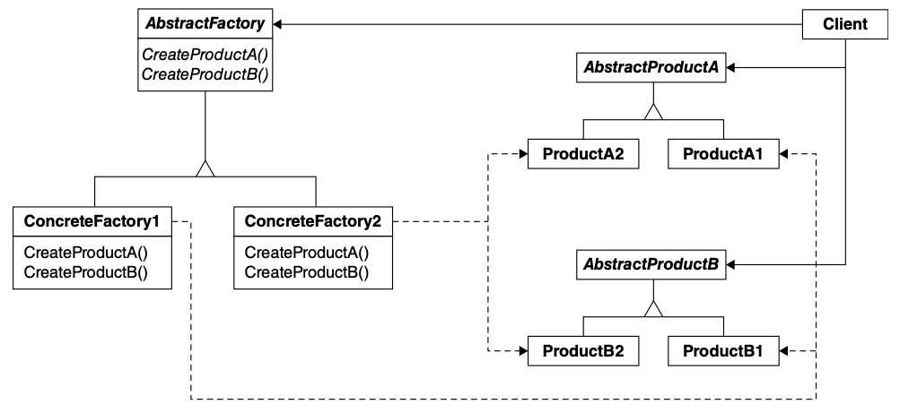

# Enquanto isso na nossa Pizzaria...✨✨


---

> Nossa Pizza Store está realmente tomando forma: ela tem uma estrutura flexível e faz um bom trabalho ao aderir aos princípios de design. 
> 
> Agora, a chave para o sucesso da Objectville Pizzaria sempre foram ingredientes frescos e de qualidade, e o que você descobriu é que com a nova estrutura suas franquias têm seguido seus *procedimentos* (i.e. assar, cortar, embalar e assim por diante...), mas algumas delas têm substituído ingredientes em suas pizzas para baratear custos e aumentar suas margens. 
> 
> Você sabe que precisa fazer alguma coisa, porque no longo prazo isso vai prejudicar a marca Objectville!
> 

---
## Garantindo a consistência dos seus ingredientes

Então, como você vai garantir que cada franquia use ingredientes de qualidade? Você vai construir uma fábrica que os produza e os envie para suas franquias!
Agora só há um problema nesse plano: elas estão localizadas em regiões diferentes e o que é molho vermelho em Nova York não é molho vermelho em Chicago. Portanto, você tem um conjunto de ingredientes que precisa ser enviado para Nova York e um conjunto diferente que precisa ser enviado para Chicago. Observe a figura abaixo.


## Família de Ingredientes

Nova York usa um conjunto de ingredientes e Chicago usa outro. Dada a popularidade da Objectville Pizza, não demorará muito para que você também precise enviar outro conjunto de ingredientes regionais para a Califórnia. E aí, o que vem a seguir? Austin?
Para que isso funcione, você terá que descobrir como lidar com famílias de ingredientes. Veja o que está acontecendo.


Mas você precisa de mais de um tipo de pizza...
Então você adicionaria algum código que determina o tipo apropriado de pizza e então faria a pizza. Veja a figura abaixo.


## Construindo fábricas de ingredientes

Agora vamos construir uma fábrica para criar nossos ingredientes. Ela será responsável pela criação de cada ingrediente que faz parte de uma **família de ingredientes**. Ou seja, a nossa `Factory` precisará criar massa, molho, queijo e assim por diante... Em breve veremos como vamos lidar com as diferenças regionais.

Vamos começar definindo uma interface (*classe abstrata*) para a fábrica que irá criar todos os nossos ingredientes:

```python
from abc import ABC, abstractmethod

class PizzaIngredientFactory(ABC):
    @abstractmethod
    def createDough(self):
        pass
    
    @abstractmethod
    def createSauce(self):
        pass
    
    @abstractmethod
    def createCheese(self):
        pass
    
    @abstractmethod
    def createVeggies(self):
        pass
    
    @abstractmethod
    def createPepperoni(self):
        pass
    
    @abstractmethod
    def createClam(self):
        pass
```

> Neste exemplo, a classe `PizzaIngredientFactory` é definida como uma classe abstrata usando o módulo abc (Abstract Base Classes) do Python. As funções dentro da interface original são convertidas em métodos abstratos usando o decorador `@abstractmethod`. Qualquer classe que herde da `PizzaIngredientFactory` agora é obrigada a implementar todos esses métodos abstratos para ser considerada uma implementação válida da fábrica de ingredientes de pizza.

#### Com essa classe abstrata, eis o que vamos fazer:

1. Construa uma fábrica para cada região. Para fazer isso, você criará uma subclasse de `PizzaIngredientFactory` que implementa cada método de criação.

2. Implemente um conjunto de classes de ingredientes a serem usados com a fábrica, como `ReggianoCheese`, `RedPeppers` e `ThickCrustDough`. Essas classes podem ser compartilhadas entre regiões quando apropriado.

3. Agora precisamos conectar tudo isso, trabalhando nossas novas fábricas de ingredientes em nosso antigo código `PizzaStore`.


## Construindo a fábrica de ingredientes de New York

Observe abaixo uma implementação da fábrica de ingredientes de New York. Esta fábrica é especializada em Molho Marinara, Queijo Reggiano,  Mariscos Frescos, etc.

```python
from abc import ABC, abstractmethod

class PizzaIngredientFactory(ABC):
    @abstractmethod
    def createDough(self):
        pass
    
    @abstractmethod
    def createSauce(self):
        pass
    
    @abstractmethod
    def createCheese(self):
        pass
    
    @abstractmethod
    def createVeggies(self):
        pass
    
    @abstractmethod
    def createPepperoni(self):
        pass
    
    @abstractmethod
    def createClam(self):
        pass

# A fábrica de ingredientes de NY implementa a interface 
# para todas as fábricas de ingredientes.
class NYPizzaIngredientFactory(PizzaIngredientFactory):
    
    # Para cada ingrediente da família de ingredientes, 
    # criamos a versão Nova York.
    def createDough(self):
        return ThinCrustDough()
    
    def createSauce(self):
        return MarinaraSauce()
    
    def createCheese(self):
        return ReggianoCheese()
    
    # Para vegetais, retornamos uma variedade de vegetais. 
    def createVeggies(self):
        veggies = [Garlic(), Onion(), Mushroom(), RedPepper()]
        return veggies
    
	 # Melhor pepperoni fatiado. 
	 # Isso é compartilhado entre New York e Chicago. 
    def createPepperoni(self):
        return SlicedPepperoni()
    
    #New York fica no litoral; 
    # obtém mariscos frescos. 
    # Chicago tem que se contentar com eles congelados.
    def createClam(self):
        return FreshClams()
```

## Retrabalhando as pizzas...

Temos nossas fábricas ativas e prontas para produzir ingredientes de qualidade. 

Agora só precisamos retrabalhar nossas Pizzas para que elas usem apenas ingredientes produzidos na fábrica. 

Começaremos com nossa classe abstrata de Pizza.

```python
from abc import ABC, abstractmethod

class Pizza(ABC):
    def __init__(self):
        self.name = None
        
        # Cada pizza contém um conjunto de ingredientes 
        # que são utilizados no seu preparo.
        self.dough = None
        self.sauce = None
        self.veggies = []
        self.cheese = None
        self.pepperoni = None
        self.clam = None

	# Este método é abstrato. 
	# É aqui que vamos recolher os ingredientes necessários 
	# para a pizza, que obviamente virão da fábrica de ingredientes.
    @abstractmethod
    def prepare(self):
        pass

    def bake(self):
        print("Bake for 25 minutes at 350")

    def cut(self):
        print("Cutting the pizza into diagonal slices")

    def box(self):
        print("Place pizza in official PizzaStore box")

    def set_name(self, name):
        self.name = name

    def get_name(self):
        return self.name

    def __str__(self):
        # código para imprimir a pizza
```

## Retrabalhando as pizzas (continuação)

Agora que você tem uma classe abstrata chamada `Pizza` para trabalhar, é hora de criar as pizzas estilo Nova York e Chicago. Porém, desta vez, elas receberão seus ingredientes direto da fábrica. Os dias de economia de ingredientes dos franqueados acabaram!

Quando escrevemos o código usando `Factory Method`, tínhamos uma classe `NYCheesePizza` e uma classe `ChicagoCheesePizza`. Se você olhar as duas classes, a única coisa que difere é o uso de ingredientes regionais. As pizzas são feitas iguais (massa + molho + queijo). O mesmo vale para as outras pizzas: Vegetariana, Marisco e assim por diante. Todas seguem as mesmas etapas de preparação; elas apenas têm ingredientes diferentes.

Então, o que você verá é que realmente não precisamos de duas classes para cada pizza. A fábrica de ingredientes vai cuidar das diferenças regionais para nós.

Observe o código da `CheesePizza` abaixo.

```python
class CheesePizza(Pizza):
	# Para fazer uma pizza agora, precisamos de uma fábrica que 	# forneça os ingredientes. Assim, cada classe Pizza recebe uma 
	# fábrica passada para seu construtor e é armazenada em uma 	#variável de instância.
    def __init__(self, ingredient_factory):
        super().__init__()
        self.ingredient_factory = ingredient_factory

    def prepare(self):
        print("Preparing", self.name)
        self.dough = self.ingredient_factory.create_dough()
        self.sauce = self.ingredient_factory.create_sauce()
        self.cheese = self.ingredient_factory.create_cheese()
```

## Colocando tudo junto ...

A implementação completa da nossa Pizzaria está abaixo.

```python
from abc import ABC, abstractmethod

class Pizza(ABC):
    def __init__(self):
        self.name = None
        self.dough = None
        self.sauce = None
        self.veggies = []
        self.cheese = None
        self.pepperoni = None
        self.clam = None

    @abstractmethod
    def prepare(self):
        pass

    def bake(self):
        print("Bake for 25 minutes at 350")

    def cut(self):
        print("Cutting the pizza into diagonal slices")

    def box(self):
        print("Place pizza in official PizzaStore box")

    def set_name(self, name):
        self.name = name

    def get_name(self):
        return self.name

    def __str__(self):
        result = f"---- {self.name} ----\n"
        if self.dough:
            result += str(self.dough) + "\n"
        if self.sauce:
            result += str(self.sauce) + "\n"
        if self.cheese:
            result += str(self.cheese) + "\n"
        if self.veggies:
            veggies_str = ", ".join(map(str, self.veggies))
            result += veggies_str + "\n"
        if self.clam:
            result += str(self.clam) + "\n"
        if self.pepperoni:
            result += str(self.pepperoni) + "\n"
        return result

class CheesePizza(Pizza):
    # Para fazer uma pizza agora, precisamos de uma fábrica que 	
    # forneça os ingredientes. Assim, cada classe Pizza recebe uma 
	  # fábrica passada para seu construtor e é armazenada em uma 	
    # variável de instância.
    def __init__(self, ingredient_factory):
        super().__init__()
        self.ingredient_factory = ingredient_factory

    # O método prepare() percorre a criação de uma pizza de queijo e, 
    # cada vez que precisa de um ingrediente, solicita à fábrica que o produza.
    def prepare(self):
        print("Preparing", self.name)
        self.dough = self.ingredient_factory.create_dough()
        self.sauce = self.ingredient_factory.create_sauce()
        self.cheese = self.ingredient_factory.create_cheese()


class VeggiePizza(Pizza):
    def __init__(self, ingredient_factory):
        super().__init__()
        self.ingredient_factory = ingredient_factory

    def prepare(self):
        print("Preparing", self.name)
        self.dough = self.ingredient_factory.create_dough()
        self.sauce = self.ingredient_factory.create_sauce()
        self.cheese = self.ingredient_factory.create_cheese()
        self.veggies = self.ingredient_factory.create_veggies()

class PepperoniPizza(Pizza):
    def __init__(self, ingredient_factory):
        super().__init__()
        self.ingredient_factory = ingredient_factory

    def prepare(self):
        print("Preparing", self.name)
        self.dough = self.ingredient_factory.create_dough()
        self.sauce = self.ingredient_factory.create_sauce()
        self.cheese = self.ingredient_factory.create_cheese()
        self.veggies = self.ingredient_factory.create_veggies()
        self.pepperoni = self.ingredient_factory.create_pepperoni()

class ClamPizza(Pizza):
    def __init__(self, ingredient_factory):
        super().__init__()
        self.ingredient_factory = ingredient_factory

    def prepare(self):
        print("Preparing", self.name)
        self.dough = self.ingredient_factory.create_dough()
        self.sauce = self.ingredient_factory.create_sauce()
        self.cheese = self.ingredient_factory.create_cheese()
        self.clam = self.ingredient_factory.create_clam()

class PizzaStore(ABC):
    @abstractmethod
    def create_pizza(self, item):
        pass

    def order_pizza(self, type):
        pizza = self.create_pizza(type)
        print(f"--- Making a {pizza.get_name()} ---")
        pizza.prepare()
        pizza.bake()
        pizza.cut()
        pizza.box()
        return pizza

class NYPizzaStore(PizzaStore):
    def create_pizza(self, item):
        pizza = None
        ingredient_factory = NYPizzaIngredientFactory()

        if item == "cheese":
            pizza = CheesePizza(ingredient_factory)
            pizza.set_name("New York Style Cheese Pizza")
        elif item == "veggie":
            pizza = VeggiePizza(ingredient_factory)
            pizza.set_name("New York Style Veggie Pizza")
        elif item == "clam":
            pizza = ClamPizza(ingredient_factory)
            pizza.set_name("New York Style Clam Pizza")
        elif item == "pepperoni":
            pizza = PepperoniPizza(ingredient_factory)
            pizza.set_name("New York Style Pepperoni Pizza")

        return pizza

class ChicagoPizzaStore(PizzaStore):
    def create_pizza(self, item):
        pizza = None
        ingredient_factory = ChicagoPizzaIngredientFactory()

        if item == "cheese":
            pizza = CheesePizza(ingredient_factory)
            pizza.set_name("Chicago Style Cheese Pizza")
        elif item == "veggie":
            pizza = VeggiePizza(ingredient_factory)
            pizza.set_name("Chicago Style Veggie Pizza")
        elif item == "clam":
            pizza = ClamPizza(ingredient_factory)
            pizza.set_name("Chicago Style Clam Pizza")
        elif item == "pepperoni":
            pizza = PepperoniPizza(ingredient_factory)
            pizza.set_name("Chicago Style Pepperoni Pizza")

        return pizza

class Dough(ABC):
    @abstractmethod
    def __str__(self):
        pass

class ThinCrustDough(Dough):
    def __str__(self):
        return "Thin Crust Dough"

class ThickCrustDough(Dough):
    def __str__(self):
        return "ThickCrust style extra thick crust dough"

class Sauce(ABC):
    @abstractmethod
    def __str__(self):
        pass

class MarinaraSauce(Sauce):
    def __str__(self):
        return "Marinara Sauce"

class PlumTomatoSauce(Sauce):
    def __str__(self):
      return "Plum and Tomato Sauce"        


class Cheese(ABC):
    @abstractmethod
    def __str__(self):
        pass

class ReggianoCheese(Cheese):
    def __str__(self):
        return "Reggiano Cheese"

class MozzarellaCheese(Cheese):
    def __str__(self):
        return "Shredded Mozzarella"

class Veggies(ABC):
    @abstractmethod
    def __str__(self):
        pass

class Garlic(Veggies):
    def __str__(self):
        return "Garlic"

class Onion(Veggies):
    def __str__(self):
        return "Onion"

class Mushroom(Veggies):
    def __str__(self):
        return "Mushrooms"

class RedPepper(Veggies):
    def __str__(self):
        return "Red Pepper"

class BlackOlives(Veggies):
    def __str__(self):
        return "Black Olives"

class Spinach(Veggies):
    def __str__(self):
        return "Spinach"

class Eggplant(Veggies):
    def __str__(self):
        return "Eggplant"

class Clams(ABC):
    @abstractmethod
    def __str__(self):
        pass

class FrozenClams(Clams):
    def __str__(self):
        return "Frozen Clams from Chesapeake Bay"

class FreshClams(Clams):
    def __str__(self):
        return "Fresh Clams from Long Island Sound"

class Pepperoni(ABC):
    @abstractmethod
    def __str__(self):
        pass

class SlicedPepperoni(Pepperoni):
    def __str__(self):
        return "Sliced Pepperoni"


class PizzaIngredientFactory(ABC):
    @abstractmethod
    def create_dough(self):
        pass

    @abstractmethod
    def create_sauce(self):
        pass

    @abstractmethod
    def create_cheese(self):
        pass

    @abstractmethod
    def create_veggies(self):
        pass

    @abstractmethod
    def create_pepperoni(self):
        pass

    @abstractmethod
    def create_clam(self):
        pass


class NYPizzaIngredientFactory(PizzaIngredientFactory):
    def create_dough(self):
        return ThinCrustDough()

    def create_sauce(self):
        return MarinaraSauce()

    def create_cheese(self):
        return ReggianoCheese()

    def create_veggies(self):
        veggies = [Garlic(), Onion(), Mushroom(), RedPepper()]
        return veggies

    def create_pepperoni(self):
        return SlicedPepperoni()

    def create_clam(self):
        return FreshClams()


class ChicagoPizzaIngredientFactory(PizzaIngredientFactory):
    def create_dough(self):
        return ThickCrustDough()

    def create_sauce(self):
        return PlumTomatoSauce()

    def create_cheese(self):
        return MozzarellaCheese()

    def create_veggies(self):
        veggies = [BlackOlives(), Spinach(), Eggplant()]
        return veggies

    def create_pepperoni(self):
        return SlicedPepperoni()

    def create_clam(self):
        return FrozenClams()


# testando o código
if __name__ == "__main__":
    ny_store = NYPizzaStore()
    chicago_store = ChicagoPizzaStore()

    pizza = ny_store.order_pizza("cheese")
    print("Ethan ordered a", pizza, "\n")

    pizza = chicago_store.order_pizza("cheese")
    print("Joel ordered a", pizza, "\n")

    pizza = ny_store.order_pizza("clam")
    print("Ethan ordered a", pizza, "\n")

    pizza = chicago_store.order_pizza("clam")
    print("Joel ordered a", pizza, "\n")

    pizza = ny_store.order_pizza("pepperoni")
    print("Ethan ordered a", pizza, "\n")

    pizza = chicago_store.order_pizza("pepperoni")
    print("Joel ordered a", pizza, "\n")

    pizza = ny_store.order_pizza("veggie")
    print("Ethan ordered a", pizza, "\n")

    pizza = chicago_store.order_pizza("veggie")
    print("Joel ordered a", pizza, "\n")
```

## O que nós fizemos?

Foi uma grande série de mudanças de código. Fornecemos um meio de criar uma família de ingredientes para pizzas, introduzindo um novo tipo de fábrica chamada `Fábrica Abstrata` (`Abstract Factory`).

Uma `Abstract Factory` nos fornece uma _interface_ para criar uma família de produtos. Ao escrever um código que usa essa interface, disassociamos nosso código da fábrica real que cria os produtos. Isso nos permite implementar uma variedade de fábricas que produzem produtos destinados a diferentes contextos – como diferentes regiões ou diferentes aparências.
Como nosso código é desacoplado dos produtos reais, podemos substituir fábricas diferentes para obter comportamentos diferentes
(como pegar marinara em vez de tomate com ameixa). Veja a figura abaixo.


> **Observações importantes.**
> 
> 1. Uma `Abstract Factory` fornece uma _interface_ para uma família de produtos. O que é uma família? No nosso caso, são tudo o que precisamos para fazer uma pizza: massa, molho, queijo, carnes e vegetais.
> 
> 2. Da fábrica abstrata derivamos uma ou mais fábricas concretas que produzem os mesmos produtos, mas com implementações diferentes.
> 
> 3. Em seguida, escrevemos nosso código para que ele use a fábrica para criar produtos. Ao passar por diversas fábricas, obtemos uma variedade de implementações desses produtos. Mas nosso código de cliente permanece o mesmo.

---

## Finalmente chegou a hora de conhecer o `Abstract Factory Pattern`

Estamos adicionando mais um padrão de fábrica à nossa família de padrões, que nos permite criar famílias de produtos. Vamos verificar a definição oficial deste padrão.


### Definição

`Abstract Factory Pattern` fornece uma interface para criar famílias de objetos relacionados ou dependentes sem especificar suas classes concretas.

> Vimos que `Abstract Factory` permite que um cliente use uma interface abstrata para criar um conjunto de produtos relacionados sem saber (ou se importar) com os produtos concretos que são realmente produzidos. 
> 
> Desta forma, o cliente fica desvinculado de qualquer uma das especificidades desses produtos concretos. Vejamos o diagrama de classes para ver como tudo isso se mantém.


Aplicando o diagrama acima para nossa `PizzaStore`


#### Observação Importante

> Perceba que cada método na `Abstract Factory` realmente se parece com um método de fábrica (`createDough()`, `createSauce()`, etc.). Cada método é declarado abstrato e as subclasses o substituem para criar algum objeto. Isto não é um método de fábrica?
> 
> Na verdade, ele é um método _escondido_  dentro da `Abstract Factory`.
> Muitas vezes esses métodos são implementados como métodos de fábrica.
>  
> Isto implica que o trabalho de uma `Abstract Factory` é definir uma interface para a criação de um conjunto de produtos.
> 
> Cada método nessa interface é responsável por criar um produto concreto, e implementamos uma subclasse da classe `Abstract Factory` para fornecer essas implementações. Portanto, os métodos de fábrica são uma maneira natural de implementar seus métodos de produtos em suas fábricas abstratas.
> 

---

## Comparação entre o `Factory Method` e `Abstract Factory`

Vamos observar o primeiro diagrama (i.e. `Factory Method`)


---

Agora o diagrama da `Abstract Factory`.


---

## Resumo das Diferenças (`Factory Method` vs `Abstract Factory`)

| `Factory Method`  | `Abstract Factory` |
| :---: | :---: |
| Expõe um método ao cliente para criar os objetos   | Contém um ou mais métodos de fábrica (i.e. `Factory Methods`) para criar uma família de objetos relacionados      |
| Usa herança e subclasses para decidir qual objeto criar     | Usa composição para delegar responsabilidade para criar objetos de outra classe      |
| É usado para criar um produto | Trata da criação de famílias de produtos relacionados      |


## Resumo do que vimos até agora (mais um pouco...)

| Item  | Observação |
| :---: | :---: |
|  1  | Todas as fábricas encapsulam a criação de objetos.  |
|  2  | `Simple Factory`, embora não seja um padrão de design genuíno, é uma maneira simples de dissociar seus clientes de classes concretas.  |
|  3  | `Factory Method` depende de herança: a criação de objetos é delegada a subclasses, que o implementam para criar objetos.    |
|  4  | `Abstract Factory` depende da composição de objetos: a criação deles é implementada em métodos expostos na interface de fábrica.    |
|  5  | Todos os padrões de fábrica promovem acoplamento fraco, reduzindo a dependência do seu aplicativo em classes concretas.    |
|  6  | A intenção do `Factory Method` é permitir que uma classe adie a instanciação para suas subclasses.    |
|  7  | A intenção do `Abstract Factory` é criar famílias de objetos relacionados sem precisar depender de suas classes concretas.    |
|  8  | O Princípio da Inversão de Dependência nos orienta a evitar dependências de tipos concretos e a buscar abstrações.    |
|  9  | As fábricas são uma técnica poderosa para codificação de abstrações, não de classes concretas.    |

---

## Um pouco de formalidade ...

## Padrão Abstract Factory (87)

### Objetivo
Fornece uma interface para criar famílias de objetos relacionados ou dependentes sem especificar suas classes concretas.

Em outras palavras, é um padrão criacional de projeto que fornece uma interface para criar objetos em uma superclasse, mas permite que essas subclasses alterem o tipo de objetos que serão criados.

### Características


* **Isolamento de produto e cliente**: isola os produtos de seus clientes, tornando a dependência do cliente de uma fábrica específica. Isso permite que estes clientes sejam independentes das classes concretas dos produtos que usam.

* **Coesão de produtos**: aumenta a coesão de produtos, permitindo que eles sejam agrupados em famílias com base em suas relações ou dependências.

* **Reuso de código**: permite o reuso de código, pois os clientes podem usar a mesma interface para criar produtos de diferentes famílias.

* **Extensibilidade**: é extensível, pois permite a adição de novas famílias de produtos sem alterar o código do cliente.

* **Desacoplamento (Decoupling)**: ajuda a manter o código desacoplado das classes concretas dos objetos que está criando. Isso significa que o código do cliente que utiliza a fábrica não precisa saber detalhes sobre as classes específicas dos objetos que está criando.

* **Configuração Flexível**: permite que você substitua uma fábrica concreta por outra sem afetar o código do cliente. Isso possibilita a troca de famílias de objetos de forma flexível e fácil.

* **Garantia de Consistência**: garante que os objetos criados sejam compatíveis entre si e pertençam à mesma família. Isso ajuda a evitar problemas de incompatibilidade entre objetos que podem ocorrer quando os objetos são criados de maneira independente.

* **Múltiplas Implementações**: Você pode ter várias implementações diferentes de fábricas abstratas para criar objetos de acordo com diferentes contextos ou configurações do aplicativo.

Em resumo:

* Usa uma super-fábrica que cria outras fábricas.

* Abstrai a criação e a composição dos objetos do sistema.

* Permite que o cliente use apenas as interfaces declaradas pelas classes `AbstractFactory` e `AbstractProduct`.

* Ele é útil quando o sistema consiste de múltiplas famílias de objetos que são projetadas para serem usadas juntas.


### Aplicações (casos de uso)

1. **Biblioteca de Interface Gráfica (GUI):** 
	* Imagine uma aplicação que precisa funcionar em diferentes sistemas operacionais, cada um com sua própria aparência de GUI. Você pode usar `Abstract Factory` para criar conjuntos de objetos de interface gráfica específicos para cada sistema operacional, garantindo que todos os elementos da GUI sejam consistentes em todo o aplicativo.

2. **Bancos de Dados:**
	* Em um sistema de gerenciamento de banco de dados (SGBD), você pode usar uma `Abstract Factory` para criar objetos de conexão, comandos SQL e transações para diferentes SGBDs, como MySQL, PostgreSQL e SQL Server. Isso permite que você troque facilmente de um sistema para outro sem modificar muito seu código.

4. **Jogos:** 
	* Em um jogo que oferece suporte a múltiplas plataformas, você pode usar uma `Abstract Factory` para criar recursos gráficos, como modelos 3D, texturas e efeitos sonoros, que são específicos para cada plataforma de destino.

5. **Máquinas Virtuais:**
	* Se você estiver desenvolvendo uma máquina virtual para executar programas em diferentes linguagens, a `Abstract Factory` pode ser usada para criar objetos de instrução, registradores e outros componentes específicos para cada linguagem suportada.

6. **Configuração do Ambiente:**
	* Em um sistema de gerenciamento de configuração, você pode usar uma `Abstract Factory` para criar objetos de configuração que sejam específicos para diferentes ambientes, como desenvolvimento, teste e produção. Isso permite uma fácil troca entre ambientes sem afetar o funcionamento do sistema.

7. **Produtos Customizados:** 
	* Em um sistema de comércio eletrônico, uma `Abstract Factory` pode ser usada para criar produtos personalizados com base nas preferências dos clientes. Cada fábrica pode criar produtos de acordo com diferentes critérios, como cor, tamanho e material.


### Estrutura Básica



> A descrição da **Estrutura Básica** segue abaixo.
> 
> `AbstractFactory`: esta é uma interface ou classe abstrata que declara os métodos de criação para uma família de objetos relacionados, como `createProductA()` e `createProductB()`.
> 
> Temos também `ConcreteFactory1` e `ConcreteFactory2`: estas são implementações concretas da interface `AbstractFactory`. Elas fornecem implementações específicas para a criação dos produtos.
> 
> `AbstractProductA` e `AbstractProductB`: são interfaces ou classes abstratas que definem a interface para os produtos criados pelo `AbstractFactory`. Cada família de produtos (`ConcreteFactory1` e `ConcreteFactory2`) possui seu próprio conjunto de `AbstractProductA` e `AbstractProductB`.
> 


### Participantes

* `AbstractFactory` (interface ou classe abstrata)
	* Declara um conjunto de métodos para criar produtos abstratos

* `ConcreteFactory` (classe concreta)
	* Implementa os métodos para criar objetos de produto concretos

* `AbstractProduct` (interface ou classe abstrata)
	* Declara uma interface para um tipo de objeto de produto

* `ConcreteProduct` (classe concreta)
	* Define um objeto de produto a ser criado pela fábrica concreta correspondente
	* Implementa a interface `AbstractProduct` 

* `Client`
	* Usa interfaces declaradas por `AbstractFactory` e `AbstractProduct` para criar objetos de produto concretos 


###Colaborações

* Normalmente, uma única instância de uma classe `ConcreteFactory` é criada em tempo de execução. Esta fábrica concreta cria objetos de produto com uma implementação específica. Para criar diferentes objetos de produtos, os clientes devem usar uma fábrica concreta diferente.
* `AbstractFactory` adia a criação de objetos de produto para sua subclasse `ConcreteFactory`.


### Exemplos de Código

#### Exemplo #1: Exemplo de uma loja de móveis. (extraído do livro "Design Patterns in Python de Sean Bradley").

Você vende muitos tipos diferentes de móveis, como cadeiras e mesas. E eles são fabricados em diferentes fábricas, usando diferentes processos não relacionados que não são importantes para o seu interesse. 

Veja o diagrama de classes que representa o cenário descrito acima.


O código ficaria assim.

```python
from abc import ABC, abstractmethod

# Interfaces
class IFurniture(ABC):
    @abstractmethod
    def get_dimensions(self):
        pass

class IFactory(ABC):
    @abstractmethod
    def create_furniture(self, furniture_type):
        pass

# Furniture classes
class SmallChair(IFurniture):
    def get_dimensions(self):
        return {"width": 40, "depth": 40, "height": 40}

class MediumChair(IFurniture):
    def get_dimensions(self):
        return {"width": 60, "depth": 60, "height": 60}

class BigChair(IFurniture):
    def get_dimensions(self):
        return {"width": 80, "depth": 80, "height": 80}

class SmallTable(IFurniture):
    def get_dimensions(self):
        return {"width": 100, "depth": 60, "height": 60}

class MediumTable(IFurniture):
    def get_dimensions(self):
        return {"width": 110, "depth": 70, "height": 60}

class BigTable(IFurniture):
    def get_dimensions(self):
        return {"width": 120, "depth": 80, "height": 60}

# Factories
class FurnitureFactory(IFactory):
    def create_furniture(self, furniture_type):
        furniture_type = furniture_type.lower()
        if furniture_type == 'smallchair':
            return SmallChair()
        elif furniture_type == 'mediumchair':
            return MediumChair()
        elif furniture_type == 'bigchair':
            return BigChair()
        elif furniture_type == 'smalltable':
            return SmallTable()
        elif furniture_type == 'mediumtable':
            return MediumTable()
        elif furniture_type == 'bigtable':
            return BigTable()
        else:
            raise ValueError("Invalid furniture type")

# testando o código
def main():
    factory = FurnitureFactory()

    try:
        furniture = factory.create_furniture("SmallChair")
        print(f"{furniture.__class__.__name__}: {furniture.get_dimensions()}")
    
        furniture = factory.create_furniture("MediumTable")
        print(f"{furniture.__class__.__name__}: {furniture.get_dimensions()}")
    
        # Testando com um tipo de móvel inválido
        furniture = factory.create_furniture("InvalidType")
        print(f"{furniture.__class__.__name__}: {furniture.get_dimensions()}")
    
    except ValueError as e:
        print(e)

if __name__ == "__main__":
    main()
```

---

#### Exemplo #2: Sistema de Reserva de Veículos.

Devemos projetar um sistema de reserva, no qual estaremos considerando três tipos de Veículos (**Carro**, **Automóvel** e **Bicicleta**), ao contrário do diagrama mostrado abaixo que possui apenas dois tipos de Veículos (Carro e Bicicleta). 

Além disso, os veículos do tipo Carro serão de três tipos (**MicroCar**, **MiniCar** e **MegaCar**), apesar do diagrama mostrar apenas dois (MicroCar e MegaCar). 
     


O código ficaria assim:

```python
from abc import ABC, abstractmethod

class Vehicle(ABC):
    @abstractmethod
    def book(self, distance: int) -> None:
        pass

    @abstractmethod
    def setVehicleType(self) -> None:
        pass

    @abstractmethod
    def setBaseCost(self) -> None:
        pass

    @abstractmethod
    def setVehicleChargesPerUnitDistance(self) -> None:
        pass

    @abstractmethod
    def calculateCostOfBooking(self, distance: int) -> int:
        pass


class Car(Vehicle):
    carType = chr
    baseCost = int
    chargesPerUnitDistance = int

    def book(self, distance: int):
        self.setVehicleType()
        self.setBaseCost()
        self.setVehicleChargesPerUnitDistance()
        cost = self.calculateCostOfBooking(distance)
        print(f"You have booked a {self.carType} Car for a distance of {distance} kms at a total cost of {cost}. ")

    def calculateCostOfBooking(self, distance: int) -> int:
        serviceCharge = 3
        return self.baseCost + self.chargesPerUnitDistance * distance + serviceCharge


class MicroCar(Car):
    def __init__(self):
        pass

    def setVehicleType(self):
        self.carType = "Micro"

    def setBaseCost(self):
        self.baseCost = 50

    def setVehicleChargesPerUnitDistance(self):
        self.chargesPerUnitDistance = 10


class MiniCar(Car):
    def __init__(self):
        pass

    def setVehicleType(self):
        self.carType = "Mini"

    def setBaseCost(self):
        self.baseCost = 100

    def setVehicleChargesPerUnitDistance(self):
        self.chargesPerUnitDistance = 20


class MegaCar(Car):
    def __init__(self):
        pass

    def setVehicleType(self):
        self.carType = "Mega"

    def setBaseCost(self):
        self.baseCost = 150

    def setVehicleChargesPerUnitDistance(self):
        self.chargesPerUnitDistance = 30


class Auto(Vehicle):
    shareType = chr
    baseCost = int
    chargesPerUnitDistance = int

    def book(self, distance: int):
        self.setVehicleType()
        self.setBaseCost()
        self.setVehicleChargesPerUnitDistance()
        cost = self.calculateCostOfBooking(distance)
        print(f"You have booked a {self.shareType} Autorickshaw for a distance of {distance} kms at a total cost of {cost}. ")

    def calculateCostOfBooking(self, distance: int):
        serviceCharge = 1
        return self.baseCost + self.chargesPerUnitDistance * distance + serviceCharge


class PersonalAuto(Auto):
    def __init__(self):
        pass

    def setVehicleType(self):
        self.shareType = "Personal"

    def setBaseCost(self):
        self.baseCost = 10

    def setVehicleChargesPerUnitDistance(self):
        self.chargesPerUnitDistance = 15


class SharedAuto(Auto):
    def __init__(self):
        pass

    def setVehicleType(self):
        self.shareType = "Shared"

    def setBaseCost(self):
        self.baseCost = 0

    def setVehicleChargesPerUnitDistance(self):
        self.chargesPerUnitDistance = 10


class Bike(Vehicle):
    bikeType = chr
    baseCost = int
    chargesPerUnitDistance = int

    def book(self, distance: int):
        self.setVehicleType()
        self.setBaseCost()
        self.setVehicleChargesPerUnitDistance()
        cost = self.calculateCostOfBooking(distance)
        print(f"You have booked a {self.bikeType} Bike for a distance of {distance} kms at a total cost of {cost}. ")

    def calculateCostOfBooking(self, distance: int):
        return self.baseCost + self.chargesPerUnitDistance * distance


class SportsBike(Bike):
    def __init__(self):
        pass

    def setVehicleType(self):
        self.bikeType = "Sports"

    def setBaseCost(self):
        self.baseCost = 40

    def setVehicleChargesPerUnitDistance(self):
        self.chargesPerUnitDistance = 15


class NormalBike(Bike):
    def __init__(self):
        pass

    def setVehicleType(self):
        self.bikeType = "Normal"

    def setBaseCost(self):
        self.baseCost = 20

    def setVehicleChargesPerUnitDistance(self):
        self.chargesPerUnitDistance = 5


class AbstractVehicleFactory(ABC):
    @abstractmethod
    def getVehicle(self, type: str) -> Vehicle:
        pass


class CarFactory(AbstractVehicleFactory):
    def __init__(self):
        pass

    def getVehicle(self, type: str):
        if type == "Micro":
            return MicroCar()
        elif type == "Mini":
            return MiniCar()
        elif type == "Mega":
            return MegaCar()
        else:
            return MiniCar()

class AutoFactory(AbstractVehicleFactory):
    def __init__(self):
        pass

    def getVehicle(self, type: str):
        if type == "Personal":
            return PersonalAuto()
        elif type == "Shared":
            return SharedAuto()
        else:
            return PersonalAuto()

class BikeFactory(AbstractVehicleFactory):
    def __init__(self):
        pass

    def getVehicle(self, type: str):
        if type == "Sports":
            return SportsBike()
        elif type == "Normal":
            return NormalBike()
        else:
            return NormalBike()


class FactoryProvider:
    @staticmethod
    def getVehicleFactory(factoryType: str):
        if factoryType == "Car":
            return CarFactory()
        elif factoryType == "Auto":
            return AutoFactory()
        elif factoryType == "Bike":
            return BikeFactory()
        else:
            return CarFactory()


if __name__ == "__main__":

    distance = 10

    # Book a Mini Car for a distance of 10 kms
    carFactory = FactoryProvider.getVehicleFactory("Car")
    miniCar = carFactory.getVehicle("Mini")
    miniCar.book(distance)

    # Book a Personal Auto for a distance of 10 kms
    autoFactory = FactoryProvider.getVehicleFactory("Auto")
    personalAuto = autoFactory.getVehicle("Personal")
    personalAuto.book(distance)

    # Book a Sports Bike for a distance of 10 kms
    bikeFactory = FactoryProvider.getVehicleFactory("Bike")
    sportsBike = bikeFactory.getVehicle("Sports")
    sportsBike.book(distance)

```

---

#### Exemplo #3: Cenário para criação de objetos tipo Desktop e Laptop.

Considere um cenário em que temos que criar objetos de desktops e laptops de fabricantes diferentes. 

* Tipo de computador (laptop/desktop):

 	* Laptop: Laptop para jogos, Laptop normal
 	* Área de trabalho: área de trabalho para jogos, área de trabalho normal

* Fabricante:

	* Lenovo
	* Dell

Para cada tipo de fabricante serão criados quatro tipos de objetos de computador.

* Laptop para jogos da Lenovo ou DELL
* Desktop para jogos da Lenovo ou DELL
* Laptop normal da Lenovo ou DELL
* Desktop normal para Lenovo ou DELL


O código ficaria assim:

```python
from abc import ABC, abstractmethod

# AbstractProductA interface
class ILaptop(ABC):
    @abstractmethod
    def name(self):
        pass

# ProductA1
class GamingLaptop(ILaptop):
    def name(self):
        return "Gaming Laptop"

# ProductA2
class NormalLaptop(ILaptop):
    def name(self):
        return "Normal Laptop"

# AbstractProductB interface
class IDesktop(ABC):
    @abstractmethod
    def name(self):
        pass

# ProductB1
class GamingDesktop(IDesktop):
    def name(self):
        return "Gaming Desktop"

# ProductB2
class NormalDesktop(IDesktop):
    def name(self):
        return "Normal Desktop"

# AbstractFactory interface
class IComputerFactory(ABC):
    @abstractmethod
    def get_laptop(self, laptop_type):
        pass

    @abstractmethod
    def get_desktop(self, desktop_type):
        pass

# ConcreteFactoryA
class LenovoFactory(IComputerFactory):
    def get_laptop(self, laptop_type):
        if laptop_type == "Gaming":
            return GamingLaptop()
        elif laptop_type == "Normal":
            return NormalLaptop()
        else:
            raise Exception(laptop_type + " type can not be created")

    def get_desktop(self, desktop_type):
        if desktop_type == "Gaming":
            return GamingDesktop()
        elif desktop_type == "Normal":
            return NormalDesktop()
        else:
            raise Exception(desktop_type + " type can not be created")

# ConcreteFactoryB
class DellFactory(IComputerFactory):
    def get_laptop(self, laptop_type):
        if laptop_type == "Gaming":
            return GamingLaptop()
        elif laptop_type == "Normal":
            return NormalLaptop()
        else:
            raise Exception(laptop_type + " type can not be created")

    def get_desktop(self, desktop_type):
        if desktop_type == "Gaming":
            return GamingDesktop()
        elif desktop_type == "Normal":
            return NormalDesktop()
        else:
            raise Exception(desktop_type + " type can not be created")

# Client class
class ComputerClient:
    def __init__(self, computer_factory, computer_type):
        self.laptop = computer_factory.get_laptop(computer_type)
        self.desktop = computer_factory.get_desktop(computer_type)

    def get_laptop_name(self):
        return self.laptop.name()

    def get_desktop_name(self):
        return self.desktop.name()


# testando o código
if __name__ == "__main__":
    lenovo_factory = LenovoFactory()
    dell_factory = DellFactory()

    print("--------- Lenovo Products --------------------------")
    lenovo_client = ComputerClient(lenovo_factory, "Gaming")
    print(lenovo_client.get_laptop_name())
    print(lenovo_client.get_desktop_name())

    lenovo_client = ComputerClient(lenovo_factory, "Normal")
    print(lenovo_client.get_laptop_name())
    print(lenovo_client.get_desktop_name())

    print("--------- Dell Products --------------------------")
    dell_client = ComputerClient(dell_factory, "Gaming")
    print(dell_client.get_laptop_name())
    print(dell_client.get_desktop_name())

    dell_client = ComputerClient(dell_factory, "Normal")
    print(dell_client.get_laptop_name())
    print(dell_client.get_desktop_name())
```
---

#### Exemplo #4: Criação de elementos GUI para várias plataformas.  (extraído do livro "Dive Into Design Patterns  de Alexander Shvetz").

Este exemplo ilustra como o padrão `Abstract Factory` pode ser usado para criar elementos UI multiplataforma sem ter que ligar o código do cliente às classes UI concretas, enquanto mantém todos os elementos criados consistentes com um sistema operacional escolhido.


O código ficaria assim:

```python
from abc import ABC, abstractmethod

# Defina as interfaces abstratas usando ABC
class GUIFactory(ABC):
    @abstractmethod
    def createButton(self):
        pass
    
    @abstractmethod
    def createCheckbox(self):
        pass

class Button(ABC):
    @abstractmethod
    def paint(self):
        pass

class Checkbox(ABC):
    @abstractmethod
    def paint(self):
        pass

# Implemente as classes concretas
class WinFactory(GUIFactory):
    def createButton(self):
        return WinButton()
    
    def createCheckbox(self):
        return WinCheckbox()

class MacFactory(GUIFactory):
    def createButton(self):
        return MacButton()
    
    def createCheckbox(self):
        return MacCheckbox()

class WinButton(Button):
    def paint(self):
        print("Renderiza um botão no estilo Windows.")

class MacButton(Button):
    def paint(self):
        print("Renderiza um botão no estilo macOS.")

class WinCheckbox(Checkbox):
    def paint(self):
        print("Renderiza uma caixa de seleção estilo Windows.")

class MacCheckbox(Checkbox):
    def paint(self):
        print("Renderiza uma caixa de seleção no estilo macOS.")

class Application:
    def __init__(self, factory):
        self.factory = factory
        self.button = None
    
    def createUI(self):
        self.button = self.factory.createButton()
    
    def paint(self):
        self.button.paint()


class ApplicationConfig:
    def __init__(self, OS):
        self.OS = OS

    # Uma função de exemplo para ler as configurações do aplicativo 
    # a partir de algum lugar (por exemplo, um arquivo de configuração)
    def readApplicationConfigFile():
    # Neste exemplo, estamos apenas retornando um objeto ApplicationConfig 
    # com o sistema operacional definido como "Windows".
      return ApplicationConfig("Mac")


# testando o código
def main():
    config = ApplicationConfig.readApplicationConfigFile()

    if config.OS == "Windows":
        factory = WinFactory()
    elif config.OS == "Mac":
        factory = MacFactory()
    else:
        raise Exception("Error! Unknown operating system.")

    app = Application(factory)
    app.createUI()  # Cria a interface do usuário
    app.paint()     # Renderiza a interface do usuário

if __name__ == "__main__":
    main()
```
---
